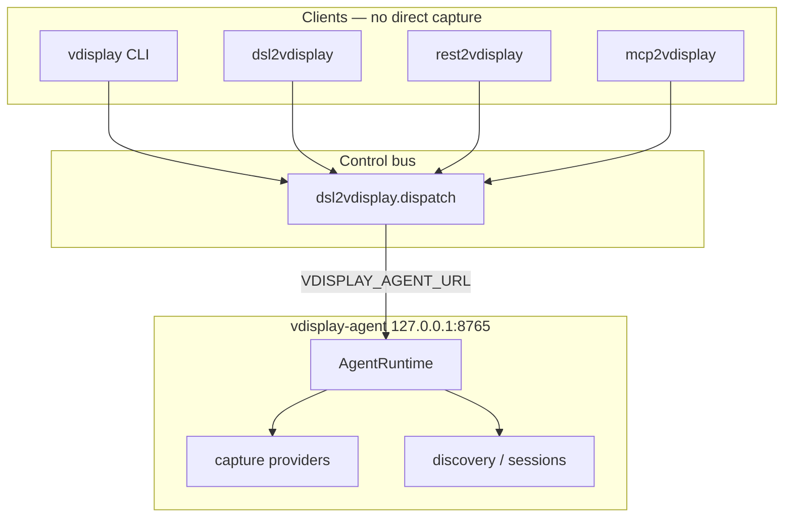

# vdisplay-agent broker

Back to [documentation index](index.md) · [packages/README.md](../packages/README.md)

Install **vdisplay-agent once** on the host. All clients (CLI, DSL, REST, MCP) talk to it over localhost HTTP instead of opening capture backends, portals, or DRM devices directly.

## Architecture



When `VDISPLAY_AGENT_URL` is set, `dispatch()` routes through `vdisplay.agent_dispatch`. The agent sets `VDISPLAY_AGENT_BROKER=1` internally so it never calls itself recursively.

## Install and run

```bash
pip install -e "packages/vdisplay-agent[serve]"
pip install -e packages/dsl2vdisplay packages/rest2vdisplay packages/mcp2vdisplay

# terminal 1 — broker (localhost only)
vdisplay-agent serve
# or: vdisplay agent serve
# default: http://127.0.0.1:8765

# terminal 2 — clients
export VDISPLAY_AGENT_URL=http://127.0.0.1:8765
```

Optional auth:

```bash
export VDISPLAY_AGENT_TOKEN=your-secret
# clients send: Authorization: Bearer your-secret
```

## Environment variables

| Variable | Where | Purpose |
|----------|-------|---------|
| `VDISPLAY_AGENT_URL` | clients | Broker base URL (e.g. `http://127.0.0.1:8765`) |
| `VDISPLAY_AGENT_TOKEN` | clients + agent | Optional Bearer token |
| `VDISPLAY_AGENT_HOST` | agent | Bind address (default `127.0.0.1`) |
| `VDISPLAY_AGENT_PORT` | agent | Listen port (default `8765`) |
| `VDISPLAY_AGENT_BROKER` | agent only | Set to `1` inside broker — do not set on clients |
| `VDISPLAY_CAPTURE_ALLOW_PORTAL` | agent | Set to `1` to opt in to xdg-desktop-portal capture |
| `DISPLAY` | agent | Host X display (default auto-resolves to `:0`) |

## Agent HTTP API

| Method | Path | Description |
|--------|------|-------------|
| GET | `/health` | Liveness |
| GET | `/capabilities` | Platform capabilities |
| GET | `/diagnostics` | DISPLAY / session diagnostics |
| GET | `/outputs` | Connected monitors (fast; no window enrichment) |
| GET | `/windows` | Application windows (query params as CLI filters) |
| POST | `/session/virtual/start` | Start Xvfb session |
| POST | `/session/mirror/start` | Start mirror session |
| POST | `/session/relay/start` | Start relay session |
| POST | `/session/screencast/start` | Start persistent portal ScreenCast (Wayland; one consent) |
| POST | `/session/screencast/stop` | Stop ScreenCast session |
| GET | `/session/screencast/status` | ScreenCast session state |
| POST | `/session/{id}/stop` | Stop session |
| POST | `/capture/frame` | Screenshot (PNG path or base64 in body) |
| POST | `/window/adopt` | Relay adopt window |
| POST | `/window/release` | Relay release window |

Quick checks:

```bash
curl -s http://127.0.0.1:8765/health | jq .
curl -s http://127.0.0.1:8765/outputs | jq '{monitor_count, monitors: [.monitors[].name]}'
```

## Client workflows

### CLI

```bash
export VDISPLAY_AGENT_URL=http://127.0.0.1:8765
vdisplay agent health
vdisplay monitors
vdisplay virtual screenshot -o /tmp/vd.png
```

### DSL

```bash
export VDISPLAY_AGENT_URL=http://127.0.0.1:8765
dsl2vdisplay -c 'HEALTH'
dsl2vdisplay -c 'MONITORS'
dsl2vdisplay -c 'SCREENSHOT OUT /tmp/out.png MODE virtual DISPLAY :99'
```

### REST (`rest2vdisplay`)

```bash
export VDISPLAY_AGENT_URL=http://127.0.0.1:8765
rest2vdisplay serve --port 8216 --agent-url http://127.0.0.1:8765

curl -s http://127.0.0.1:8216/health | jq .
curl -s -X POST http://127.0.0.1:8216/v1/dsl \
  -H 'content-type: application/json' \
  -d '{"verb":"MONITORS"}' | jq '.data.monitor_count'
curl -s -X POST http://127.0.0.1:8216/v1/dsl \
  -H 'content-type: text/plain' \
  -d 'HEALTH'
```

REST routes:

| Method | Path | Description |
|--------|------|-------------|
| GET | `/health` | Adapter health + broker status |
| GET | `/capabilities` | Proxy to agent capabilities |
| GET | `/v1/schema` | DSL schema list |
| GET | `/v1/schema/{verb}` | Schema for one verb |
| POST | `/v1/dsl` | Execute DSL (JSON or plain text) |
| POST | `/v1/commands` | Alias for `/v1/dsl` |

### MCP (`mcp2vdisplay`)

```bash
export VDISPLAY_AGENT_URL=http://127.0.0.1:8765
mcp2vdisplay serve
```

Tools:

| Tool | Description |
|------|-------------|
| `vdisplay_agent_status` | Broker connectivity + capabilities |
| `vdisplay_run_command` | Single DSL line |
| `vdisplay_run_dsl` | Multi-line DSL script |
| `vdisplay_to_dsl` | NL → DSL (no side effects) |

## Capture providers (host)

The agent tries driver-level providers in order:

- **Xvfb / owned display:** X11 → MSS (XCB) → DRM → fbdev
- **Wayland host:** DRM → fbdev → MSS → X11
- **Portal:** only when `VDISPLAY_CAPTURE_ALLOW_PORTAL=1`

Virtual display screenshots (`MODE virtual`, Xvfb `:99`) work without portal prompts. Host mirror screenshots on **GNOME Wayland + NVIDIA** often fail until a persistent ScreenCast session is started in the agent, or until the user has DRM access (e.g. `video` group for `/dev/fb0`).

### Etap 2 — persistent ScreenCast (Wayland)

Start once (interactive source picker + Screen Recording consent), then capture many frames without new prompts:

```bash
curl -s -X POST http://127.0.0.1:8765/session/screencast/start \
  -H 'content-type: application/json' \
  -d '{"interactive": true}' | jq .

curl -s http://127.0.0.1:8765/session/screencast/status | jq .

# host capture now uses the open PipeWire stream
export VDISPLAY_AGENT_URL=http://127.0.0.1:8765
vdisplay screenshot -o /tmp/host.png --source DP-1

curl -s -X POST http://127.0.0.1:8765/session/screencast/stop | jq .
```

Requirements on the agent host:

- `python3-dbus`, `python3-gi` (GNOME session bus)
- `ffmpeg` built with PipeWire input **or** GStreamer `pipewiresrc`
- Screen Recording permission for `vdisplay-agent` in GNOME Settings

## Typical multi-terminal setup

```bash
# 1 — broker
vdisplay-agent serve --port 8765

# 2 — export once per shell / systemd user unit
export VDISPLAY_AGENT_URL=http://127.0.0.1:8765

# optional: install broker as user service (Linux)
mkdir -p ~/.config/systemd/user
cp packaging/systemd/vdisplay-agent.user.service ~/.config/systemd/user/
# edit ExecStart if vdisplay-agent is not in ~/.local/bin
systemctl --user daemon-reload
systemctl --user enable --now vdisplay-agent.service
```

Environment file (optional):

```bash
mkdir -p ~/.config/vdisplay
printf 'VDISPLAY_AGENT_URL=http://127.0.0.1:8765\n' > ~/.config/vdisplay/agent.env
# add to shell: set -a; source ~/.config/vdisplay/agent.env; set +a
```

```bash
# 3 — any combination of adapters
rest2vdisplay serve --port 8216
mcp2vdisplay serve
dsl2vdisplay -c 'MONITORS'
vdisplay screenshot --all-monitors --out-dir /tmp/shots --mode mirror
```

## Related

- [Troubleshooting — agent and capture](troubleshooting.md#vdisplay-agent-and-capture)
- [Installation — control layer](installation.md#control-layer-and-agent)
- [Example: agent-broker](../examples/agent-broker/)
- [packages/vdisplay-agent/README.md](../packages/vdisplay-agent/README.md)
