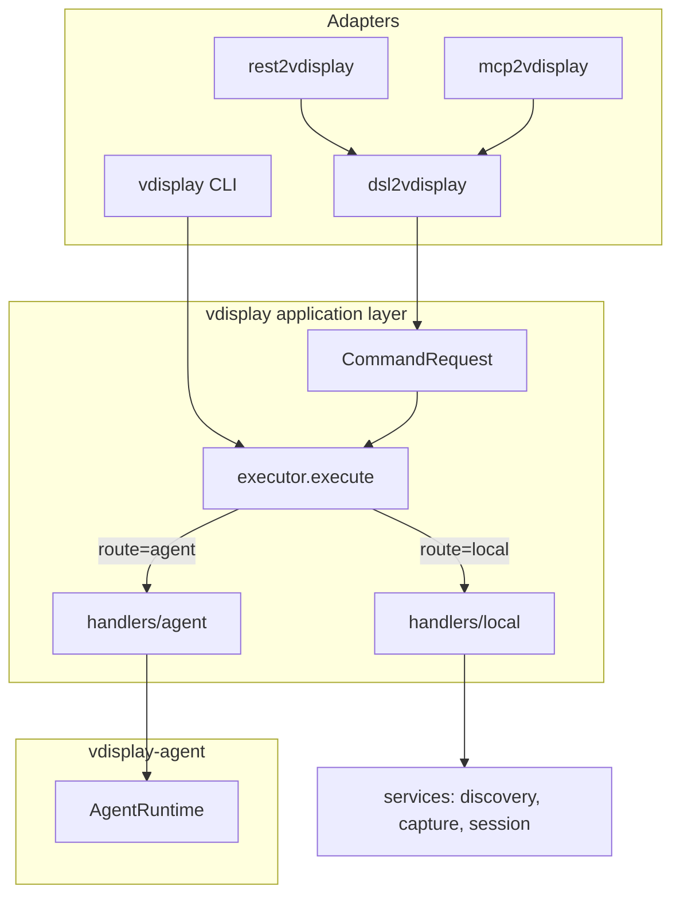

# Architecture — command execution layer

Back to [documentation index](index.md) · [Agent broker](agent-broker.md)

All interfaces (CLI, DSL, REST, MCP) share one execution path.

## Flow



## Routing

| Condition | Route | Handler |
|-----------|-------|---------|
| `VDISPLAY_AGENT_URL` set, not broker process | `agent` | `AgentClient` → HTTP |
| otherwise | `local` | `application.services.*` |

The broker sets `VDISPLAY_AGENT_BROKER=1` so it never routes back to itself.

## Key modules

| Module | Role |
|--------|------|
| `application/commands.py` | `CommandRequest`, `CommandResult`, `CommandVerb` |
| `application/executor.py` | Single entry: `execute(request)` |
| `application/handlers/local.py` | In-process use-cases |
| `application/handlers/agent.py` | Broker HTTP mapping |
| `application/services/` | discovery, capture, session, control, info |
| `control/` | Provider registry, routing, plugins, verifier |
| `client.py` | `AgentClient` SDK |

## Control and extensibility

Control operations use the same `CommandRequest` → `executor` path as capture. The router selects a **provider adapter** from capabilities and selector context — never from vendor-specific backends (Chrome vs Firefox are application profiles, not providers).

```
CLI / DSL / REST / Agent
        ↓
application.services.control
        ↓
ControlRouter (scoring + profile inference)
        ↓
ProviderRegistry + plugins.register_control_provider()
        ↓
ControlProvider (atspi | browser | terminal | x11 | custom)
        ↓
VerifierPipeline
```

See [control-plane.md](control-plane.md) and [RFC 001](rfc/001-extensibility-model.md).

## Agent persistence

Long-running broker work (sampler, screencast, sessions) is recorded in SQLite (`agent-tasks.db`). Startup marks orphan `running` tasks as `stale`. See [agent-broker.md — Tasks](agent-broker.md#tasks-durable-broker-work).

## Deprecated

- `vdisplay.agent_dispatch.dispatch_via_agent` — use `application.executor.execute`
- `vdisplay.cli_handlers.*` — use `application.services`

## From source (development)

Install the core package **and** adapters in editable mode so tests and CLI use the same code:

```bash
pip install -e ".[pillow,dev]"
pip install -e "packages/vdisplay-agent[serve]"
pip install -e packages/dsl2vdisplay packages/rest2vdisplay packages/mcp2vdisplay
pytest tests/ -q
```

If `dsl2vdisplay` is only installed from PyPI/site-packages, bus routing may be stale.
