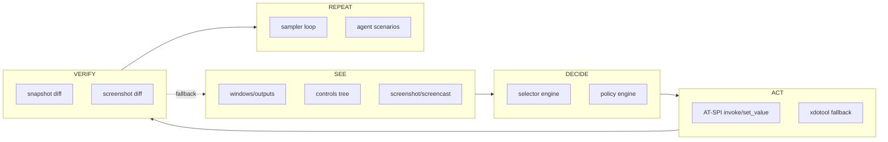
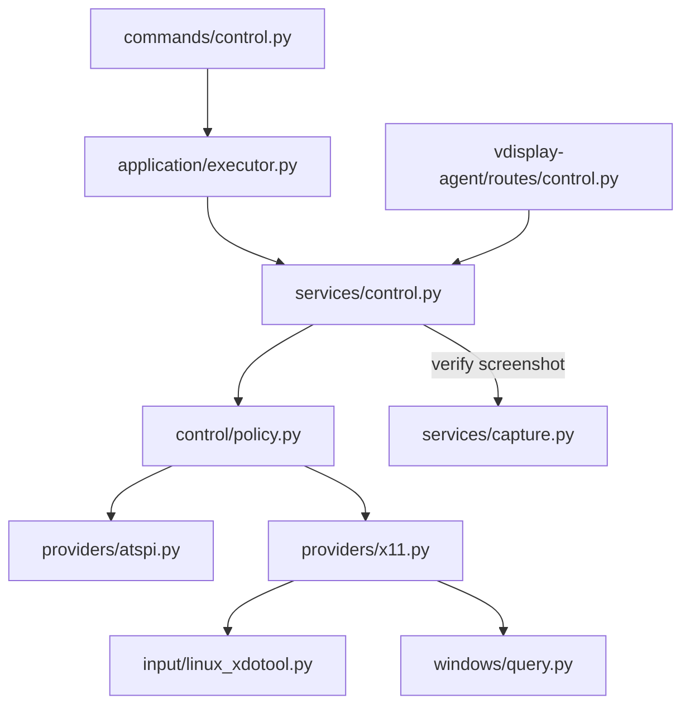

# Plan produktowo-architektoniczny `vdisplay`

Plan oparty na **aktualnym stanie repozytorium** (v0.1.5, ~9.5k LOC core + agent) i Twoim kierunku: z orchestracji capture → **substrat automatyzacji desktopu** z dwoma kanałami: **control plane** (accessibility-first) i **vision plane** (screenshot/screencast jako walidacja i fallback).

---

## 1. Stan obecny — co już masz

### Vision plane (działa, do stabilizacji)
| Warstwa | Status | Pliki |
|---------|--------|-------|
| Host capture | ✅ Wayland + X11 | `capture/host.py` (543 ln), `capture/providers/*` |
| ScreenCast | ✅ unattended loop | `capture/portal_screencast.py` (741 ln) |
| Policy | ✅ kontrakt unattended | `capture/policy.py` |
| Sampler | ✅ agent worker + recovery | `sampler_loop.py`, `vdisplay-agent/services/sampler.py` |
| Discovery | ✅ monitory, okna (X11) | `discovery.py`, `windows/*` |
| Agent broker | ✅ 18 endpointów | `vdisplay-agent/server.py` |

### Control plane (szkielet, brak produktu)
| Warstwa | Status | Pliki |
|---------|--------|-------|
| Window geometry | ✅ relay adopt/move | `backends/linux_x11_relay.py` |
| Pointer injection | ⚠️ klasa istnieje, **zero wywołań** | `input/linux_xdotool.py` |
| AT-SPI / UIA / AX | ❌ brak | — |
| CLI control | ❌ brak | — |
| Agent control API | ❌ brak | — |
| `CommandVerb` control | ❌ brak | `application/commands.py` |

**Wniosek:** capture/sampler to już ~70% vision plane. Następny skok wartości to **control domain**, nie kolejne capture hacki.

---

## 2. Cel docelowy — jeden model operacyjny



Wspólny kontrakt use-case'u:

```
see → decide → act → verify → repeat
```

Każda operacja (CLI / REST / DSL / MCP / agent) przechodzi przez ten sam `CommandRequest` → `executor` → handler.

---

## 3. Architektura docelowa — dwa plane'y

```
src/vdisplay/
├── capture/          # VISION — stabilizacja, nie rozbudowa feature'ów
├── control/          # CONTROL — nowa domena (główny kierunek)
│   ├── models.py
│   ├── base.py
│   ├── policy.py
│   ├── selector.py
│   ├── actions.py
│   ├── snapshot.py
│   └── providers/
│       ├── atspi.py      # Linux first
│       ├── x11.py        # geometry + xdotool fallback
│       ├── uia.py        # Sprint 4
│       └── ax.py         # Sprint 4
├── windows/            # SEE (geometry) — bez zmian koncepcyjnych
├── input/              # ACT (pointer) — podpiąć pod control
├── application/
│   └── services/
│       ├── control.py
│       ├── control_discovery.py
│       └── control_actions.py
└── commands/
    └── control.py      # CLI: controls, click, focus, set-value
```

Agent analogicznie:

```
packages/vdisplay-agent/src/vdisplay_agent/
├── routes/             # refactor server.py
│   ├── health.py
│   ├── session.py
│   ├── capture.py
│   ├── sampler.py
│   ├── control.py      # nowe
│   └── diagnose.py
└── services/
    └── control.py      # nowe
```

---

## 4. Wspólny model kontrolki (`ControlNode`)

```python
# src/vdisplay/control/models.py (propozycja)

from dataclasses import dataclass, field
from enum import StrEnum
from typing import Any

class ControlRole(StrEnum):
    BUTTON = "button"
    INPUT = "input"
    CHECKBOX = "checkbox"
    COMBOBOX = "combobox"
    MENU_ITEM = "menuitem"
    LABEL = "label"
    PANEL = "panel"
    WINDOW = "window"
    UNKNOWN = "unknown"

class ControlActionKind(StrEnum):
    INVOKE = "invoke"
    FOCUS = "focus"
    SET_VALUE = "set_value"
    PRESS = "press"
    EXPAND = "expand"
    SELECT = "select"

@dataclass(frozen=True)
class ControlBounds:
    x: int
    y: int
    width: int
    height: int

@dataclass
class ControlAction:
    kind: ControlActionKind
    name: str | None = None
    description: str | None = None

@dataclass
class ControlNode:
    id: str                          # stabilny w obrębie snapshotu
    backend: str                     # "atspi" | "x11-fallback"
    role: ControlRole
    name: str | None
    description: str | None
    bounds: ControlBounds | None
    window_id: str | None
    app_label: str | None
    state: dict[str, Any] = field(default_factory=dict)
    actions: list[ControlAction] = field(default_factory=list)
    text_value: str | None = None
    parent_id: str | None = None
    children_ids: list[str] = field(default_factory=list)

@dataclass
class ControlSnapshot:
    backend: str
    window_id: str | None
    app_label: str | None
    nodes: dict[str, ControlNode]
    root_ids: list[str]
```

---

## 5. Provider interface (analogia do `capture/providers/`)

```python
# src/vdisplay/control/base.py

from abc import ABC, abstractmethod
from typing import Any

class ControlProvider(ABC):
    name: str

    @abstractmethod
    def available(self) -> tuple[bool, str]:
        """(ok, reason)"""

    @abstractmethod
    def list_apps(self) -> list[dict[str, Any]]: ...

    @abstractmethod
    def list_windows(self, *, app: str | None = None) -> list[dict[str, Any]]: ...

    @abstractmethod
    def snapshot(self, *, window_id: str | None = None, app: str | None = None) -> ControlSnapshot: ...

    @abstractmethod
    def find(self, query: "ControlSelector") -> list[ControlNode]: ...

    @abstractmethod
    def invoke(self, element_id: str, *, action: str | None = None) -> dict[str, Any]: ...

    @abstractmethod
    def focus(self, element_id: str) -> dict[str, Any]: ...

    @abstractmethod
    def set_value(self, element_id: str, value: str) -> dict[str, Any]: ...

    @abstractmethod
    def bounds(self, element_id: str) -> ControlBounds | None: ...
```

Routing providerów (`control/policy.py`):

```python
@dataclass
class ControlCapabilityContract:
    supports_semantic_control: bool
    supports_unattended_control: bool
    supports_invoke: bool
    supports_set_value: bool
    supports_focus: bool
    requires_accessibility_enablement: bool
    fallback_to_pointer_injection: bool
    backends: list[str]
    reasons: list[str]

def assess_control_capability(*, display: str | None = None) -> ControlCapabilityContract:
    # 1. AT-SPI bus dostępny?
    # 2. GTK/Qt bridge env (GTK_A11Y, QT_ACCESSIBILITY)?
    # 3. xdotool jako fallback?
    ...
```

---

## 6. Plan per moduł — szczegółowo

### 6.1 `capture/*` — **freeze feature'ów, tylko stabilizacja**

**Cel:** vision plane jako warstwa pomocnicza. Brak nowych ścieżek capture.

| Plik | Akcja | Nowe moduły |
|------|-------|-------------|
| `capture/host.py` | Rozbić | `host_routing.py`, `host_regions.py`, `host_multimon.py`, `host_errors.py` |
| `capture/portal_screencast.py` | Rozbić | `screencast/session.py`, `screencast/portal_dbus.py`, `screencast/pipewire.py`, `screencast/recovery.py` |
| `capture/policy.py` | Rozszerzyć | dodać `vision_ready` do wspólnego capability snapshot |

**Funkcje do wydzielenia z `host.py`:**

```python
def resolve_host_capture_plan(...) -> HostCapturePlan: ...
def capture_with_plan(plan: HostCapturePlan) -> tuple[bytes, dict]: ...
def capture_window_region(region, ...) -> tuple[bytes, dict]: ...  # już częściowo jest
def capture_monitor_region(...) -> tuple[bytes, dict]: ...
def capture_multimon(...) -> dict: ...
```

**Kryterium done:** zero regresji w 122+ testach; `host.py` < 200 ln (reszta w submodułach).

---

### 6.2 `control/*` — **nowa domena (Sprint 1 priorytet)**

#### `control/providers/atspi.py` — Linux first

Zależności systemowe (diagnostyka, nie pip):
- `at-spi2-core`, D-Bus session bus
- `GTK_A11Y=1` / `QT_ACCESSIBILITY=1` dla aplikacji GTK/Qt

Implementacja przez `python3-gi` (PyGObject) lub `pyatspi2` — preferuj **PyGObject + `gi.repository.Atk`**, bo już masz `gi` w portal screencast.

```python
# control/providers/atspi.py — szkielet

class AtspiControlProvider(ControlProvider):
    name = "atspi"

    def available(self) -> tuple[bool, str]:
        # sprawdź org.a11y.Bus na session bus
        ...

    def snapshot(self, *, window_id=None, app=None) -> ControlSnapshot:
        # przejdź drzewo Accessible, mapuj role → ControlRole
        ...

    def invoke(self, element_id, *, action=None):
        # org.a11y.atspi.Action.DoAction(index)
        ...

    def set_value(self, element_id, value):
        # Accessible.SetTextContents / Value.SetValue
        ...
```

Mapowanie ról AT-SPI → `ControlRole`:

| AT-SPI | `ControlRole` |
|--------|---------------|
| `PUSH_BUTTON` | `button` |
| `ENTRY`, `TEXT` | `input` |
| `CHECK_BOX` | `checkbox` |
| `COMBO_BOX` | `combobox` |
| `MENU_ITEM` | `menuitem` |

#### `control/providers/x11.py` — fallback

```python
class X11ControlProvider(ControlProvider):
    name = "x11-fallback"

    def invoke(self, element_id, *, action=None):
        # bounds z cache snapshotu → LinuxXdotoolInput.click(x, y)
        ...

    def set_value(self, element_id, value):
        # focus + xdotool type (ostatnia deska ratunku)
        ...
```

Reuse: `input/linux_xdotool.py`, `windows/query.py`, `resolve_window_region()` z `capture/host.py`.

---

### 6.3 `control/selector.py` — Sprint 2

```python
@dataclass
class ControlSelector:
    role: ControlRole | None = None
    name: str | None = None          # exact
    name_contains: str | None = None # fuzzy
    app: str | None = None
    window_id: str | None = None
    window_title: str | None = None
    ancestor: "ControlSelector | None" = None
    index: int | None = None

# Składnia stringowa (CLI):
# button[name="Save"]
# input[name~="Search"]
# app[wm_class="firefox"] >> button[name="Open"]
def parse_selector(expr: str) -> ControlSelector: ...
def rank_matches(nodes: list[ControlNode], sel: ControlSelector) -> list[ControlNode]: ...
```

Reuse wzorca z `windows/rank.py`.

---

### 6.4 `control/actions.py` + verify-after-action — Sprint 2

```python
@dataclass
class ActionResult:
    ok: bool
    action: str
    element_id: str
    backend: str
    before: ControlSnapshot | None
    after: ControlSnapshot | None
    screenshot_before: str | None = None
    screenshot_after: str | None = None
    state_diff: dict[str, Any] = field(default_factory=dict)

def execute_control_action(
    *,
    selector: ControlSelector,
    action: ControlActionKind,
    value: str | None = None,
    verify: bool = True,
    screenshot_verify: bool = False,
    fallback: bool = True,
) -> ActionResult:
    # 1. policy routing (AT-SPI → x11)
    # 2. snapshot before
    # 3. act
    # 4. snapshot after + diff (focus, value, children count)
    # 5. optional screenshot via capture_svc
    ...
```

---

### 6.5 `application/services/*` — use-case'y

Nowe pliki:

| Plik | Funkcje |
|------|---------|
| `services/control_discovery.py` | `controls_list()`, `controls_find()`, `controls_describe()` |
| `services/control_actions.py` | `control_click()`, `control_focus()`, `control_set_value()` |
| `services/control.py` | fasada łącząca discovery + actions + verify |

```python
# services/control.py
def controls_list(*, display=None, window_id=None, app=None, backend="auto") -> dict: ...
def controls_find(*, selector: ControlSelector, backend="auto") -> dict: ...
def control_click(*, selector, verify=True, fallback=True) -> dict: ...
def control_focus(*, selector) -> dict: ...
def control_set_value(*, selector, value: str, verify=True) -> dict: ...
def diagnose_control(*, display=None) -> dict: ...
```

Integracja z `executor.py` — ten sam routing agent/local co screenshot.

---

### 6.6 `application/commands.py` — nowe werby

```python
class CommandVerb(StrEnum):
    ...
    CONTROLS = "CONTROLS"
    CONTROL_CLICK = "CONTROL_CLICK"
    CONTROL_FOCUS = "CONTROL_FOCUS"
    CONTROL_SET_VALUE = "CONTROL_SET_VALUE"
    DIAGNOSE_CONTROL = "DIAGNOSE_CONTROL"
```

Rozszerzenie `CommandRequest`:

```python
selector: dict[str, Any] | None = None   # lub ControlSelector serialized
verify: bool = True
fallback: bool = True
backend: str = "auto"
```

---

### 6.7 `commands/control.py` — CLI

```bash
vdisplay controls --app firefox
vdisplay controls --window-id 0xabc --format tree|flat|json

vdisplay click --name Save --role button
vdisplay click --selector 'button[name="Save"]'

vdisplay focus --name Search --role input
vdisplay set-value --name Search --value "abc"

vdisplay diagnose --control
```

Flagi wspólne z resztą CLI: `--display`, `--backend auto|atspi|x11`.

---

### 6.8 Agent — refactor + control API

#### Refactor `server.py` (hotspot, 223 ln → routery)

```python
# vdisplay_agent/routes/control.py
def register_control_routes(app, broker):
    @app.get("/controls")
    def list_controls(...): ...

    @app.post("/controls/find")
    def find_controls(body): ...

    @app.post("/control/invoke")
    def invoke_control(body): ...

    @app.post("/control/focus")
    def focus_control(body): ...

    @app.post("/control/set-value")
    def set_control_value(body): ...

    @app.get("/diagnostics/control")
    def diagnose_control(...): ...
```

`create_app()` staje się:

```python
def create_app() -> FastAPI:
    app = FastAPI(...)
    register_middleware(app)
    register_health_routes(app, broker)
    register_session_routes(app, broker)
    register_capture_routes(app, broker)
    register_sampler_routes(app, broker)
    register_control_routes(app, broker)   # nowe
    register_diagnose_routes(app, broker)
    return app
```

#### `client.py` — mirror endpointów

```python
def list_controls(self, **filters) -> dict: ...
def find_control(self, selector: dict) -> dict: ...
def invoke_control(self, selector: dict, *, action: str | None = None) -> dict: ...
def focus_control(self, selector: dict) -> dict: ...
def set_control_value(self, selector: dict, value: str) -> dict: ...
```

---

### 6.9 Adaptery (DSL / REST / MCP) — Sprint 3

| Pakiet | Zmiana |
|--------|--------|
| `dsl2vdisplay/grammar.py` | werby `CONTROLS`, `CLICK`, `FOCUS`, `SET_VALUE` |
| `nlp2vdisplay/to_dsl.py` | „kliknij Zapisz” → `CLICK name=Save role=button` |
| `mcp2vdisplay/server.py` | tools: `vdisplay_controls`, `vdisplay_click`, ... |
| `rest2vdisplay/app.py` | `/controls`, `/control/click`, ... |

Wszystkie przez `executor.execute(CommandRequest(...))` — **jedna ścieżka**.

---

## 7. Rozszerzenie capability modelu

### `platform_capabilities()` — dodać sekcję `control`

```json
{
  "control": {
    "semantic": true,
    "backends": ["atspi", "x11-fallback"],
    "can_invoke": true,
    "can_set_value": true,
    "can_focus": true,
    "requires_a11y_bus": true,
    "unattended_ready": false,
    "reasons": ["AT-SPI bus active", "xdotool available for fallback"]
  }
}
```

### `diagnose --control` / `diagnose --unattended` — rozszerzyć

```
vdisplay diagnose --control
vdisplay diagnose --unattended   # już jest — dodać control.unattended_ready
```

Diagnostyka Linux sprawdza:
- `dbus-send --session org.a11y.Bus /org/a11y/atspi/accessible/root`
- `echo $GTK_A11Y`, `echo $QT_ACCESSIBILITY`
- `which xdotool`
- sample snapshot z focusowanej aplikacji (jeśli dostępna)

---

## 8. Kolejność wdrożenia (sprinty)

### Sprint 0 — stabilizacja vision (1 tydzień, równolegle)
- [ ] Rozbicie `host.py` (bez zmiany API)
- [ ] Rozbicie `portal_screencast.py`
- [ ] Refactor `server.py` → `routes/*`
- [ ] `--all-monitors` screencast w workflow docs

**Acceptance:** 122+ testów green, zero nowych capture feature'ów.

---

### Sprint 1 — **„Linux: znajdź button/input i invoke/set_value bez myszki"** (2 tygodnie)

| # | Zadanie | Pliki | Done when |
|---|---------|-------|-----------|
| 1.1 | Modele + base provider | `control/models.py`, `control/base.py` | unit testy modeli |
| 1.2 | AT-SPI provider: `available`, `snapshot` | `control/providers/atspi.py` | GTK demo app → drzewo z button+input |
| 1.3 | AT-SPI: `invoke`, `set_value`, `focus` | j.w. | klik zmienia label; input przyjmuje tekst |
| 1.4 | Policy routing | `control/policy.py` | `assess_control_capability()` |
| 1.5 | X11 fallback provider | `control/providers/x11.py`, podpięcie `input/linux_xdotool.py` | działa gdy AT-SPI off |
| 1.6 | Application services | `services/control*.py` | use-case'y callable z Pythona |
| 1.7 | CLI | `commands/control.py` | `controls`, `click`, `set-value`, `focus` |
| 1.8 | Agent endpoints | `routes/control.py`, `services/control.py` | HTTP parity z CLI |
| 1.9 | `diagnose --control` | `commands/diagnose.py`, `capabilities.py` | JSON z backend readiness |
| 1.10 | Test fixture | `tests/fixtures/gtk_demo_app.py` | behawioralne testy AT-SPI |

**Milestone Sprint 1:**
```bash
vdisplay controls --app <gtk-demo>
vdisplay click --name "Increment" --role button
vdisplay set-value --name "Entry" --value "hello"
# bez xdotool, bez myszki, przez AT-SPI
```

---

### Sprint 2 — selector + verify (2 tygodnie)

| # | Zadanie |
|---|---------|
| 2.1 | `selector.py` + składnia stringowa |
| 2.2 | Ranking jak `windows/rank.py` |
| 2.3 | `actions.py` z verify-after-action (snapshot diff) |
| 2.4 | Opcjonalny screenshot verify (`capture_svc` before/after) |
| 2.5 | `CommandVerb` + executor handlers |
| 2.6 | Testy: focus changed, value changed, dialog opened |

---

### Sprint 3 — scenariusze i adaptery (2 tygodnie)

| # | Zadanie |
|---|---------|
| 3.1 | DSL/MCP/REST werby control |
| 3.2 | Recorder/replayer akcji (JSON scenario format) |
| 3.3 | Eksport drzewa UI (`controls --format json`) |
| 3.4 | App-specific adapter: Firefox (pilot) |
| 3.5 | Sampler + control razem (test: co 1s screenshot + co Ns klik) |

---

### Sprint 4 — cross-platform (backlog)

| Platforma | Provider | Wzorzec |
|-----------|----------|---------|
| Windows | `control/providers/uia.py` | `InvokePattern`, `ValuePattern` |
| macOS | `control/providers/ax.py` | `AXUIElementPerformAction`, settable attributes |

Wspólna semantyka przez `ControlRole` + `ControlActionKind` — backend tylko tłumaczy.

---

## 9. Plan testów behawioralnych

### Fixture GTK demo (`tests/fixtures/gtk_demo_app.py`)

Minimalna aplikacja:
- `Gtk.Button` label „Increment” → zwiększa counter label
- `Gtk.Entry` → przyjmuje tekst
- `Gtk.CheckButton`

### Testy Sprint 1

```python
def test_controls_list_returns_button_and_input(gtk_demo): ...
def test_click_button_changes_label(gtk_demo): ...
def test_set_value_updates_entry(gtk_demo): ...
def test_x11_fallback_when_atspi_unavailable(gtk_demo, monkeypatch): ...
def test_agent_control_invoke(agent_client, gtk_demo): ...
def test_diagnose_control_reports_atspi_ready(): ...
```

### Testy integracyjne z capture

```python
def test_click_then_screenshot_shows_new_state(gtk_demo, agent_client): ...
def test_sampler_and_control_concurrent(agent_client, gtk_demo): ...
```

---

## 10. Czego **nie** robić (granice produktu)

1. **Nie** dodawać nowych ścieżek capture (DRM hacki, kolejne portale) — vision plane jest wystarczający.
2. **Nie** budować OCR/vision-first automation — screenshot tylko jako verify/fallback.
3. **Nie** mieszać control logic w `capture/host.py` — `resolve_window_region` zostaje w vision; control ma własne bounds z AT-SPI.
4. **Nie** rozbudowywać mirror/relay jako głównego mechanizmu sterowania — zostają jako geometry/move w X11 session.
5. **Nie** implementować UIA/AX przed dowiezieniem AT-SPI na Linuxie.

---

## 11. Mapa zależności między istniejącym a nowym



---

## 12. Najkrótsza wersja — 7 kroków

1. **Freeze capture** — tylko refaktor i stabilizacja.
2. **Dodaj `control/`** z provider model jak `capture/providers/`.
3. **Sprint 1 cel:** AT-SPI `invoke` + `set_value` na GTK demo — bez myszki.
4. **Podłącz** istniejący `LinuxXdotoolInput` jako fallback, nie jako default.
5. **Rozbij** `server.py`, `host.py`, `portal_screencast.py`.
6. **Ujednolić** CLI / agent / executor przez `CommandVerb` control.
7. **Dopiero potem** UIA (Windows) i AX (macOS).

---

## 13. Propozycja następnego kroku implementacyjnego

Jeśli chcesz przejść od planu do kodu, najbardziej wartościowy pierwszy PR to **Sprint 1.1–1.3**:

```
src/vdisplay/control/
├── __init__.py
├── models.py
├── base.py
├── policy.py
└── providers/
    ├── __init__.py
    └── atspi.py

tests/fixtures/gtk_demo_app.py
tests/test_control_atspi.py
```

Jeden measurable outcome:

> `vdisplay click --name Increment --role button` zmienia tekst labela w GTK demo app przez AT-SPI, bez `xdotool`.

Mogę w następnym kroku rozpisać to jako **konkretny plan PR-ów** (PR-1: modele + policy, PR-2: AT-SPI snapshot, PR-3: invoke/set_value + CLI) albo od razu zacząć implementację Sprint 1. Co wolisz?