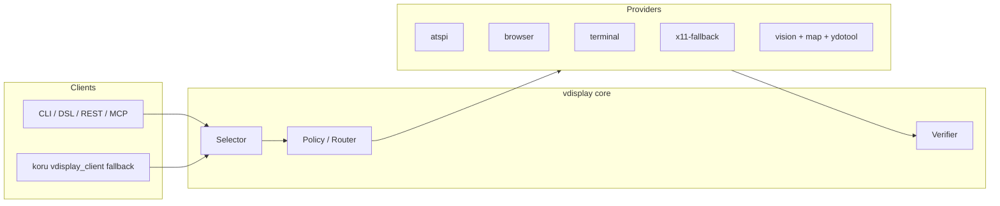

# Desktop control — how it works today (2026-06)

**Question:** What can vdisplay actually control on a Linux desktop today, what is missing, and how does that relate to koru/coru and JetBrains PyCharm?

Related: [wayland-control.md](wayland-control.md) · [control-plane.md](../control-plane.md) · [agent-broker.md](agent-broker.md) · [reference/env.md](../reference/env.md)

---

## Summary

vdisplay is a **multi-provider control plane**: one selector/API routes actions to AT-SPI, Playwright, terminal PTY, X11 pointer fallback, or vision/map + ydotool depending on host environment and target app class.

| Surface | Status today | Primary path |
|---------|----------------|--------------|
| **Browser** (Chromium/Firefox via session) | **Works** | Playwright DOM + verify |
| **Terminal** (PTY session) | **Works** | Terminal grid provider |
| **GTK/XWayland desktop** (Files, Calculator, Toolbox) | **Partial** | AT-SPI and/or xdotool on XWayland windows |
| **Native Wayland apps** (PyCharm default, Cursor Glass UI) | **Limited** | Vision + GUI map + ydotool — **no reliable semantic chat tree** |
| **IDE chat prompt** (Cursor, PyCharm AI, Copilot in Electron) | **Mostly not via vdisplay** | Use **koru autopilot plugin** for VS Code family; PyCharm needs map/vision or XWayland+AT-SPI |

**Bottom line:** vdisplay excels at **brokered capture**, **browser/terminal automation**, and **map-based pointer control** on Wayland. For IDE chat on native Wayland, use **`vdisplay ide prompt`** (compose launch → focus → map/selectors → set-value) or the **koru autopilot plugin** for VS Code family.

---

## Architecture (today)



1. **Discovery** — `vdisplay all`, `diagnose control` → backends, host (`linux_wayland` / `linux_x11`), reasons.
2. **Routing** — `control/router.py` + `scoring.py` pick a provider from selector + application profile.
3. **Actuation** — click, focus, set-value, invoke on the chosen provider.
4. **Verify** — semantic diff, DOM, OCR (`--verify`), optional vision LLM (cold path).

On a **GNOME Wayland** host (typical Ubuntu 22.04+):

- `vdisplay windows` lists **XWayland** windows only — native Wayland apps are invisible to X11 enumeration.
- `xdotool` / `x11-fallback` is **ineligible** on `linux_wayland` unless the target runs under XWayland.
- **Portal screencast** (via `vdisplay-agent`) works for full-desktop capture; pointer actuation uses **ydotool** + optional **GUI map** targets.

Run readiness:

```bash
cd /path/to/vdisplay && source .venv/bin/activate
vdisplay diagnose control
# or via broker:
export VDISPLAY_AGENT_URL=http://127.0.0.1:8765
curl -s http://127.0.0.1:8765/diagnostics/control | jq .
```

Example output on Wayland (when AT-SPI + browser + terminal + x11-fallback are available):

- `supports_semantic_control: true` (aggregate)
- `backends: ["atspi", "x11-fallback", "browser", "terminal"]`
- `host_environment: linux_wayland`

That does **not** mean every app exposes a usable widget tree — only that at least one semantic backend is reachable.

---

## koru / coru integration

koru can call vdisplay as a **fallback** when the IDE autopilot **plugin socket** is unavailable (`koru.integrations.vdisplay_client`).

| Mechanism | Role |
|-----------|------|
| **Plugin socket** (e.g. `koru-autopilot-cursor`) | **Preferred** — paste/submit via IDE commands, chat events, probe ladder |
| **vdisplay fallback** | Secondary — `controls_find` + `set_value` on accessibility tree |
| **Keyboard fallback** (wtype/ydotool) | Tertiary on Wayland when plugin and vdisplay fail |

Environment (koru side):

| Variable | Default | Purpose |
|----------|---------|---------|
| `KORU_VDISPLAY_CONTROL_FALLBACK` | `auto` | Enable fallback when plugin missing and Wayland/IDE heuristics say simplified control is insufficient |
| `KORU_VDISPLAY_AGENT_URL` | auto from vdisplay | Broker URL if not importing vdisplay in-process |
| `KORU_VDISPLAY_DRY_RUN` | off | Log-only drive |

**Important (verified 2026-06-10):** On Cursor + native Wayland, vdisplay fallback returns:

```text
no chat input matched for ide=cursor (app='Cursor'); focus_error=focus failed
```

Electron/Glass chat lives in a **webview** not exposed to generic AT-SPI `role=input` selectors. For Cursor, **plugin connection is required**; vdisplay does not replace it today.

coru/koru must be run from the **project directory** (e.g. `~/github/wronai/vdisplay`) so planfile, daemon metadata, and `.venv` align. Running from `$HOME` breaks planfile tickets and may re-exec into the wrong koru venv.

---

## Control paths by target

### Browser — full semantic control

```bash
vdisplay control browser-open --url https://example.com --session-id web-1
vdisplay control click --backend browser --session-id web-1 --selector "#submit" --verify
```

Works headless or headed; DOM verify on `--verify`.

### Terminal — full semantic control

```bash
dsl2vdisplay -c 'terminal open --session-id t1 --command bash'
vdisplay control set-value --backend terminal --session-id t1 --terminal-line 1 --value "ls -la" --verify
```

### GTK / XWayland desktop widgets

```bash
export GTK_A11Y=1
# optional: GDK_BACKEND=x11 for GTK under XWayland
vdisplay control list --app Nautilus --backend atspi --format tree
vdisplay control click --role button --name Home --verify
```

### Native Wayland (PyCharm default, Cursor, many Electron apps)

**Not listed** in `vdisplay windows`. Options:

| Approach | Open app | Find chat input | Type prompt | Maturity |
|----------|----------|-----------------|-------------|----------|
| **A. Vision + GUI map** | Manual / OS launcher | Build map once (`map build --crop-bounds`) | `control set-value --map --target message` | **Works** with upkeep (map refresh on UI change) |
| **B. Force XWayland + AT-SPI** | `env -u WAYLAND_DISPLAY DISPLAY=:0 pycharm` | `control find --backend atspi` | `control set-value --role entry` | **Partial** — needs `libatk-wrapper-java`, screen-reader VM flag |
| **C. koru plugin** (Cursor/VS Code family) | N/A | Plugin commands | `send_chat` via socket | **Works** when extension loaded + connected |
| **D. Raw xdotool on XWayland window** | Same as B | Window id + coordinates | `xdotool type` | **Brittle** — bypasses vdisplay routing on Wayland |

Details: [wayland-control.md](wayland-control.md) · [vision-only-wayland.md](../vision-only-wayland.md)

---

## Scenario: open PyCharm and write a prompt

Use the **end-to-end CLI** (launch optional, focus, type):

```bash
cd ~/github/wronai/vdisplay && source .venv/bin/activate
export VDISPLAY_AGENT_URL=http://127.0.0.1:8765   # Wayland capture broker

# List known apps + launch variants
vdisplay app list
vdisplay app show pycharm

# Launch PyCharm (optional) and type into chat when map or AT-SPI is ready
vdisplay app open pycharm
vdisplay ide prompt --ide pycharm --text "Explain this stack trace"

# XWayland variant (better AT-SPI tree)
vdisplay app open pycharm --variant default-xwayland
vdisplay ide prompt --ide pycharm --backend atspi --text "Explain this stack trace"

# Vision + GUI map (native Wayland)
vdisplay map build --crop-bounds ... --monitor DP-1 -o maps/pycharm-chat.json
vdisplay ide prompt --ide pycharm --map maps/pycharm-chat.json --text "Explain this stack trace" --submit
```

Map templates (target id hints): `maps/templates/pycharm-chat.manifest.json`, `cursor-chat.manifest.json`, `vscode-chat.manifest.json`.

### Path 1 — Vision + map (native Wayland PyCharm)

**Prerequisites:** `vdisplay-agent serve`, portal screencast, `ydotoold`, scoped GUI map for the chat panel.

```bash
export VDISPLAY_AGENT_URL=http://127.0.0.1:8765
export YDOTOOL_SOCKET=/tmp/.ydotool_socket

vdisplay-agent serve &
sleep 2
vdisplay agent screencast start

# One-time (or after UI layout change): build map for chat region
vdisplay map build --crop-bounds ... --monitor DP-1 -o maps/pycharm-chat.json

vdisplay map show maps/pycharm-chat.json   # note target ids: message, send, ...

vdisplay control click --map maps/pycharm-chat.json --target chat
vdisplay control set-value --map maps/pycharm-chat.json --target message \
  --value "Explain this stack trace" --verify
```

**Gaps:** no `vdisplay app launch pycharm`; map is **not** auto-discovered; target ids are project-specific; AI panel moves break the map.

### Path 2 — XWayland + AT-SPI (better tree, worse HiDPI)

```bash
sudo apt install libatk-wrapper-java   # once
# Add to pycharm64.vmoptions: ide.support.screenreaders.enabled=true

env -u WAYLAND_DISPLAY -u XDG_SESSION_TYPE DISPLAY=:0 pycharm-professional &

vdisplay control list --backend atspi --app PyCharm
vdisplay control set-value --role entry --name "Chat input" --value "..." --verify
```

**Gaps:** must restart IDE in XWayland; role/name labels vary by JetBrains version; dbind timeouts reported in testing; not validated for **2026.1 AI chat** specifically.

### Path 3 — koru JetBrains lane (outside vdisplay core)

Use koru autopilot for JetBrains (`koru-autopilot-jetbrains` plugin + daemon on `koru-autopilot-jetbrains.sock`) — same plugin-first model as Cursor. vdisplay is not the primary actuator for JetBrains chat in koru today.

---

## What is missing (gap matrix)

| Gap | Impact | Status / direction |
|-----|--------|-------------------|
| **App launcher registry** | Could not `vdisplay app open pycharm` | **Done** — `vdisplay app list/open/show` + `desktop_apps.py` |
| **No JetBrains-specific provider** | Swing/AWT chat not in AT-SPI tree reliably | Still open — plugin or JBR accessibility bridge |
| **Electron webview invisible to AT-SPI** | Cursor, VS Code chat fail `controls_find` | koru plugin (VS Code family) or map/vision via `vdisplay ide prompt` |
| **Native Wayland window list empty** | Cannot match by title for PyCharm | Documented — map/screencast path |
| **Map build is manual** | High setup cost per app/layout | **Partial** — map templates in `maps/templates/`; auto-map still future |
| **koru vdisplay selectors too generic** | Miss Glass UI | **Partial** — IDE selector packs in `vdisplay.desktop_apps`, used by koru fallback |
| **End-to-end “prompt IDE” CLI** | Users expect one command | **Done** — `vdisplay ide prompt` |
| **Wayland focus from external terminal** | koru `ide reload` cannot focus Cursor | OS-level limitation; operator steps or in-IDE commands |
| **Profile-aware Cursor extension** | Extension not loaded in empty profile | Document + doctor fix for VS Code profiles (see operator runbooks) |

---

## Recommended operator checklist (desktop + koru)

1. **Project context:** `cd ~/github/wronai/vdisplay && source .venv/bin/activate`
2. **Broker (Wayland capture):** `vdisplay-agent serve` + `export VDISPLAY_AGENT_URL=...`
3. **Control readiness:** `vdisplay diagnose control`
4. **koru daemon:** `export KORU_AUTOPILOT_INSTANCE=cursor-main && koru autopilot daemon` (from project dir)
5. **IDE plugin (Cursor):** extension in active profile, `koruAutopilot.socketPath`, Connect autopilot
6. **Open project folder in IDE** — fixes workspace mismatch for coru drive routing
7. **PyCharm on Wayland:** plan for **map path** or **XWayland restart** before expecting semantic control

---

## Related docs

- [wayland-control.md](wayland-control.md) — PyCharm, ydotool, env vars
- [control-plane.md](../control-plane.md) — providers, plugins, JetBrains notes, test results
- [vision-only-wayland.md](../vision-only-wayland.md) — vision-only profile
- [gui-map-pack.md](gui-map-pack.md) — map build/refresh
- [examples/control-plane/README.md](../../examples/control-plane/README.md) — runnable demos

Back to [start-here.md](../start-here.md)
