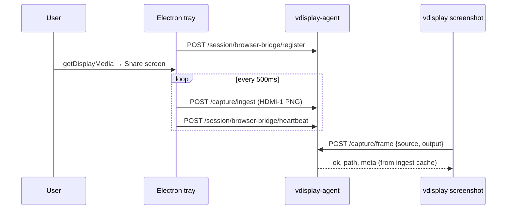

# Keeper 2.0 — Browser Bridge PoC (Electron / getDisplayMedia)

Replace the **Python PipeWire keeper** as the frame *delivery* path to `vdisplay-agent`.
Does **not** remove Wayland consent: Electron/Chromium still shows the screen-share picker
(same portal stack under the hood on GNOME).

Implementation status: the agent-side push API is implemented and the existing
`packages/vdisplay-electron-share` app can push frames to it. This must stay in
the same Electron package; do not add a second implementation under
`examples/`. Pull-broker mode (`GET /frame.png`) remains available through
`VDISPLAY_ELECTRON_SHARE_URL`.

## Problem today

| Layer | Works? | Failure mode |
|-------|--------|--------------|
| Portal session (`active`, `ready`) | often yes | — |
| Python keeper + GStreamer + PipeWire | often no | `Screen Recording permission missing`, timeout |
| `POST /capture/frame` → `vdisplay screenshot` | no | 400 / blank PNG |
| Koru surface-only | yes | no `capture.png` / VQL |

## PoC goal

```
Electron Share Manager  →  getDisplayMedia (user Share)
                        →  canvas PNG every N ms
                        →  POST /capture/ingest  (push mode)
Agent                   →  BrowserFrameStore (TTL cache per monitor)
vdisplay CLI            →  capture_host_to_file reads store first → PNG on disk
Koru                    →  prepare-vdisplay gets real capture.png + VQL
```

One monitor (`HDMI-1`) is enough for the first PoC.

---

## Session lifecycle



**Fallback:** if no fresh ingest frame, agent uses existing PipeWire keeper (unchanged).

---

## New HTTP endpoints (vdisplay-agent)

All on `http://127.0.0.1:8766`, same auth as today (`Authorization` header if configured).

### 1. Register bridge

`POST /session/browser-bridge/register`

```json
{
  "client": "vdisplay-electron-bridge",
  "version": "0.1.0",
  "monitors": ["HDMI-1"]
}
```

Response:

```json
{
  "ok": true,
  "bridge_id": "bb_7f3a…",
  "ttl_s": 5,
  "ingest_url": "/capture/ingest"
}
```

### 2. Heartbeat

`POST /session/browser-bridge/heartbeat`

```json
{
  "bridge_id": "bb_7f3a…",
  "sharing": true,
  "monitors": ["HDMI-1"],
  "fps": 2.0
}
```

Response: `{ "ok": true, "capture_ready": true }`

Agent sets `capture_ready=true` when `sharing=true` and last ingest for each declared
monitor is younger than `ttl_s` (default 5s).

### 3. Ingest frame (core)

`POST /capture/ingest`

**JSON (PoC — simple):**

```json
{
  "bridge_id": "bb_7f3a…",
  "source": "HDMI-1",
  "seq": 42,
  "mime": "image/png",
  "png_base64": "<base64>",
  "width": 4096,
  "height": 2560,
  "display_id": "1",
  "display_label": "HDMI display",
  "source_id": "screen:1",
  "source_name": "Entire screen",
  "display_bounds": { "x": 0, "y": 0, "width": 2048, "height": 1280 },
  "scale_factor": 1,
  "captured_at_ms": 1781288051050
}
```

**Alternative — multipart (preferred for prod):**

```
POST /capture/ingest
Content-Type: multipart/form-data

bridge_id=bb_7f3a…
source=HDMI-1
seq=42
file=@frame.png
```

Response:

```json
{
  "ok": true,
  "source": "HDMI-1",
  "bytes": 183920,
  "seq": 42,
  "age_ms": 12
}
```

Validation:

- `source` must match a connected monitor name from `GET /outputs` (or alias map).
- Reject if `bridge_id` unknown or heartbeat stale.
- Max frame size e.g. 25 MB; PNG or JPEG only for PoC.

### 4. Status (extend screencast status or new route)

`GET /session/browser-bridge/status`

```json
{
  "ok": true,
  "registered": true,
  "bridge_id": "bb_7f3a…",
  "sharing": true,
  "capture_ready": true,
  "monitors": {
    "HDMI-1": { "last_seq": 42, "age_ms": 180, "bytes": 183920 }
  },
  "keeper_mode": "browser_bridge"
}
```

Extend `GET /session/screencast/status`:

```json
{
  "capture_ready": true,
  "keeper_mode": "browser_bridge",
  "browser_bridge": { "sharing": true, "age_ms": 180 }
}
```

When `keeper_mode=browser_bridge` and `capture_ready=true`, **skip** Python keeper
socket checks in `_raise_if_wayland_screencast_keeper_missing`.

---

## Agent internal: `BrowserFrameStore`

```python
# packages/vdisplay-agent/src/vdisplay_agent/services/browser_frame_store.py

@dataclass
class FrameEntry:
    path: Path          # persistent temp PNG
    meta: dict          # source, width, height, seq, captured_at_ms
    received_at: float  # monotonic

# key: f"{display}:{source}"  e.g. ":0:HDMI-1"
_FRAME_STORE: dict[str, FrameEntry] = {}
_BRIDGE: BridgeState | None = None

def ingest(source, png_bytes, *, bridge_id, seq, meta) -> dict: ...
def get_fresh(source, *, display=":0", max_age_s=5.0) -> FrameEntry | None: ...
def capture_ready() -> bool: ...
```

Hook in `capture_host_to_file` path (`services/capture.py` → `host.capture_host_to_file`):

1. If `BrowserFrameStore.get_fresh(source)` → write/copy to `output`, return meta.
2. Else existing PipeWire / keeper / X11 path.

Same hook for `web_frame_cache.capture_monitor_frame_with_meta` → fixes `/api/web/frame/HDMI-1` 503.

---

## Electron PoC mode

```
packages/vdisplay-electron-share/
  package.json
  main.js          # tray/window/web API, register, heartbeat, ingest
  renderer.js      # getDisplayMedia → canvas → main process frame events
  preload.js       # safe IPC bridge
```

Keep this inside `packages/vdisplay-electron-share`; do not add
`examples/electron-bridge`. The current package already owns the tray,
always-on-top preview, multi-instance ports, and local frame broker. Push ingest
should be an additional transport mode of that same manager.

**main.js sketch:**

```javascript
const { app, Tray, Menu, nativeImage } = require('electron');
const { startCapture, stopCapture } = require('./capture');
const { registerBridge, heartbeat } = require('./agent');

const AGENT = process.env.VDISPLAY_AGENT_URL || 'http://127.0.0.1:8766';
let bridgeId = null;

app.whenReady().async () => {
  bridgeId = (await registerBridge(AGENT, ['HDMI-1'])).bridge_id;
  const tray = new Tray(nativeImage.createEmpty());
  tray.setContextMenu(Menu.buildFromTemplate([
    { label: 'Share HDMI-1', click: () => startCapture({ agent: AGENT, bridgeId, source: 'HDMI-1' }) },
    { label: 'Stop', click: () => stopCapture() },
    { label: 'Quit', click: () => app.quit() },
  ]));
  setInterval(() => heartbeat(AGENT, bridgeId), 2000);
});
```

**capture.js sketch:**

```javascript
async function startCapture({ agent, bridgeId, source }) {
  const stream = await navigator.mediaDevices.getDisplayMedia({
    video: { displaySurface: 'monitor', width: { ideal: 4096 }, height: { ideal: 2560 } },
    audio: false,
  });
  const video = document.createElement('video');
  video.srcObject = stream;
  await video.play();
  const canvas = document.createElement('canvas');
  const ctx = canvas.getContext('2d');
  let seq = 0;
  timer = setInterval(async () => {
    canvas.width = video.videoWidth;
    canvas.height = video.videoHeight;
    ctx.drawImage(video, 0, 0);
    const blob = await new Promise(r => canvas.toBlob(r, 'image/png'));
    await ingestFrame(agent, { bridgeId, source, seq: ++seq, blob });
  }, 500);
}
```

Use a hidden `BrowserWindow` for `getDisplayMedia` (required in Electron).

---

## Verification checklist

```bash
# Terminal 1
vdisplay-agent serve

# Terminal 2 — start the same Electron manager and click Share HDMI-1.
vdisplay electron-share start --install --instance pycharm --target "PyCharm chat" --port 8799

curl -s http://127.0.0.1:8766/session/browser-bridge/status | jq

export VDISPLAY_AGENT_URL=http://127.0.0.1:8766
vdisplay screenshot -o /tmp/test-hdmi1.png --source HDMI-1
ls -la /tmp/test-hdmi1.png

cd ~/github/semcod/koru
.venv/bin/koru autopilot prepare-vdisplay --ide jetbrains
ls -la .vdisplay/*/observe/capture.png
```

---

## Multi-monitor (phase 2)

| Approach | Pros | Cons |
|----------|------|------|
| One `getDisplayMedia` per monitor | Simple crop/meta | User picks each screen |
| Single “Entire screen” + crop by `/outputs` geometry | One Share for All Screens | Crop/scale math, DPI |
| Multiple ingest streams + one bridge | Clean agent model | More UI |

PoC: single monitor. Phase 2: read `GET /outputs`, map picker `label` → `HDMI-1` / `DP-1`.

---

## Security

- Bind agent to `127.0.0.1` only (already default).
- Optional `VDISPLAY_BROWSER_BRIDGE_TOKEN` — Electron sends `Authorization: Bearer …`.
- Reject ingest from non-localhost.
- Do not expose `/capture/ingest` on LAN without token.

---

## Koru / bootstrap changes (minimal)

- `ensure_screencast_session`: treat `browser_bridge.capture_ready` like keeper ready.
- Do **not** auto-start portal from Koru on Wayland (unchanged).
- CLI hint when capture fails: “Start vdisplay Electron bridge or `vdisplay agent screencast start --force`”.

---

## Out of scope for PoC

- Replacing xdg-desktop-portal D-Bus session entirely
- Silent / headless capture without user Share
- Tauri (use Electron first for Chromium capture parity on Linux)
