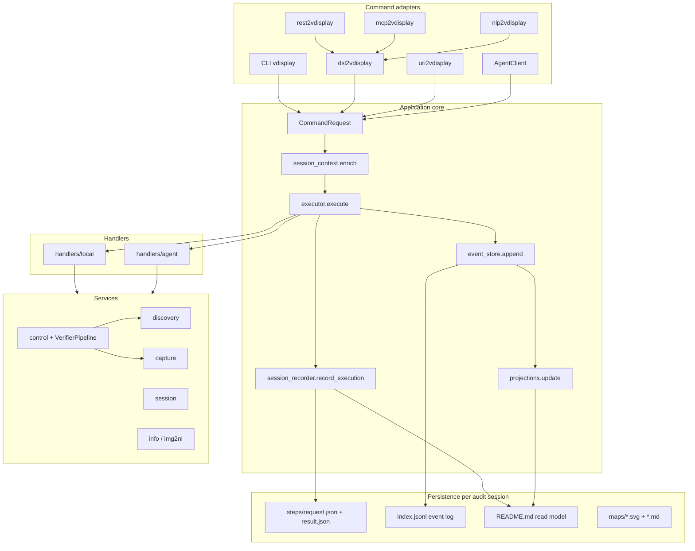
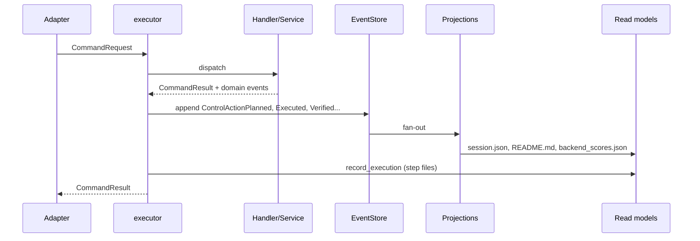
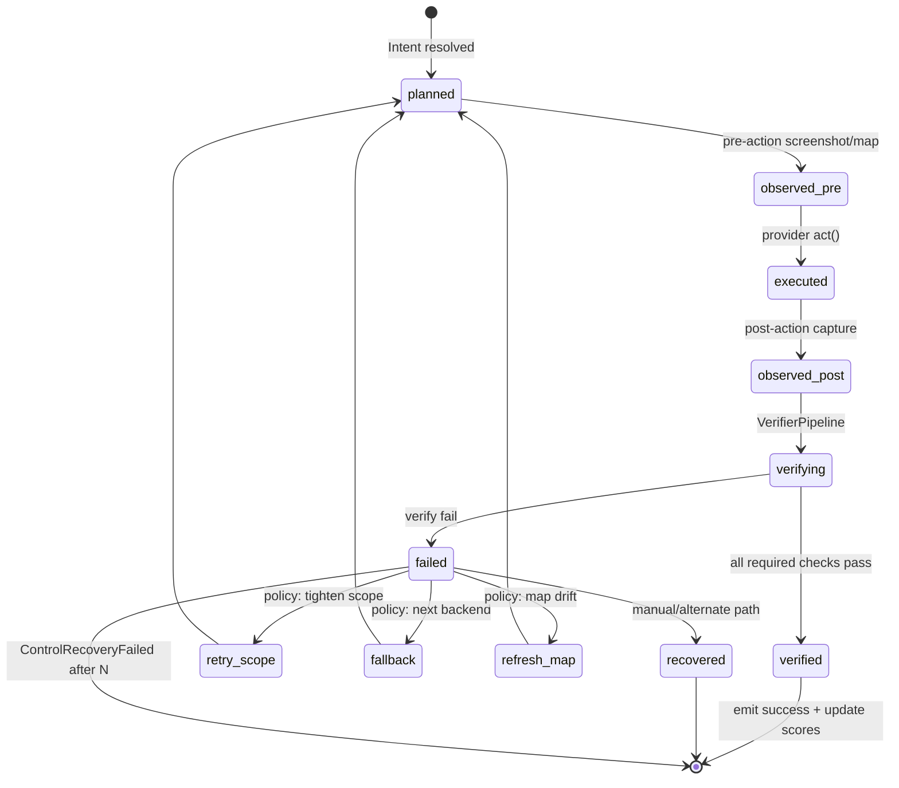

# RFC 002: CQRS/ES evolution, Protobuf envelopes, and control feedback loop

| Field | Value |
|-------|-------|
| Status | **Draft** — builds on session recorder MVP (PR #1) |
| Authors | vdisplay contributors |
| Created | 2026-06-09 |
| Related | [architecture.md](../architecture.md) · [RFC 001](001-extensibility-model.md) · [session-report.md](../guides/session-report.md) |

## Summary

vdisplay is already an **adapter-driven orchestration platform**: CLI, DSL, REST, MCP, NL, and agent broker all normalize to `CommandRequest` and pass through `application.executor`. Session recording MVP (`session_recorder.py`) adds per-step audit folders under `.vdisplay/`.

This RFC describes the next phase:

1. **Event store** layered on top of the existing session recorder (not a parallel subsystem).
2. **Protobuf envelopes** as optional canonical wire format for commands, results, and domain events.
3. **Unified control feedback loop** with explicit action lifecycle, multi-phase verification, policy-driven retry, and backend scoring projections.

## Current state (MVP landed)

Already implemented and hooked in `executor.py`:

| Component | Role |
|-----------|------|
| `application/commands.py` | `CommandRequest`, `CommandResult`, `ArtifactRef`, `session_id`, `request_id` |
| `application/executor.py` | `enrich_command_request` → execute → `extract_diagnostics` → `record_execution` |
| `application/session_recorder.py` | `StepRecord`, `SessionDocument`, `request.json`, `result.json`, `README.md` |
| `application/artifacts.py` | Explicit artifact refs from control/capture payloads |
| `application/session_context.py` | `--session`, `--session-id`, env propagation |
| `commands/session.py` | Root CLI session flags |

Gap vs target: no append-only **event log**, no **replay**, no structured **control lifecycle** events, diagnostics still partially inferred from `result.data` instead of a dedicated `diagnostics.control` block.

---

## Architecture diagram

### Layered orchestration (today + target)



### CQRS/ES flow (target)



### Control feedback loop (target)



---

## Protobuf schemas

Protobuf is **internal-first**: JSON remains the external API for REST/MCP/CLI. Envelopes wrap existing dict payloads during migration.

### Package layout

```text
proto/vdisplay/v1/
  common.proto      # Artifact, TraceContext, Value
  command.proto     # CommandEnvelope, QueryEnvelope
  result.proto      # ResultEnvelope
  event.proto       # DomainEvent + typed bodies
  control.proto     # ControlAction*, Verify*, Routing*
```

### `common.proto`

```protobuf
syntax = "proto3";
package vdisplay.v1;

message TraceContext {
  string session_id = 1;       // audit session slug or UUID folder name
  string request_id = 2;       // per-step UUID
  string correlation_id = 3;   // optional DSL script / agent run id
  string request_source = 4;   // cli | dsl | rest | mcp | nl | agent
  int64 created_at_ms = 5;
}

message Artifact {
  string kind = 1;             // screenshot | preview | diff | map | json
  string path = 2;             // absolute or session-relative
  string label = 3;
  string role = 4;             // before | after | diff | overlay
}

message StringMap {
  map<string, string> values = 1;
}
```

### `command.proto`

```protobuf
syntax = "proto3";
package vdisplay.v1;

import "vdisplay/v1/common.proto";

enum CommandVerb {
  COMMAND_VERB_UNSPECIFIED = 0;
  MONITORS = 1;
  WINDOWS = 2;
  SCREENSHOT = 3;
  CONTROL_CLICK = 4;
  CONTROL_SET_VALUE = 5;
  CONTROL_FOCUS = 6;
  CONTROLS_FIND = 7;
  BROWSER_OPEN = 8;
  TERMINAL_OPEN = 9;
  ADOPT = 10;
  RELEASE = 11;
  // ... extend via reserved ranges
}

message CommandEnvelope {
  TraceContext trace = 1;
  CommandVerb verb = 2;
  string command_line = 3;     // original DSL/CLI line
  StringMap args = 4;          // flat control/capture args
  bytes payload_json = 5;      // full CommandRequest.to_dict() during transition
  string schema_version = 6;   // e.g. "2026-06"
}

message QueryEnvelope {
  TraceContext trace = 1;
  CommandVerb verb = 2;
  StringMap filters = 3;
  bytes payload_json = 4;
}
```

### `result.proto`

```protobuf
syntax = "proto3";
package vdisplay.v1;

import "vdisplay/v1/common.proto";

message ResultEnvelope {
  TraceContext trace = 1;
  bool ok = 2;
  string action = 3;
  string handler = 4;          // local | agent
  bytes payload_json = 5;      // CommandResult.data
  bytes diagnostics_json = 6;  // structured diagnostics.control, routing, verify
  repeated Artifact artifacts = 7;
  ErrorInfo error = 8;
  int32 duration_ms = 9;
}

message ErrorInfo {
  string code = 1;
  string message = 2;
  string details_json = 3;
}
```

### `event.proto`

```protobuf
syntax = "proto3";
package vdisplay.v1;

import "vdisplay/v1/common.proto";

message DomainEvent {
  string event_id = 1;
  TraceContext trace = 2;
  int64 occurred_at_ms = 3;
  string aggregate_type = 4;   // control_action | browser_session | gui_map | capture
  string aggregate_id = 5;     // action_id, session_id, map_id
  string event_type = 6;       // snake_case type name
  uint32 event_version = 7;    // schema version for this event_type
  bytes body_json = 8;         // typed payload; migrate to nested messages later
  repeated Artifact artifacts = 9;
}

// Typed bodies (optional phase 2 — start with body_json only)
message ControlActionPlanned {
  string action_id = 1;
  string verb = 2;             // click | set_value | focus
  string selector_json = 3;
  string map_id = 4;
  string scope_id = 5;
  RoutingDecision routing = 6;
}

message RoutingDecision {
  string requested_backend = 1;
  string selected_provider = 2;
  string verify_provider = 3;
  string verify_mode = 4;
  repeated string why_selected = 5;
  string application_profile = 6;
}

message ControlVerificationCompleted {
  string action_id = 1;
  bool passed = 2;
  float confidence = 3;
  repeated VerifyPhaseResult phases = 4;
}

message VerifyPhaseResult {
  string phase = 1;            // semantic | visual | ocr | layout | session
  bool passed = 2;
  float confidence = 3;
  repeated string reasons = 4;
}
```

### Storage format

Per audit session:

```text
.vdisplay/{session}/
  index.jsonl          # one DomainEvent per line (JSON today, proto base64 optional)
  session.json         # projection: metadata + summary
  README.md            # projection: human timeline
  projections/
    backend_scores.json
    control_state.json
    map_health.json
  steps/...
```

Line format (transition period):

```json
{"event_id":"...","event_type":"ControlActionExecuted","body":{...},"occurred_at_ms":...}
```

Optional `VDISPLAY_EVENT_FORMAT=protobuf` writes length-delimited binary alongside JSONL.

---

## Domain events

### Event catalog

| Event type | Aggregate | When emitted | Key fields |
|------------|-----------|--------------|------------|
| `SessionStarted` | `audit_session` | First `record_execution` in folder | `session_id`, `source`, `host`, `env` |
| `CommandReceived` | `command` | Before handler dispatch | `verb`, `request_source`, `command_line` |
| `CommandCompleted` | `command` | After handler returns | `ok`, `duration_ms`, `handler` |
| `BrowserSessionOpened` | `browser_session` | `BROWSER_OPEN` success | `browser_session_id`, `engine`, `url` |
| `TerminalSessionOpened` | `terminal_session` | `TERMINAL_OPEN` success | `terminal_session_id`, `title` |
| `ScreenshotCaptured` | `capture` | `SCREENSHOT` success | `path`, `monitor`, `source` |
| `WindowAdopted` | `relay_session` | `ADOPT` | `window_id` |
| `WindowReleased` | `relay_session` | `RELEASE` | `window_id` |
| `GuiMapBuilt` | `gui_map` | map build CLI / refresh | `map_id`, `path`, `element_count` |
| `GuiMapDriftDetected` | `gui_map` | diff over threshold | `map_id`, `drift_score`, `changed_targets` |
| `ControlActionPlanned` | `control_action` | After routing, before act | `action_id`, `routing`, `selector`, `map` |
| `ControlPreObservation` | `control_action` | Before act | `screenshot_before`, `map_snapshot` |
| `ControlActionExecuted` | `control_action` | Provider `act()` returned | `provider`, `method`, `coordinates` |
| `ControlPostObservation` | `control_action` | After act | `screenshot_after`, `preview` |
| `ControlVerificationStarted` | `control_action` | VerifierPipeline entry | `phases`, `verify_mode` |
| `ControlVerificationPassed` | `control_action` | All required phases pass | `confidence`, `phase_results` |
| `ControlVerificationFailed` | `control_action` | Any required phase fails | `failed_phases`, `reasons` |
| `ControlRetryScheduled` | `control_action` | Policy chooses retry | `attempt`, `strategy`, `next_provider` |
| `ControlRecoveryFailed` | `control_action` | Exhausted retries | `attempts`, `last_error` |
| `BackendScoreUpdated` | `backend_reliability` | After verified action | `app_profile`, `provider`, `delta` |

### Command → event mapping (control)

| CommandVerb | Minimum events per successful step |
|-------------|--------------------------------------|
| `CONTROLS_FIND` | `CommandReceived`, `CommandCompleted` |
| `CONTROL_CLICK` | `ControlActionPlanned`, `ControlPreObservation`, `ControlActionExecuted`, `ControlPostObservation`, optional verify events, `CommandCompleted` |
| `CONTROL_SET_VALUE` | Same as click + OCR verify phase when `vision` |
| `CONTROL_FOCUS` | Planned + Executed + Completed |

---

## Projections (read models)

| Projection | Source events | Output | Consumer |
|------------|---------------|--------|----------|
| `session_timeline` | All `Command*` + control lifecycle | `README.md`, `session.json` summary | Human review, CI artifacts |
| `latest_control_state_by_session` | `ControlAction*` | `projections/control_state.json` | Agent replanner, CLI `session show` |
| `backend_success_rate_by_app` | `ControlVerification*` + `BackendScoreUpdated` | `projections/backend_scores.json` | Router scoring input |
| `gui_map_health_by_scope` | `GuiMapBuilt`, `GuiMapDriftDetected`, verify layout failures | `projections/map_health.json` | Auto refresh map policy |
| `verification_failure_reasons` | `ControlVerificationFailed` | Aggregated in `session.json` | Debugging, flaky test detection |

### `backend_scores.json` shape (example)

```json
{
  "pycharm@linux_wayland": {
    "atspi": {"success": 12, "fail": 8, "score": 42},
    "vision": {"success": 45, "fail": 3, "score": 91}
  }
}
```

Router reads this file (or in-memory projection) in `evaluate_provider_routing()` as a **prior**, not a hard override.

---

## Control feedback loop design

### Action lifecycle model

New module: `src/vdisplay/control/action_state.py`

```python
class ControlActionPhase(StrEnum):
    PLANNED = "planned"
    OBSERVED_PRE = "observed_pre"
    EXECUTED = "executed"
    OBSERVED_POST = "observed_post"
    VERIFYING = "verifying"
    VERIFIED = "verified"
    FAILED = "failed"
    RETRY_SCHEDULED = "retry_scheduled"
    RECOVERED = "recovered"

@dataclass
class ControlActionState:
    action_id: str
    phase: ControlActionPhase
    attempt: int
    routing: dict[str, Any]
    verify: dict[str, Any]
    artifacts: list[ArtifactRef]
    events: list[str]  # event_ids appended
```

Persisted in `result.diagnostics["control"]` and emitted as domain events.

### Unified verifier pipeline

Extend existing `VerifierPipeline` (`control/verifier.py`) with explicit phases:

| Phase | Backend | Used when |
|-------|---------|-----------|
| `semantic` | atspi / browser / terminal | Native state change, label/value |
| `visual` | screenshot diff | `screenshot_verify` or hybrid |
| `ocr` | vision / img2nl | Text presence after set-value |
| `layout` | gui_map | Target bounds moved/disappeared |
| `session` | browser DOM / terminal grid | Session-scoped targets |

Policy in `control/verify_policy.py`:

```python
def required_phases(action, routing, map_element) -> list[str]: ...
def aggregate_confidence(phase_results) -> float: ...
```

### Retry policy engine

New module: `src/vdisplay/control/retry_policy.py`

```python
@dataclass
class RetryPolicy:
    max_attempts: int = 3
    strategies: tuple[str, ...] = ("retry_scope", "fallback_backend", "refresh_map")

def next_action(state: ControlActionState, failure: VerifyFailure) -> RetryDecision: ...
```

Integration point: `application/services/control.py` wraps `_execute_action` in a loop:

```text
plan → observe_pre → execute → observe_post → verify
  → pass: commit + score update
  → fail: retry_policy.next → replan or ControlRecoveryFailed
```

### Scoped control default

When `--map` / `map_id` present:

1. Resolve target via `gui_map` (existing).
2. Restrict screenshot + OCR to element bounds (+ padding).
3. Layout verify compares map anchor vs post-action detection.

Emit `ControlPreObservation` with scoped region metadata.

### Diagnostics contract

`application/services/control.py` must populate:

```python
diagnostics = {
    "control": {
        "action_id": "...",
        "phase": "verified",
        "attempt": 1,
        "selector": {...},
        "map": {"map_id", "target_id", "scope"},
        "routing": ProviderRoutingDecision.to_dict(),
        "verify": {
            "mode": "hybrid",
            "verified": True,
            "confidence": 0.92,
            "phases": [...],
        },
    }
}
```

`session_recorder.extract_diagnostics()` merges `result.diagnostics` with legacy `result.data.routing` (already partial).

---

## PR implementation plan

### Principles

- **Extend** `session_recorder` + `executor` hook; do not fork a second logging system.
- **JSON first**, Protobuf optional behind env flag.
- **Control diagnostics** before event store (events mirror diagnostics).
- Each PR is independently mergeable with tests.

### Phase map

| Phase | PR | Theme | Depends on |
|-------|-----|-------|------------|
| 0 | #1 (merged) | Session recorder MVP | — |
| 1 | PR-A | Rich control diagnostics | #1 |
| 2 | PR-B | README + DSL dump + map artifacts | PR-A |
| 3 | PR-C | Event store (`index.jsonl`) | PR-A |
| 4 | PR-D | Control lifecycle + retry policy | PR-A, PR-C |
| 5 | PR-E | Projections + backend scoring | PR-C, PR-D |
| 6 | PR-F | Protobuf envelopes (internal) | PR-C |
| 7 | PR-G | Agent session propagation | PR-C |

---

### PR-A: Rich control diagnostics

**Goal:** Session steps show *why* vision beat atspi, full verify drill-down.

| File | Change |
|------|--------|
| `application/services/control.py` | Build `diagnostics["control"]` in `_build_action_payload`; attach full `routing.to_dict()` |
| `application/session_recorder.py` | `extract_diagnostics`: prefer `result.diagnostics`, merge `control` subtree |
| `application/commands.py` | Optional: `CommandResult.diagnostics` populated by handlers (already exists) |
| `tests/test_session_recorder.py` | Assert routing/verify in diagnostics.json |
| `tests/test_control_diagnostics.py` | **new** — mock routing decision in control result |

**New fields in diagnostics (not CommandRequest):**

```python
diagnostics["control"]["action_id"]: str
diagnostics["control"]["phase"]: str
diagnostics["control"]["routing"]: ProviderRoutingDecision dict
diagnostics["control"]["verify"]["phases"]: list[dict]
```

**Commit:**

```text
feat(control): emit structured diagnostics.control for session recorder
```

---

### PR-B: Session report enrichment

**Goal:** README shows decisions, DSL replay, map context.

| File | Change |
|------|--------|
| `application/session_recorder.py` | Write `command.dsl.txt` via `dsl2vdisplay.grammar.to_text` when available |
| `application/session_recorder.py` | Write `diagnostics.json` per step |
| `application/session_recorder.py` | `render_readme`: routing table, verify phases, artifact thumbnails (paths) |
| `application/artifacts.py` | Map artifacts: `map.json`, `map.svg`, `map.md` |
| `application/services/control.py` | Call `gui_map_export.write_map_artifacts` when map used |
| `docs/guides/session-report.md` | Document new files |
| `tests/test_session_recorder.py` | DSL + diagnostics + map sections |

**Commit:**

```text
feat(session): DSL dump, diagnostics.json, and map artifacts in reports
```

---

### PR-C: Event store foundation

**Goal:** Append-only `index.jsonl` from executor.

| File | Change |
|------|--------|
| `application/event_store.py` | **new** — `append(event)`, `read_all(session_root)` |
| `application/events.py` | **new** — event dataclasses + `to_domain_event()` |
| `application/executor.py` | Emit `CommandReceived`, `CommandCompleted` |
| `application/session_recorder.py` | `record_execution` also calls `event_store.append` |
| `tests/test_event_store.py` | **new** |

**New env vars:**

- `VDISPLAY_EVENT_STORE=1` (default on when session recording on)
- `VDISPLAY_EVENT_FORMAT=json|protobuf` (default `json`)

**Commit:**

```text
feat(events): append-only index.jsonl from executor and session recorder
```

---

### PR-D: Control lifecycle + retry policy ✅

**Goal:** Policy-driven retry/fallback with explicit phases.

| File | Change |
|------|--------|
| `control/action_state.py` | **new** — `ControlActionState`, phases |
| `control/retry_policy.py` | **new** — `RetryPolicy`, `next_action()` |
| `control/verify_policy.py` | **new** — `required_phases()` |
| `control/verifier.py` | Return `list[VerifyPhaseResult]` with confidence |
| `application/services/control.py` | Retry loop; emit lifecycle events to event store |
| `application/events.py` | Control event types |
| `tests/test_control_retry_policy.py` | **new** |
| `tests/test_control_action_state.py` | **new** |

**Commit sequence (squash optional):**

1. `feat(control): action lifecycle model and verify phases`
2. `feat(control): retry policy with scope fallback and backend rotation`

---

### PR-E: Projections + backend scoring

**Goal:** Read models for router learning and session inspection.

| File | Change |
|------|--------|
| `application/projections/__init__.py` | **new** |
| `application/projections/session_timeline.py` | Update README/session.json from events |
| `application/projections/backend_scores.py` | **new** |
| `application/projections/control_state.py` | **new** |
| `application/projections/map_health.py` | **new** |
| `control/scoring.py` | Read `backend_scores` prior in routing |
| `commands/session.py` | `vdisplay session show`, `vdisplay session export` |
| `tests/test_projections.py` | **new** |

**Commit:**

```text
feat(projections): backend scores and control state read models
```

---

### PR-F: Protobuf envelopes

**Goal:** Binary transport for agent bus and event export.

| File | Change |
|------|--------|
| `proto/vdisplay/v1/*.proto` | Schemas above |
| `pyproject.toml` | `grpcio-tools` or `betterproto` dev dep |
| `application/proto/codec.py` | **new** — encode/decode envelopes |
| `application/event_store.py` | Optional protobuf lines |
| `packages/vdisplay-agent/.../envelope.py` | Accept `CommandEnvelope` bytes |
| `tests/test_proto_codec.py` | **new** |

**Commit:**

```text
feat(proto): v1 command/result/event envelopes with JSON fallback
```

---

### PR-G: Agent session propagation

**Goal:** Broker executions land in same audit session folder.

| File | Change |
|------|--------|
| `packages/vdisplay-agent/.../routes/session.py` | Forward `audit_session_id` |
| `packages/vdisplay-agent/.../services/sessions.py` | Persist session root hint |
| `application/handlers/agent.py` | Pass `session_id`, `request_id` in broker body |
| `client.py` | Include trace headers |

**Commit:**

```text
feat(agent): propagate audit session metadata through broker
```

---

## Model changes summary

### CommandRequest (already in MVP — no breaking changes)

| Field | Status |
|-------|--------|
| `session_id` | audit session slug |
| `request_id` | per-step UUID |
| `request_source` | adapter name |

### CommandResult (extend)

| Field | PR | Notes |
|-------|-----|-------|
| `diagnostics` | A | Structured; `control` subtree |
| `session_id` | copy from request | Already wired |
| `request_id` | copy from request | Already wired |

### New runtime types (not wire breaking)

| Type | Module |
|------|--------|
| `ControlActionState` | `control/action_state.py` |
| `DomainEvent` | `application/events.py` |
| `RetryDecision` | `control/retry_policy.py` |
| `VerifyPhaseResult` | `control/verifier.py` |

---

## Testing strategy

| Layer | Tests |
|-------|-------|
| Unit | `extract_diagnostics`, event serialization, retry policy, verify phases |
| Integration | CLI `--session` + `control click --verify` → folder contains diagnostics + events |
| Replay | Read `index.jsonl`, rebuild `session.json` summary (no desktop needed) |
| Live (optional) | GTK demo, PyCharm vision — mark `@pytest.mark.live` |

---

## Migration / compatibility

- Session folders without `index.jsonl` remain valid; projections rebuild from `steps/*/result.json`.
- External REST/MCP JSON schemas unchanged until explicit v2.
- `VDISPLAY_EVENT_FORMAT=protobuf` is opt-in; default JSONL for git-friendly diffs.

---

## Open questions

1. **Session root**: keep `.vdisplay/` vs configurable `sessions/` — current code uses `VDISPLAY_SESSION_DIR` (keep).
2. **Event retention**: per-session only vs global aggregator — start per-session.
3. **Score persistence**: global `~/.config/vdisplay/backend_scores.json` vs per-project — start global with session export merge.

---

## Recommended next action

Start **PR-A** (control diagnostics) on branch `feat/session-diagnostics` off `feat/session-recorder`. It unblocks README quality and event payloads without Protobuf complexity.

```bash
git checkout feat/session-recorder
git checkout -b feat/session-diagnostics
# implement PR-A files
pytest tests/test_session_recorder.py tests/test_control_diagnostics.py -q
```
