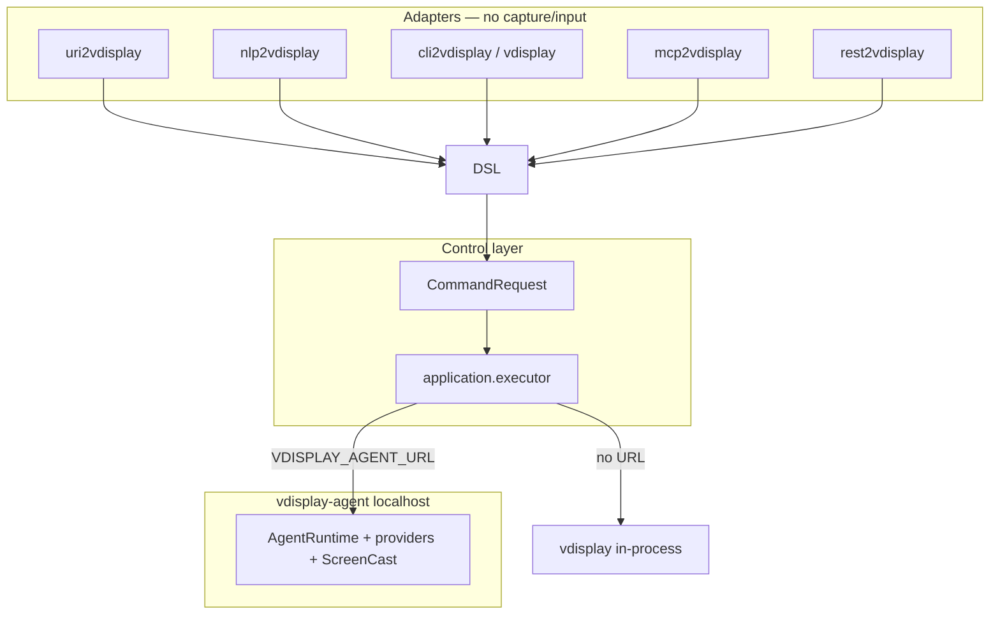

# vdisplay control layer packages

Documentation hub: [docs/index.md](../docs/index.md) · [docs/start-here.md](../docs/start-here.md)

Sterowanie `vdisplay` przez DSL i bus CQRS. Adaptery delegują do `dsl2vdisplay.dispatch()`.

## Packages

| Package | Role | Entry |
|---------|------|-------|
| `dsl2vdisplay` | Grammar + Schema + bus CQRS | `dsl2vdisplay` |
| `vdisplay-agent` | Localhost broker (sessions, capture, discovery) | `vdisplay-agent` |
| `uri2vdisplay` | `vdisplay://cmd/...` → DSL | `uri2vdisplay` |
| `nlp2vdisplay` | NL → DSL | `nlp2vdisplay` |
| `cli2vdisplay` | REPL / exec | `cli2vdisplay` |
| `mcp2vdisplay` | MCP tools | `mcp2vdisplay` |
| `rest2vdisplay` | REST API (port 8216) | `rest2vdisplay` |
| `vdisplay-electron-share` | Optional Electron screen-share manager for GNOME Wayland | `vdisplay electron-share ...` |

## Flow

**Recommended:** run `vdisplay-agent` once, point all adapters at it:

```bash
vdisplay-agent serve --port 8765
export VDISPLAY_AGENT_URL=http://127.0.0.1:8765
```



When `VDISPLAY_AGENT_URL` is set, `dispatch()` → `CommandRequest` → `executor.execute()` routes to the broker via `AgentClient`. Without the URL, the same commands run in-process (development / tests).

Inside the broker, `VDISPLAY_AGENT_BROKER=1` prevents recursive HTTP calls back to itself. See [docs/architecture.md](../docs/architecture.md).

## DSL verbs

**Query:** `HEALTH`, `INFO`, `OUTPUTS`, `MONITORS`, `WINDOWS`, `ALL`, `CAPABILITIES`, `VALIDATE`

**Command:** `SCREENSHOT`, `VIRTUAL_START`, `VIRTUAL_STOP`, `LAUNCH`, `MIRROR`, `ADOPT`, `RELEASE`

## Install

```bash
pip install -e ".[pillow,dev]"
pip install -e "packages/vdisplay-agent[serve]"
pip install -e packages/dsl2vdisplay packages/rest2vdisplay packages/mcp2vdisplay
```

## Output objects (`nl`)

Query responses for monitors and windows include **`nl`** — a natural-language description of their contents. Useful for `nlp2vdisplay` and agent tooling.

The agent `/outputs` endpoint returns monitors **without** window enrichment (fast). Use `/windows` or DSL `ALL` for full state with `nl`.

CLI equivalents:

```bash
vdisplay all
vdisplay monitors
vdisplay windows --apps-only
vdisplay nlp "list monitors on display zero"
dsl2vdisplay -c 'MONITORS DISPLAY :0'   # same JSON as vdisplay monitors
dsl2vdisplay -c 'WINDOWS DISPLAY :0'    # same JSON as vdisplay windows
nlp2vdisplay "list monitors on display zero"              # NL → DSL → JSON
nlp2vdisplay to-dsl --dsl-only "list monitors on display zero"  # DSL only
```

## REST adapter

```bash
export VDISPLAY_AGENT_URL=http://127.0.0.1:8765
rest2vdisplay serve --port 8216 --agent-url $VDISPLAY_AGENT_URL

curl -s http://127.0.0.1:8216/health | jq .
curl -s -X POST http://127.0.0.1:8216/v1/dsl \
  -H 'content-type: application/json' \
  -d '{"verb":"MONITORS"}' | jq .
```

| Route | Method | Description |
|-------|--------|-------------|
| `/health` | GET | Adapter + broker status |
| `/capabilities` | GET | Agent capabilities (503 without URL) |
| `/v1/dsl` | POST | DSL as JSON or `text/plain` |
| `/v1/commands` | POST | Alias for `/v1/dsl` |
| `/v1/schema` | GET | All verb schemas |

## MCP adapter

```bash
export VDISPLAY_AGENT_URL=http://127.0.0.1:8765
mcp2vdisplay serve
```

Tools: `vdisplay_agent_status`, `vdisplay_run_command`, `vdisplay_run_dsl`, `vdisplay_to_dsl`.

## Examples

```bash
# 1. Start broker (install once)
vdisplay-agent serve --port 8765
export VDISPLAY_AGENT_URL=http://127.0.0.1:8765

# 2. Any adapter — same permissions/runtime
dsl2vdisplay -c 'MONITORS'
rest2vdisplay serve --port 8216 --agent-url $VDISPLAY_AGENT_URL
mcp2vdisplay serve
vdisplay monitors
vdisplay virtual screenshot -o /tmp/vd.png
```

Full broker reference: [docs/agent-broker.md](../docs/agent-broker.md) · Guide: [docs/guides/agent-broker.md](../docs/guides/agent-broker.md)

## Electron Share Manager

The Electron manager is an optional GUI capture bridge for Wayland desktops. It
opens a stable app window for the browser/system picker, keeps a compact
always-on-top preview, can hide to tray, and exposes the latest shared frame to
`vdisplay` over localhost.

```bash
vdisplay electron-share start --install --instance pycharm --target "PyCharm chat" --port 8799

export VDISPLAY_ELECTRON_SHARE_URL=http://127.0.0.1:8799
vdisplay screenshot -o /tmp/pycharm.png --source HDMI-1
```

Docs: [../docs/electron-share-manager.md](../docs/electron-share-manager.md) ·
Package README: [vdisplay-electron-share/README.md](vdisplay-electron-share/README.md)
