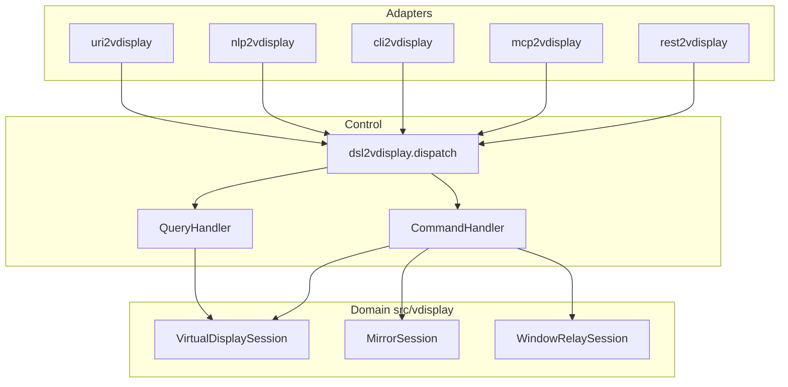

# vdisplay control layer packages

Sterowanie `vdisplay` przez DSL i bus CQRS. Adaptery delegują do `dsl2vdisplay.dispatch()`.

## Packages

| Package | Role | Entry |
|---------|------|-------|
| `dsl2vdisplay` | Grammar + Schema + bus CQRS | `dsl2vdisplay` |
| `uri2vdisplay` | `vdisplay://cmd/...` → DSL | `uri2vdisplay` |
| `nlp2vdisplay` | NL → DSL | `nlp2vdisplay` |
| `cli2vdisplay` | REPL / exec | `cli2vdisplay` |
| `mcp2vdisplay` | MCP tools | `mcp2vdisplay` |
| `rest2vdisplay` | REST API (port 8216) | `rest2vdisplay` |

## Flow



## DSL verbs

**Query:** `HEALTH`, `INFO`, `OUTPUTS`, `WINDOWS`, `CAPABILITIES`, `VALIDATE`

**Command:** `SCREENSHOT`, `VIRTUAL_START`, `VIRTUAL_STOP`, `LAUNCH`, `MIRROR`, `ADOPT`, `RELEASE`

## Install

```bash
pip install -e packages/dsl2vdisplay
pip install -e packages/uri2vdisplay packages/nlp2vdisplay packages/cli2vdisplay
pip install -e "packages/mcp2vdisplay[mcp]" "packages/rest2vdisplay[rest]"
```

## Examples

```bash
dsl2vdisplay -c 'INFO'
dsl2vdisplay -c 'OUTPUTS DISPLAY :0'
cli2vdisplay exec 'SCREENSHOT OUT screen.png DISPLAY :99'
rest2vdisplay serve --port 8216
mcp2vdisplay serve
```
