# System Architecture Analysis
<!-- generated in 0.00s -->

## Overview

- **Project**: /home/tom/github/wronai/vdisplay
- **Primary Language**: python
- **Languages**: python: 113, json: 14, toml: 8, shell: 7, yml: 5
- **Analysis Mode**: static
- **Total Functions**: 579
- **Total Classes**: 36
- **Modules**: 158
- **Entry Points**: 317

## Architecture by Module

### src.vdisplay.api
- **Functions**: 32
- **Classes**: 3
- **File**: `api.py`

### src.vdisplay.capture.portal_screencast
- **Functions**: 30
- **Classes**: 1
- **File**: `portal_screencast.py`

### src.vdisplay.client
- **Functions**: 25
- **Classes**: 1
- **File**: `client.py`

### src.vdisplay.backends.linux_x11_relay
- **Functions**: 24
- **Classes**: 2
- **File**: `linux_x11_relay.py`

### src.vdisplay.capture.linux_xwd
- **Functions**: 21
- **File**: `linux_xwd.py`

### src.vdisplay.backends.linux_x11_mirror
- **Functions**: 17
- **Classes**: 1
- **File**: `linux_x11_mirror.py`

### packages.vdisplay-agent.src.vdisplay_agent.runtime
- **Functions**: 15
- **Classes**: 1
- **File**: `runtime.py`

### src.vdisplay.nlp
- **Functions**: 14
- **File**: `nlp.py`

### src.vdisplay.backends.linux_xvfb
- **Functions**: 14
- **Classes**: 1
- **File**: `linux_xvfb.py`

### src.vdisplay.application.handlers.agent
- **Functions**: 14
- **File**: `agent.py`

### src.vdisplay.discovery
- **Functions**: 13
- **File**: `discovery.py`

### src.vdisplay.application.handlers.local
- **Functions**: 13
- **File**: `local.py`

### packages.dsl2vdisplay.src.dsl2vdisplay.grammar
- **Functions**: 12
- **File**: `grammar.py`

### src.vdisplay.windows.filter
- **Functions**: 12
- **File**: `filter.py`

### src.vdisplay.backends.base
- **Functions**: 11
- **Classes**: 1
- **File**: `base.py`

### src.vdisplay.application.services.session
- **Functions**: 10
- **File**: `session.py`

### packages.vdisplay-agent.src.vdisplay_agent.envelope
- **Functions**: 9
- **File**: `envelope.py`

### packages.vdisplay-agent.src.vdisplay_agent.services.sessions
- **Functions**: 9
- **File**: `sessions.py`

### examples.run_all_examples
- **Functions**: 9
- **File**: `run_all_examples.sh`

### examples.common.screenshot_meta
- **Functions**: 9
- **File**: `screenshot_meta.py`

## Key Entry Points

Main execution flows into the system:

### packages.vdisplay-agent.src.vdisplay_agent.server.create_app
- **Calls**: FastAPI, None.strip, app.get, app.get, app.get, app.get, app.get, app.post

### examples.agent-broker.broker_demo.main
- **Calls**: src.vdisplay.agent_config.resolve_agent_url, AgentClient, print, print, print, client.outputs, print, print

### examples.host-relay.relay_demo.main
- **Calls**: os.environ.get, src.vdisplay.discovery.resolve_host_display, Path, output_dir.mkdir, print, examples.host-relay.relay_demo._capture_phase, WindowRelaySession.create, session.start

### packages.mcp2vdisplay.src.mcp2vdisplay.server.create_server
- **Calls**: FastMCP, app.tool, app.tool, app.tool, app.tool, app.tool, app.tool, app.tool

### src.vdisplay.commands.relay.register
- **Calls**: sub.add_parser, parser.add_subparsers, relay_sub.add_parser, radopt.add_argument, radopt.add_argument, radopt.add_argument, radopt.add_argument, radopt.add_argument

### examples.host-mirror.mirror_demo.main
- **Calls**: Path, output_dir.mkdir, os.environ.get, os.environ.get, src.vdisplay.discovery.diagnose_display, print, src.vdisplay.discovery.list_monitors, src.vdisplay.payloads.all_payload

### examples.ci-agent.agent.main
- **Calls**: Path, output_dir.mkdir, int, int, int, os.environ.get, None.strip, VirtualDisplaySession.create

### src.vdisplay.backends.linux_x11_relay.LinuxX11RelayBackend.adopt_window
- **Calls**: src.vdisplay.backends.linux_x11_relay._window_geometry, src.vdisplay.backends.linux_x11_relay._move_window, WindowState, src.vdisplay.windows.query.find_companion_frames, src.vdisplay.backends.linux_x11_relay._save_stash, CapabilityError, src.vdisplay.backends.linux_x11_relay._window_metadata, src.vdisplay.backends.linux_x11_relay._find_window_id

### src.vdisplay.capture.portal_screencast.PortalScreenCastSession.start
- **Calls**: src.vdisplay.capture.portal_screencast._start_screencast, str, list, payload.get, src.vdisplay.capture.portal_screencast._set_active, payload.get, VDisplayError, int

### src.vdisplay.application.commands.CommandRequest.from_dsl
- **Calls**: None.upper, bool, cls, CommandVerb, cmd.get, str, cmd.get, cmd.get

### src.vdisplay.commands.agent.handle
- **Calls**: VDisplayError, print, uvicorn.run, src.vdisplay.cli_handlers.print_json, src.vdisplay.commands.agent._agent_client, VDisplayError, os.environ.get, int

### src.vdisplay.commands.virtual.register
- **Calls**: sub.add_parser, parser.add_subparsers, virtual_sub.add_parser, vstart.add_argument, vstart.add_argument, vstart.add_argument, vstart.add_argument, vstart.set_defaults

### src.vdisplay.capture.providers.fbdev.FbdevProvider._capture
- **Calls**: src.vdisplay.capture.providers.fbdev._fb_info, io.BytesIO, image.save, buf.getvalue, VDisplayError, Image.frombuffer, max, max

### packages.vdisplay-agent.src.vdisplay_agent.services.windows.list_windows
- **Calls**: filters.get, filters.get, filters.get, discovery.list_windows_local, None.lower, None.strip, int, None.lower

### src.vdisplay.capture.providers.drm.DrmProvider._capture
- **Calls**: src.vdisplay.utils.require_command, src.vdisplay.capture.providers.drm._drm_devices, VDisplayError, VDisplayError, tempfile.NamedTemporaryFile, Path, args.extend, subprocess.run

### packages.vdisplay-agent.src.vdisplay_agent.cli.main
- **Calls**: argparse.ArgumentParser, parser.add_subparsers, sub.add_parser, serve.add_argument, serve.add_argument, serve.add_argument, parser.parse_args, print

### examples.headless-virtual.run_virtual.main
- **Calls**: Path, output_dir.mkdir, int, int, os.environ.get, VirtualDisplaySession.create, session.start, os.environ.get

### src.vdisplay.commands.agent.register
- **Calls**: sub.add_parser, parser.add_subparsers, agent_sub.add_parser, agent_serve.add_argument, agent_serve.add_argument, agent_serve.set_defaults, agent_sub.add_parser, agent_health.set_defaults

### src.vdisplay.application.services.info.platform_info
- **Calls**: VirtualDisplaySession.create, src.vdisplay.capture.linux_xwd._is_wayland_session, src.vdisplay.api.platform_summary, session.capabilities, None.capabilities, None.capabilities, src.vdisplay.discovery.list_outputs, src.vdisplay.agent_config.resolve_agent_url

### packages.cli2vdisplay.src.cli2vdisplay.cli.main
- **Calls**: argparse.ArgumentParser, parser.add_subparsers, sub.add_parser, exec_p.add_argument, sub.add_parser, parser.parse_args, packages.dsl2vdisplay.src.dsl2vdisplay.bus.dispatch, print

### src.vdisplay.commands.mirror.register
- **Calls**: sub.add_parser, parser.add_subparsers, mirror_sub.add_parser, mstart.add_argument, mstart.add_argument, mstart.add_argument, mstart.add_argument, mstart.add_argument

### src.vdisplay.capture.policy.assess_unattended_capture
> Assess host for continuous capture without repeated portal prompts.
- **Calls**: src.vdisplay.discovery.resolve_host_display, src.vdisplay.discovery._looks_like_xvfb_only, src.vdisplay.capture.linux_xwd._is_wayland_session, reasons.append, CaptureCapabilityContract, CaptureCapabilityContract, reasons.extend, CaptureCapabilityContract

### packages.nlp2vdisplay.src.nlp2vdisplay.cli.main
- **Calls**: list, argparse.ArgumentParser, parser.add_subparsers, sub.add_parser, to_dsl.add_argument, to_dsl.add_argument, sub.add_parser, apply_p.add_argument

### packages.vdisplay-agent.src.vdisplay_agent.services.relay.adopt_window
- **Calls**: store.relay_session, relay.adopt_window, body.get, relay.list_adopted, body.get, body.get, body.get, body.get

### src.vdisplay.commands.screenshot.register
- **Calls**: sub.add_parser, src.vdisplay.commands.common.add_display_arg, parser.add_argument, parser.add_argument, parser.add_argument, parser.add_argument, parser.add_argument, parser.add_argument

### src.vdisplay.backends.linux_xvfb.LinuxXvfbBackend._acquire_display
- **Calls**: src.vdisplay.backends.linux_xvfb._probe_display, src.vdisplay.backends.linux_xvfb._display_candidates, BackendNotAvailableError, subprocess.Popen, time.sleep, src.vdisplay.backends.linux_xvfb._probe_display, proc.terminate, proc.wait

### packages.dsl2vdisplay.src.dsl2vdisplay.handlers.command.handle_mirror
- **Calls**: src.vdisplay.discovery.resolve_host_display, src.vdisplay.discovery.list_outputs, packages.dsl2vdisplay.src.dsl2vdisplay.handlers.command._ok, cmd.get, len, packages.dsl2vdisplay.src.dsl2vdisplay.handlers.command._err, session.mirror_start, packages.dsl2vdisplay.src.dsl2vdisplay.handlers.command._err

### packages.dsl2vdisplay.src.dsl2vdisplay.handlers.command.handle_adopt
- **Calls**: packages.dsl2vdisplay.src.dsl2vdisplay.handlers.command._ok, session.relay_adopt, packages.dsl2vdisplay.src.dsl2vdisplay.handlers.command._err, src.vdisplay.discovery.resolve_host_display, cmd.get, cmd.get, cmd.get, cmd.get

### packages.uri2vdisplay.src.uri2vdisplay.cli.main
- **Calls**: argparse.ArgumentParser, parser.add_subparsers, sub.add_parser, dec.add_argument, sub.add_parser, run.add_argument, parser.parse_args, packages.uri2vdisplay.src.uri2vdisplay.decode.uri_to_dsl

### packages.vdisplay-agent.src.vdisplay_agent.services.relay.release_window
- **Calls**: store.relay_session, relay.release_window, body.get, relay.list_adopted, body.get, body.get, body.get, body.get

## Process Flows

Key execution flows identified:

### Flow 1: create_app
```
create_app [packages.vdisplay-agent.src.vdisplay_agent.server]
```

### Flow 2: main
```
main [examples.agent-broker.broker_demo]
  └─ →> resolve_agent_url
      └─> _probe_default_agent
          └─> _probe_agent_url
          └─> _default_agent_base
```

### Flow 3: create_server
```
create_server [packages.mcp2vdisplay.src.mcp2vdisplay.server]
```

### Flow 4: register
```
register [src.vdisplay.commands.relay]
```

### Flow 5: adopt_window
```
adopt_window [src.vdisplay.backends.linux_x11_relay.LinuxX11RelayBackend]
  └─ →> _window_geometry
      └─ →> run_command
  └─ →> _move_window
      └─ →> run_command
  └─ →> find_companion_frames
      └─> list_windows_enriched
          └─> scan_windows
          └─ →> require_command
```

### Flow 6: start
```
start [src.vdisplay.capture.portal_screencast.PortalScreenCastSession]
  └─ →> _start_screencast
      └─> _ensure_portal_deps
      └─> _start_screencast_impl
  └─ →> _set_active
```

### Flow 7: from_dsl
```
from_dsl [src.vdisplay.application.commands.CommandRequest]
```

### Flow 8: handle
```
handle [src.vdisplay.commands.agent]
  └─> _agent_client
      └─ →> resolve_agent_url
          └─> _probe_default_agent
          └─> agent_auto_enabled
  └─ →> print_json
```

### Flow 9: _capture
```
_capture [src.vdisplay.capture.providers.fbdev.FbdevProvider]
  └─ →> _fb_info
```

### Flow 10: list_windows
```
list_windows [packages.vdisplay-agent.src.vdisplay_agent.services.windows]
```

## Key Classes

### src.vdisplay.client.AgentClient
> HTTP client for the local vdisplay-agent broker.
- **Methods**: 24
- **Key Methods**: src.vdisplay.client.AgentClient.__init__, src.vdisplay.client.AgentClient._request, src.vdisplay.client.AgentClient._send, src.vdisplay.client.AgentClient._build_request, src.vdisplay.client.AgentClient._http_error_message, src.vdisplay.client.AgentClient._raise_on_error, src.vdisplay.client.AgentClient._normalize_payload, src.vdisplay.client.AgentClient.request, src.vdisplay.client.AgentClient.health, src.vdisplay.client.AgentClient.capabilities

### packages.vdisplay-agent.src.vdisplay_agent.runtime.AgentRuntime
> Privileged runtime: owns session store and broker services.
- **Methods**: 17
- **Key Methods**: packages.vdisplay-agent.src.vdisplay_agent.runtime.AgentRuntime.sessions, packages.vdisplay-agent.src.vdisplay_agent.runtime.AgentRuntime.relay, packages.vdisplay-agent.src.vdisplay_agent.runtime.AgentRuntime.platform_capabilities, packages.vdisplay-agent.src.vdisplay_agent.runtime.AgentRuntime.diagnostics, packages.vdisplay-agent.src.vdisplay_agent.runtime.AgentRuntime.outputs, packages.vdisplay-agent.src.vdisplay_agent.runtime.AgentRuntime.list_windows, packages.vdisplay-agent.src.vdisplay_agent.runtime.AgentRuntime.start_virtual, packages.vdisplay-agent.src.vdisplay_agent.runtime.AgentRuntime.start_mirror, packages.vdisplay-agent.src.vdisplay_agent.runtime.AgentRuntime.start_relay, packages.vdisplay-agent.src.vdisplay_agent.runtime.AgentRuntime.start_screencast

### src.vdisplay.api.VirtualDisplaySession
- **Methods**: 11
- **Key Methods**: src.vdisplay.api.VirtualDisplaySession.__init__, src.vdisplay.api.VirtualDisplaySession.create, src.vdisplay.api.VirtualDisplaySession.start, src.vdisplay.api.VirtualDisplaySession.stop, src.vdisplay.api.VirtualDisplaySession.launch, src.vdisplay.api.VirtualDisplaySession.screenshot_bytes, src.vdisplay.api.VirtualDisplaySession.save_screenshot, src.vdisplay.api.VirtualDisplaySession.adopt_window, src.vdisplay.api.VirtualDisplaySession.release_window, src.vdisplay.api.VirtualDisplaySession.info

### src.vdisplay.backends.base.BaseBackend
- **Methods**: 11
- **Key Methods**: src.vdisplay.backends.base.BaseBackend.__init__, src.vdisplay.backends.base.BaseBackend.capabilities, src.vdisplay.backends.base.BaseBackend.info, src.vdisplay.backends.base.BaseBackend.start, src.vdisplay.backends.base.BaseBackend.stop, src.vdisplay.backends.base.BaseBackend.launch, src.vdisplay.backends.base.BaseBackend.screenshot_bytes, src.vdisplay.backends.base.BaseBackend.save_screenshot, src.vdisplay.backends.base.BaseBackend.adopt_window, src.vdisplay.backends.base.BaseBackend.release_window

### src.vdisplay.backends.linux_xvfb.LinuxXvfbBackend
- **Methods**: 10
- **Key Methods**: src.vdisplay.backends.linux_xvfb.LinuxXvfbBackend.__init__, src.vdisplay.backends.linux_xvfb.LinuxXvfbBackend.capabilities, src.vdisplay.backends.linux_xvfb.LinuxXvfbBackend.info, src.vdisplay.backends.linux_xvfb.LinuxXvfbBackend.start, src.vdisplay.backends.linux_xvfb.LinuxXvfbBackend.stop, src.vdisplay.backends.linux_xvfb.LinuxXvfbBackend.launch, src.vdisplay.backends.linux_xvfb.LinuxXvfbBackend.screenshot_bytes, src.vdisplay.backends.linux_xvfb.LinuxXvfbBackend.adopt_window, src.vdisplay.backends.linux_xvfb.LinuxXvfbBackend.release_window, src.vdisplay.backends.linux_xvfb.LinuxXvfbBackend._acquire_display
- **Inherits**: BaseBackend

### src.vdisplay.api.WindowRelaySession
- **Methods**: 9
- **Key Methods**: src.vdisplay.api.WindowRelaySession.__init__, src.vdisplay.api.WindowRelaySession.create, src.vdisplay.api.WindowRelaySession.start, src.vdisplay.api.WindowRelaySession.stop, src.vdisplay.api.WindowRelaySession.adopt_window, src.vdisplay.api.WindowRelaySession.release_window, src.vdisplay.api.WindowRelaySession.list_adopted, src.vdisplay.api.WindowRelaySession.info, src.vdisplay.api.WindowRelaySession.capabilities

### src.vdisplay.api.MirrorSession
- **Methods**: 8
- **Key Methods**: src.vdisplay.api.MirrorSession.__init__, src.vdisplay.api.MirrorSession.create, src.vdisplay.api.MirrorSession.start, src.vdisplay.api.MirrorSession.stop, src.vdisplay.api.MirrorSession.screenshot_bytes, src.vdisplay.api.MirrorSession.save_screenshot, src.vdisplay.api.MirrorSession.info, src.vdisplay.api.MirrorSession.capabilities

### src.vdisplay.backends.linux_x11_mirror.LinuxX11MirrorBackend
- **Methods**: 7
- **Key Methods**: src.vdisplay.backends.linux_x11_mirror.LinuxX11MirrorBackend.__init__, src.vdisplay.backends.linux_x11_mirror.LinuxX11MirrorBackend.capabilities, src.vdisplay.backends.linux_x11_mirror.LinuxX11MirrorBackend.info, src.vdisplay.backends.linux_x11_mirror.LinuxX11MirrorBackend.start, src.vdisplay.backends.linux_x11_mirror.LinuxX11MirrorBackend._activate_mirror, src.vdisplay.backends.linux_x11_mirror.LinuxX11MirrorBackend.stop, src.vdisplay.backends.linux_x11_mirror.LinuxX11MirrorBackend.screenshot_bytes
- **Inherits**: BaseBackend

### src.vdisplay.backends.linux_x11_relay.LinuxX11RelayBackend
> Move windows between monitors/outputs within the same X11 session.
- **Methods**: 7
- **Key Methods**: src.vdisplay.backends.linux_x11_relay.LinuxX11RelayBackend.__init__, src.vdisplay.backends.linux_x11_relay.LinuxX11RelayBackend.capabilities, src.vdisplay.backends.linux_x11_relay.LinuxX11RelayBackend.info, src.vdisplay.backends.linux_x11_relay.LinuxX11RelayBackend.start, src.vdisplay.backends.linux_x11_relay.LinuxX11RelayBackend.adopt_window, src.vdisplay.backends.linux_x11_relay.LinuxX11RelayBackend.release_window, src.vdisplay.backends.linux_x11_relay.LinuxX11RelayBackend.list_adopted
- **Inherits**: BaseBackend

### src.vdisplay.input.linux_xdotool.LinuxXdotoolInput
- **Methods**: 6
- **Key Methods**: src.vdisplay.input.linux_xdotool.LinuxXdotoolInput.__init__, src.vdisplay.input.linux_xdotool.LinuxXdotoolInput._env, src.vdisplay.input.linux_xdotool.LinuxXdotoolInput.move, src.vdisplay.input.linux_xdotool.LinuxXdotoolInput.click, src.vdisplay.input.linux_xdotool.LinuxXdotoolInput.type_text, src.vdisplay.input.linux_xdotool.LinuxXdotoolInput.hotkey

### packages.vdisplay-agent.src.vdisplay_agent.session_store.SessionStore
- **Methods**: 5
- **Key Methods**: packages.vdisplay-agent.src.vdisplay_agent.session_store.SessionStore.register, packages.vdisplay-agent.src.vdisplay_agent.session_store.SessionStore.get, packages.vdisplay-agent.src.vdisplay_agent.session_store.SessionStore.pop, packages.vdisplay-agent.src.vdisplay_agent.session_store.SessionStore.relay_session, packages.vdisplay-agent.src.vdisplay_agent.session_store.SessionStore.clear_relay

### src.vdisplay.capture.portal_screencast.PortalScreenCastSession
> Hold an open portal ScreenCast session and grab PNG frames from PipeWire.
- **Methods**: 5
- **Key Methods**: src.vdisplay.capture.portal_screencast.PortalScreenCastSession.is_ready, src.vdisplay.capture.portal_screencast.PortalScreenCastSession.start, src.vdisplay.capture.portal_screencast.PortalScreenCastSession.status, src.vdisplay.capture.portal_screencast.PortalScreenCastSession.capture_png, src.vdisplay.capture.portal_screencast.PortalScreenCastSession.stop

### src.vdisplay.capture.providers.mss.MssProvider
- **Methods**: 5
- **Key Methods**: src.vdisplay.capture.providers.mss.MssProvider.__init__, src.vdisplay.capture.providers.mss.MssProvider.available, src.vdisplay.capture.providers.mss.MssProvider.capture_full, src.vdisplay.capture.providers.mss.MssProvider.capture_region, src.vdisplay.capture.providers.mss.MssProvider._grab

### src.vdisplay.backends.mirror_stub.MirrorStubBackend
- **Methods**: 4
- **Key Methods**: src.vdisplay.backends.mirror_stub.MirrorStubBackend.__init__, src.vdisplay.backends.mirror_stub.MirrorStubBackend.capabilities, src.vdisplay.backends.mirror_stub.MirrorStubBackend.info, src.vdisplay.backends.mirror_stub.MirrorStubBackend.screenshot_bytes
- **Inherits**: BaseBackend

### src.vdisplay.capture.providers.drm.DrmProvider
- **Methods**: 4
- **Key Methods**: src.vdisplay.capture.providers.drm.DrmProvider.available, src.vdisplay.capture.providers.drm.DrmProvider.capture_full, src.vdisplay.capture.providers.drm.DrmProvider.capture_region, src.vdisplay.capture.providers.drm.DrmProvider._capture

### src.vdisplay.capture.providers.fbdev.FbdevProvider
- **Methods**: 4
- **Key Methods**: src.vdisplay.capture.providers.fbdev.FbdevProvider.available, src.vdisplay.capture.providers.fbdev.FbdevProvider.capture_full, src.vdisplay.capture.providers.fbdev.FbdevProvider.capture_region, src.vdisplay.capture.providers.fbdev.FbdevProvider._capture

### src.vdisplay.capture.providers.x11.X11Provider
- **Methods**: 4
- **Key Methods**: src.vdisplay.capture.providers.x11.X11Provider.__init__, src.vdisplay.capture.providers.x11.X11Provider.available, src.vdisplay.capture.providers.x11.X11Provider.capture_full, src.vdisplay.capture.providers.x11.X11Provider.capture_region

### src.vdisplay.application.commands.CommandResult
- **Methods**: 4
- **Key Methods**: src.vdisplay.application.commands.CommandResult.to_dict, src.vdisplay.application.commands.CommandResult.to_dsl_result, src.vdisplay.application.commands.CommandResult.success, src.vdisplay.application.commands.CommandResult.failure

### src.vdisplay.capture.portal.PortalProvider
> Opt-in portal capture (VDISPLAY_CAPTURE_ALLOW_PORTAL=1). Not used by default.
- **Methods**: 3
- **Key Methods**: src.vdisplay.capture.portal.PortalProvider.available, src.vdisplay.capture.portal.PortalProvider.capture_full, src.vdisplay.capture.portal.PortalProvider.capture_region

### src.vdisplay.capture.providers.base.CaptureProvider
- **Methods**: 3
- **Key Methods**: src.vdisplay.capture.providers.base.CaptureProvider.available, src.vdisplay.capture.providers.base.CaptureProvider.capture_full, src.vdisplay.capture.providers.base.CaptureProvider.capture_region
- **Inherits**: Protocol

## Data Transformation Functions

Key functions that process and transform data:

### packages.dsl2vdisplay.src.dsl2vdisplay.schema_registry.validate_command_dict
- **Output to**: None.upper, packages.dsl2vdisplay.src.dsl2vdisplay.schema_registry.schema_for_verb, jsonschema.validate, str, cmd.get

### packages.dsl2vdisplay.src.dsl2vdisplay.grammar._parse_windows
- **Output to**: packages.dsl2vdisplay.src.dsl2vdisplay.grammar._with_display, packages.dsl2vdisplay.src.dsl2vdisplay.grammar.pick_flag

### packages.dsl2vdisplay.src.dsl2vdisplay.grammar._parse_screenshot
- **Output to**: packages.dsl2vdisplay.src.dsl2vdisplay.grammar.pick_flag, packages.dsl2vdisplay.src.dsl2vdisplay.grammar.pick_flag, packages.dsl2vdisplay.src.dsl2vdisplay.grammar.pick_flag, int, packages.dsl2vdisplay.src.dsl2vdisplay.grammar.pick_flag

### packages.dsl2vdisplay.src.dsl2vdisplay.grammar._parse_virtual_start
- **Output to**: packages.dsl2vdisplay.src.dsl2vdisplay.grammar.pick_flag, packages.dsl2vdisplay.src.dsl2vdisplay.grammar.pick_flag, int, packages.dsl2vdisplay.src.dsl2vdisplay.grammar.pick_flag, int

### packages.dsl2vdisplay.src.dsl2vdisplay.grammar._parse_launch
- **Output to**: packages.dsl2vdisplay.src.dsl2vdisplay.grammar.pick_flag, launch.append, cmd.get, str, str

### packages.dsl2vdisplay.src.dsl2vdisplay.grammar._parse_mirror
- **Output to**: packages.dsl2vdisplay.src.dsl2vdisplay.grammar.pick_flag, packages.dsl2vdisplay.src.dsl2vdisplay.grammar.pick_flag, packages.dsl2vdisplay.src.dsl2vdisplay.grammar.pick_flag, packages.dsl2vdisplay.src.dsl2vdisplay.grammar.pick_flag

### packages.dsl2vdisplay.src.dsl2vdisplay.grammar._parse_adopt
- **Output to**: packages.dsl2vdisplay.src.dsl2vdisplay.grammar.pick_flag, packages.dsl2vdisplay.src.dsl2vdisplay.grammar.pick_flag, packages.dsl2vdisplay.src.dsl2vdisplay.grammar.pick_flag, packages.dsl2vdisplay.src.dsl2vdisplay.grammar.pick_flag, packages.dsl2vdisplay.src.dsl2vdisplay.grammar.pick_flag

### packages.dsl2vdisplay.src.dsl2vdisplay.grammar._parse_release
- **Output to**: packages.dsl2vdisplay.src.dsl2vdisplay.grammar.pick_flag, packages.dsl2vdisplay.src.dsl2vdisplay.grammar.pick_flag, packages.dsl2vdisplay.src.dsl2vdisplay.grammar.pick_flag, packages.dsl2vdisplay.src.dsl2vdisplay.grammar.pick_flag

### packages.dsl2vdisplay.src.dsl2vdisplay.grammar.parse_line
- **Output to**: packages.dsl2vdisplay.src.dsl2vdisplay.grammar.split_command, None.upper, _VERB_PARSERS.get, parser

### packages.dsl2vdisplay.src.dsl2vdisplay.handlers.query.handle_validate
- **Output to**: discovery.diagnose, DslResult, shutil.which, shutil.which, shutil.which

### packages.nlp2vdisplay.src.nlp2vdisplay.to_dsl.parse_display
- **Output to**: None.parse_display, __import__

### packages.vdisplay-agent.src.vdisplay_agent.serve_port._parse_ss_pids
- **Output to**: re.finditer, pids.append, int, match.group

### examples.run_all_examples.validate_dir

### examples.common.validate_artifacts.validate_image_and_meta
- **Output to**: examples.common.screenshot_meta.meta_path_for, image_path.exists, meta_path.exists, examples.common.screenshot_meta.png_dimensions, json.loads

### examples.common.validate_artifacts.validate_directory
- **Output to**: sorted, root.glob, errors.extend, examples.common.validate_artifacts.validate_image_and_meta

### src.vdisplay.cli.build_parser
- **Output to**: argparse.ArgumentParser, parser.add_subparsers, src.vdisplay.commands.register_all

### src.vdisplay.nlp.parse_display
- **Output to**: text.lower, re.search, re.search, match.group, match.group

### src.vdisplay.nlp._validate_dsl
- **Output to**: None.strip, src.vdisplay.nlp._display_suffix

### src.vdisplay.discovery._parse_xrandr_query
- **Output to**: src.vdisplay.utils.run_command, result.stdout.splitlines, None.strip, re.match, re.match

### src.vdisplay.capture.linux_xwd._parse_xwd_header
- **Output to**: struct.unpack, src.vdisplay.capture.linux_xwd._header_fields, len, VDisplayError, VDisplayError

### src.vdisplay.capture.linux_xwd._decode_pixels
- **Output to**: bytearray, range, bytes, range, bytes

### src.vdisplay.capture.portal_screencast.invalidate_screencast_session
> Drop a stale ScreenCast session so the next start opens a fresh portal stream.
- **Output to**: src.vdisplay.capture.portal_screencast._set_active, session.stop, src.vdisplay.capture.portal_screencast._set_active_if_self, src.vdisplay.capture.portal_screencast._set_active

### src.vdisplay.capture.portal_screencast._capture_pipewire_frame_gi_subprocess
- **Output to**: src.vdisplay.capture.portal_screencast._system_python, subprocess.run, out.is_file, str, str

### src.vdisplay.capture.portal_screencast._start_screencast_subprocess
- **Output to**: src.vdisplay.capture.portal_screencast._vdisplay_src_path, os.environ.copy, env.setdefault, src.vdisplay.capture.portal_screencast._system_python, None.strip

### src.vdisplay.application.handlers.local._validate
- **Output to**: discovery.diagnose, shutil.which, shutil.which, shutil.which, shutil.which

## Behavioral Patterns

### recursion_enrich_screenshot_payload
- **Type**: recursion
- **Confidence**: 0.90
- **Functions**: src.vdisplay.application.services.img2nl_enrich.enrich_screenshot_payload

## Public API Surface

Functions exposed as public API (no underscore prefix):

- `packages.vdisplay-agent.src.vdisplay_agent.server.create_app` - 103 calls
- `src.vdisplay.capture.host.capture_host_png` - 44 calls
- `packages.rest2vdisplay.src.rest2vdisplay.app.create_app` - 38 calls
- `examples.agent-broker.broker_demo.main` - 35 calls
- `examples.host-relay.relay_demo.main` - 33 calls
- `packages.mcp2vdisplay.src.mcp2vdisplay.server.create_server` - 32 calls
- `src.vdisplay.commands.relay.register` - 32 calls
- `examples.host-mirror.mirror_demo.main` - 31 calls
- `packages.dsl2vdisplay.src.dsl2vdisplay.bus.dispatch` - 27 calls
- `examples.ci-agent.agent.main` - 27 calls
- `src.vdisplay.discovery.list_outputs` - 27 calls
- `src.vdisplay.backends.linux_x11_relay.LinuxX11RelayBackend.adopt_window` - 27 calls
- `src.vdisplay.capture.portal_screencast.PortalScreenCastSession.start` - 26 calls
- `src.vdisplay.application.commands.CommandRequest.from_dsl` - 25 calls
- `src.vdisplay.commands.agent.handle` - 23 calls
- `src.vdisplay.capture.host.capture_all_monitors` - 23 calls
- `examples.common.validate_artifacts.validate_image_and_meta` - 22 calls
- `src.vdisplay.commands.virtual.register` - 22 calls
- `src.vdisplay.windows.query.inspect_window` - 21 calls
- `packages.vdisplay-agent.src.vdisplay_agent.services.windows.list_windows` - 20 calls
- `src.vdisplay.discovery.diagnose_display` - 19 calls
- `packages.vdisplay-agent.src.vdisplay_agent.cli.main` - 18 calls
- `examples.headless-virtual.run_virtual.main` - 18 calls
- `src.vdisplay.nl.window_center_on_output` - 18 calls
- `src.vdisplay.commands.agent.register` - 18 calls
- `src.vdisplay.application.services.info.platform_info` - 17 calls
- `packages.cli2vdisplay.src.cli2vdisplay.cli.main` - 16 calls
- `src.vdisplay.nl.describe_window_nl` - 16 calls
- `src.vdisplay.commands.mirror.register` - 16 calls
- `src.vdisplay.capture.policy.assess_unattended_capture` - 16 calls
- `packages.nlp2vdisplay.src.nlp2vdisplay.cli.main` - 15 calls
- `examples.common.screenshot_meta.describe_screenshot_nl` - 15 calls
- `packages.vdisplay-agent.src.vdisplay_agent.services.relay.adopt_window` - 14 calls
- `src.vdisplay.commands.screenshot.register` - 14 calls
- `src.vdisplay.capture.linux_xwd.is_blank_png` - 14 calls
- `packages.dsl2vdisplay.src.dsl2vdisplay.handlers.command.handle_mirror` - 13 calls
- `packages.dsl2vdisplay.src.dsl2vdisplay.handlers.command.handle_adopt` - 13 calls
- `packages.uri2vdisplay.src.uri2vdisplay.cli.main` - 13 calls
- `packages.vdisplay-agent.src.vdisplay_agent.services.relay.release_window` - 13 calls
- `src.vdisplay.nl.describe_output_nl` - 13 calls

## System Interactions

How components interact:

```mermaid
graph TD
    create_app --> FastAPI
    create_app --> strip
    create_app --> get
    main --> resolve_agent_url
    main --> AgentClient
    main --> print
    main --> get
    main --> resolve_host_display
    main --> Path
    main --> mkdir
    create_server --> FastMCP
    create_server --> tool
    register --> add_parser
    register --> add_subparsers
    register --> add_argument
    main --> diagnose_display
    main --> int
    adopt_window --> _window_geometry
    adopt_window --> _move_window
    adopt_window --> WindowState
    adopt_window --> find_companion_frame
    adopt_window --> _save_stash
    start --> _start_screencast
    start --> str
    start --> list
    start --> get
    start --> _set_active
    from_dsl --> upper
    from_dsl --> bool
    from_dsl --> cls
```



## Reverse Engineering Guidelines

1. **Entry Points**: Start analysis from the entry points listed above
2. **Core Logic**: Focus on classes with many methods
3. **Data Flow**: Follow data transformation functions
4. **Process Flows**: Use the flow diagrams for execution paths
5. **API Surface**: Public API functions reveal the interface

## Context for LLM

Maintain the identified architectural patterns and public API surface when suggesting changes.