# System Architecture Analysis
<!-- generated in 0.00s -->

## Overview

- **Project**: /home/tom/github/wronai/vdisplay
- **Primary Language**: python
- **Languages**: python: 145, json: 20, toml: 8, shell: 7, yml: 5
- **Analysis Mode**: static
- **Total Functions**: 852
- **Total Classes**: 63
- **Modules**: 195
- **Entry Points**: 478

## Architecture by Module

### src.vdisplay.client
- **Functions**: 37
- **Classes**: 1
- **File**: `client.py`

### src.vdisplay.api
- **Functions**: 32
- **Classes**: 3
- **File**: `api.py`

### src.vdisplay.capture.portal_screencast
- **Functions**: 31
- **Classes**: 1
- **File**: `portal_screencast.py`

### src.vdisplay.control.providers.browser_playwright
- **Functions**: 28
- **Classes**: 3
- **File**: `browser_playwright.py`

### packages.vdisplay-agent.src.vdisplay_agent.runtime
- **Functions**: 24
- **Classes**: 1
- **File**: `runtime.py`

### src.vdisplay.backends.linux_x11_relay
- **Functions**: 24
- **Classes**: 2
- **File**: `linux_x11_relay.py`

### packages.dsl2vdisplay.src.dsl2vdisplay.grammar
- **Functions**: 23
- **File**: `grammar.py`

### src.vdisplay.capture.linux_xwd
- **Functions**: 21
- **File**: `linux_xwd.py`

### src.vdisplay.application.handlers.agent
- **Functions**: 20
- **File**: `agent.py`

### src.vdisplay.control.verify
- **Functions**: 19
- **File**: `verify.py`

### src.vdisplay.application.handlers.local
- **Functions**: 19
- **File**: `local.py`

### src.vdisplay.backends.linux_x11_mirror
- **Functions**: 17
- **Classes**: 1
- **File**: `linux_x11_mirror.py`

### src.vdisplay.control.selector
- **Functions**: 17
- **Classes**: 1
- **File**: `selector.py`

### src.vdisplay.control.providers.atspi_impl
- **Functions**: 15
- **File**: `atspi_impl.py`

### src.vdisplay.control.providers.terminal_session
- **Functions**: 15
- **Classes**: 2
- **File**: `terminal_session.py`

### src.vdisplay.nlp
- **Functions**: 14
- **File**: `nlp.py`

### src.vdisplay.backends.linux_xvfb
- **Functions**: 14
- **Classes**: 1
- **File**: `linux_xvfb.py`

### src.vdisplay.control.providers.atspi
- **Functions**: 14
- **Classes**: 1
- **File**: `atspi.py`

### src.vdisplay.control.providers.terminal_screen
- **Functions**: 14
- **Classes**: 3
- **File**: `terminal_screen.py`

### src.vdisplay.discovery
- **Functions**: 13
- **File**: `discovery.py`

## Key Entry Points

Main execution flows into the system:

### src.vdisplay.application.commands.CommandRequest.from_dsl
- **Calls**: None.upper, bool, cls, CommandVerb, cmd.get, str, cmd.get, cmd.get

### packages.vdisplay-agent.src.vdisplay_agent.routes.session.register_routes
- **Calls**: app.post, app.post, app.post, app.post, app.post, app.get, app.post, Header

### packages.vdisplay-agent.src.vdisplay_agent.routes.control.register_routes
- **Calls**: app.get, app.post, app.post, app.post, app.post, app.post, Query, Header

### src.vdisplay.commands.relay.register
- **Calls**: sub.add_parser, parser.add_subparsers, relay_sub.add_parser, radopt.add_argument, radopt.add_argument, radopt.add_argument, radopt.add_argument, radopt.add_argument

### src.vdisplay.commands.control.register
- **Calls**: sub.add_parser, parser.add_subparsers, control_sub.add_parser, src.vdisplay.commands.common.add_display_arg, listing.add_argument, listing.add_argument, listing.add_argument, listing.add_argument

### examples.agent-broker.broker_demo.main
- **Calls**: src.vdisplay.agent_config.resolve_agent_url, AgentClient, print, print, print, client.outputs, print, print

### src.vdisplay.control.providers.atspi_impl.dispatch
- **Calls**: payload.get, RuntimeError, src.vdisplay.control.providers.atspi_impl._atspi, Atspi.init, Atspi.get_desktop, src.vdisplay.control.providers.atspi_impl._resolve_accessible, src.vdisplay.control.providers.atspi_impl._iface, src.vdisplay.control.providers.atspi_impl._atspi_module

### examples.host-relay.relay_demo.main
- **Calls**: os.environ.get, src.vdisplay.discovery.resolve_host_display, Path, output_dir.mkdir, print, examples.host-relay.relay_demo._capture_phase, WindowRelaySession.create, session.start

### packages.mcp2vdisplay.src.mcp2vdisplay.server.create_server
- **Calls**: FastMCP, app.tool, app.tool, app.tool, app.tool, app.tool, app.tool, app.tool

### examples.host-mirror.mirror_demo.main
- **Calls**: Path, output_dir.mkdir, os.environ.get, os.environ.get, src.vdisplay.discovery.diagnose_display, print, src.vdisplay.discovery.list_monitors, src.vdisplay.payloads.all_payload

### src.vdisplay.commands.sampler.handle
- **Calls**: src.vdisplay.agent_config.resolve_agent_url, src.vdisplay.commands.sampler._config_from_args, src.vdisplay.cli_handlers.print_json, src.vdisplay.cli_handlers.print_json, src.vdisplay.cli_handlers.print_json, src.vdisplay.application.services.sampler.start_sampler_via_agent, src.vdisplay.cli_handlers.print_json, src.vdisplay.application.services.sampler.run_sampler

### packages.vdisplay-agent.src.vdisplay_agent.routes.health.register_routes
- **Calls**: app.get, app.get, app.get, app.get, app.get, Header, check_auth, packages.vdisplay-agent.src.vdisplay_agent.envelope.success

### src.vdisplay.control.providers.x11.X11ControlProvider.snapshot
- **Calls**: src.vdisplay.windows.query.find_windows, src.vdisplay.windows.query.pick_best_window, ControlBounds, ControlNode, ControlSnapshot, VDisplayError, int, int

### examples.ci-agent.agent.main
- **Calls**: Path, output_dir.mkdir, int, int, int, os.environ.get, None.strip, VirtualDisplaySession.create

### src.vdisplay.backends.linux_x11_relay.LinuxX11RelayBackend.adopt_window
- **Calls**: src.vdisplay.backends.linux_x11_relay._window_geometry, src.vdisplay.backends.linux_x11_relay._move_window, WindowState, src.vdisplay.windows.query.find_companion_frames, src.vdisplay.backends.linux_x11_relay._save_stash, CapabilityError, src.vdisplay.backends.linux_x11_relay._window_metadata, src.vdisplay.backends.linux_x11_relay._find_window_id

### src.vdisplay.capture.portal_screencast.PortalScreenCastSession.start
- **Calls**: src.vdisplay.capture.portal_screencast._start_screencast, str, list, payload.get, src.vdisplay.capture.portal_screencast._set_active, payload.get, VDisplayError, int

### src.vdisplay.application.services.sampler_loop.SamplerLoop._run
- **Calls**: None.expanduser, out_dir.mkdir, src.vdisplay.application.services.sampler_loop.frame_extension, self._stop.is_set, self._stop.wait, Path, self._capture_fn, src.vdisplay.application.services.sampler_loop.transcode_frame

### src.vdisplay.control.selector.ControlSelector.from_dict
- **Calls**: dict, extra.update, cls, cls.__dataclass_fields__.values, payload.get, payload.get, payload.get, payload.get

### src.vdisplay.commands.agent.handle
- **Calls**: VDisplayError, print, uvicorn.run, src.vdisplay.cli_handlers.print_json, src.vdisplay.commands.agent._agent_client, VDisplayError, os.environ.get, int

### src.vdisplay.commands.sampler.register
- **Calls**: sub.add_parser, parser.add_subparsers, subp.add_parser, src.vdisplay.commands.common.add_display_arg, start.add_argument, start.add_argument, start.add_argument, start.add_argument

### src.vdisplay.commands.virtual.register
- **Calls**: sub.add_parser, parser.add_subparsers, virtual_sub.add_parser, vstart.add_argument, vstart.add_argument, vstart.add_argument, vstart.add_argument, vstart.set_defaults

### src.vdisplay.capture.providers.fbdev.FbdevProvider._capture
- **Calls**: src.vdisplay.capture.providers.fbdev._fb_info, io.BytesIO, image.save, buf.getvalue, VDisplayError, Image.frombuffer, max, max

### src.vdisplay.commands.control.handle
- **Calls**: src.vdisplay.cli_handlers.print_json, src.vdisplay.cli_handlers.print_json, src.vdisplay.cli_handlers.print_json, src.vdisplay.cli_handlers.print_json, src.vdisplay.cli_handlers.print_json, control_svc.controls_list, control_svc.controls_find, control_svc.control_click

### packages.vdisplay-agent.src.vdisplay_agent.services.windows.list_windows
- **Calls**: filters.get, filters.get, filters.get, discovery.list_windows_local, None.lower, None.strip, int, None.lower

### src.vdisplay.commands.agent.register
- **Calls**: sub.add_parser, parser.add_subparsers, agent_sub.add_parser, agent_serve.add_argument, agent_serve.add_argument, agent_serve.set_defaults, agent_sub.add_parser, agent_health.set_defaults

### src.vdisplay.capture.providers.drm.DrmProvider._capture
- **Calls**: src.vdisplay.utils.require_command, src.vdisplay.capture.providers.drm._drm_devices, VDisplayError, VDisplayError, tempfile.NamedTemporaryFile, Path, args.extend, subprocess.run

### packages.vdisplay-agent.src.vdisplay_agent.cli.main
- **Calls**: argparse.ArgumentParser, parser.add_subparsers, sub.add_parser, serve.add_argument, serve.add_argument, serve.add_argument, parser.parse_args, print

### packages.vdisplay-agent.src.vdisplay_agent.routes.sampler.register_routes
- **Calls**: app.post, app.post, app.get, Header, check_auth, Header, check_auth, Header

### examples.headless-virtual.run_virtual.main
- **Calls**: Path, output_dir.mkdir, int, int, os.environ.get, VirtualDisplaySession.create, session.start, os.environ.get

### src.vdisplay.control.models.ElementCapabilities.from_dict
- **Calls**: cls, cls, bool, bool, bool, bool, bool, bool

## Process Flows

Key execution flows identified:

### Flow 1: from_dsl
```
from_dsl [src.vdisplay.application.commands.CommandRequest]
```

### Flow 2: register_routes
```
register_routes [packages.vdisplay-agent.src.vdisplay_agent.routes.session]
```

### Flow 3: register
```
register [src.vdisplay.commands.relay]
```

### Flow 4: main
```
main [examples.agent-broker.broker_demo]
  └─ →> resolve_agent_url
      └─> _probe_default_agent
          └─> _probe_agent_url
          └─> _default_agent_base
```

### Flow 5: dispatch
```
dispatch [src.vdisplay.control.providers.atspi_impl]
  └─> _atspi
```

### Flow 6: create_server
```
create_server [packages.mcp2vdisplay.src.mcp2vdisplay.server]
```

### Flow 7: handle
```
handle [src.vdisplay.commands.sampler]
  └─> _config_from_args
  └─ →> resolve_agent_url
      └─> _probe_default_agent
          └─> _probe_agent_url
          └─> _default_agent_base
  └─ →> print_json
```

### Flow 8: snapshot
```
snapshot [src.vdisplay.control.providers.x11.X11ControlProvider]
  └─ →> find_windows
      └─> list_windows_enriched
          └─> scan_windows
          └─ →> require_command
  └─ →> pick_best_window
      └─ →> pick_largest
```

### Flow 9: adopt_window
```
adopt_window [src.vdisplay.backends.linux_x11_relay.LinuxX11RelayBackend]
  └─ →> _window_geometry
      └─ →> run_command
  └─ →> _move_window
      └─ →> run_command
  └─ →> find_companion_frames
      └─> list_windows_enriched
          └─> scan_windows
          └─ →> require_command
```

### Flow 10: start
```
start [src.vdisplay.capture.portal_screencast.PortalScreenCastSession]
  └─ →> _start_screencast
      └─> _screencast_multiple
      └─> _ensure_portal_deps
  └─ →> _set_active
```

## Key Classes

### src.vdisplay.client.AgentClient
> HTTP client for the local vdisplay-agent broker.
- **Methods**: 33
- **Key Methods**: src.vdisplay.client.AgentClient.__init__, src.vdisplay.client.AgentClient._request, src.vdisplay.client.AgentClient._send, src.vdisplay.client.AgentClient._build_request, src.vdisplay.client.AgentClient._http_error_message, src.vdisplay.client.AgentClient._raise_on_error, src.vdisplay.client.AgentClient._normalize_payload, src.vdisplay.client.AgentClient.request, src.vdisplay.client.AgentClient.health, src.vdisplay.client.AgentClient.capabilities

### packages.vdisplay-agent.src.vdisplay_agent.runtime.AgentRuntime
> Privileged runtime: owns session store and broker services.
- **Methods**: 26
- **Key Methods**: packages.vdisplay-agent.src.vdisplay_agent.runtime.AgentRuntime.sessions, packages.vdisplay-agent.src.vdisplay_agent.runtime.AgentRuntime.relay, packages.vdisplay-agent.src.vdisplay_agent.runtime.AgentRuntime.platform_capabilities, packages.vdisplay-agent.src.vdisplay_agent.runtime.AgentRuntime.diagnostics, packages.vdisplay-agent.src.vdisplay_agent.runtime.AgentRuntime.outputs, packages.vdisplay-agent.src.vdisplay_agent.runtime.AgentRuntime.list_windows, packages.vdisplay-agent.src.vdisplay_agent.runtime.AgentRuntime.start_virtual, packages.vdisplay-agent.src.vdisplay_agent.runtime.AgentRuntime.start_mirror, packages.vdisplay-agent.src.vdisplay_agent.runtime.AgentRuntime.start_relay, packages.vdisplay-agent.src.vdisplay_agent.runtime.AgentRuntime.start_screencast

### src.vdisplay.api.VirtualDisplaySession
- **Methods**: 11
- **Key Methods**: src.vdisplay.api.VirtualDisplaySession.__init__, src.vdisplay.api.VirtualDisplaySession.create, src.vdisplay.api.VirtualDisplaySession.start, src.vdisplay.api.VirtualDisplaySession.stop, src.vdisplay.api.VirtualDisplaySession.launch, src.vdisplay.api.VirtualDisplaySession.screenshot_bytes, src.vdisplay.api.VirtualDisplaySession.save_screenshot, src.vdisplay.api.VirtualDisplaySession.adopt_window, src.vdisplay.api.VirtualDisplaySession.release_window, src.vdisplay.api.VirtualDisplaySession.info

### src.vdisplay.backends.base.BaseBackend
- **Methods**: 11
- **Key Methods**: src.vdisplay.backends.base.BaseBackend.__init__, src.vdisplay.backends.base.BaseBackend.capabilities, src.vdisplay.backends.base.BaseBackend.info, src.vdisplay.backends.base.BaseBackend.start, src.vdisplay.backends.base.BaseBackend.stop, src.vdisplay.backends.base.BaseBackend.launch, src.vdisplay.backends.base.BaseBackend.screenshot_bytes, src.vdisplay.backends.base.BaseBackend.save_screenshot, src.vdisplay.backends.base.BaseBackend.adopt_window, src.vdisplay.backends.base.BaseBackend.release_window

### src.vdisplay.control.providers.browser_playwright.BrowserPlaywrightProvider
- **Methods**: 11
- **Key Methods**: src.vdisplay.control.providers.browser_playwright.BrowserPlaywrightProvider.__init__, src.vdisplay.control.providers.browser_playwright.BrowserPlaywrightProvider.available, src.vdisplay.control.providers.browser_playwright.BrowserPlaywrightProvider._ensure_page, src.vdisplay.control.providers.browser_playwright.BrowserPlaywrightProvider.snapshot, src.vdisplay.control.providers.browser_playwright.BrowserPlaywrightProvider.find, src.vdisplay.control.providers.browser_playwright.BrowserPlaywrightProvider._resolve_element, src.vdisplay.control.providers.browser_playwright.BrowserPlaywrightProvider.invoke, src.vdisplay.control.providers.browser_playwright.BrowserPlaywrightProvider.focus, src.vdisplay.control.providers.browser_playwright.BrowserPlaywrightProvider.set_value, src.vdisplay.control.providers.browser_playwright.BrowserPlaywrightProvider.bounds
- **Inherits**: ControlProvider

### src.vdisplay.backends.linux_xvfb.LinuxXvfbBackend
- **Methods**: 10
- **Key Methods**: src.vdisplay.backends.linux_xvfb.LinuxXvfbBackend.__init__, src.vdisplay.backends.linux_xvfb.LinuxXvfbBackend.capabilities, src.vdisplay.backends.linux_xvfb.LinuxXvfbBackend.info, src.vdisplay.backends.linux_xvfb.LinuxXvfbBackend.start, src.vdisplay.backends.linux_xvfb.LinuxXvfbBackend.stop, src.vdisplay.backends.linux_xvfb.LinuxXvfbBackend.launch, src.vdisplay.backends.linux_xvfb.LinuxXvfbBackend.screenshot_bytes, src.vdisplay.backends.linux_xvfb.LinuxXvfbBackend.adopt_window, src.vdisplay.backends.linux_xvfb.LinuxXvfbBackend.release_window, src.vdisplay.backends.linux_xvfb.LinuxXvfbBackend._acquire_display
- **Inherits**: BaseBackend

### src.vdisplay.control.providers.x11.X11ControlProvider
- **Methods**: 10
- **Key Methods**: src.vdisplay.control.providers.x11.X11ControlProvider.__init__, src.vdisplay.control.providers.x11.X11ControlProvider.available, src.vdisplay.control.providers.x11.X11ControlProvider.snapshot, src.vdisplay.control.providers.x11.X11ControlProvider.find, src.vdisplay.control.providers.x11.X11ControlProvider._node_for, src.vdisplay.control.providers.x11.X11ControlProvider._click_node, src.vdisplay.control.providers.x11.X11ControlProvider.invoke, src.vdisplay.control.providers.x11.X11ControlProvider.focus, src.vdisplay.control.providers.x11.X11ControlProvider.set_value, src.vdisplay.control.providers.x11.X11ControlProvider.bounds
- **Inherits**: ControlProvider

### src.vdisplay.api.WindowRelaySession
- **Methods**: 9
- **Key Methods**: src.vdisplay.api.WindowRelaySession.__init__, src.vdisplay.api.WindowRelaySession.create, src.vdisplay.api.WindowRelaySession.start, src.vdisplay.api.WindowRelaySession.stop, src.vdisplay.api.WindowRelaySession.adopt_window, src.vdisplay.api.WindowRelaySession.release_window, src.vdisplay.api.WindowRelaySession.list_adopted, src.vdisplay.api.WindowRelaySession.info, src.vdisplay.api.WindowRelaySession.capabilities

### src.vdisplay.control.providers.terminal_session.TerminalSessionRegistry
> In-memory registry of open terminal sessions.
- **Methods**: 9
- **Key Methods**: src.vdisplay.control.providers.terminal_session.TerminalSessionRegistry.__init__, src.vdisplay.control.providers.terminal_session.TerminalSessionRegistry.list_ids, src.vdisplay.control.providers.terminal_session.TerminalSessionRegistry.get, src.vdisplay.control.providers.terminal_session.TerminalSessionRegistry.require, src.vdisplay.control.providers.terminal_session.TerminalSessionRegistry.open_mock, src.vdisplay.control.providers.terminal_session.TerminalSessionRegistry.open_process, src.vdisplay.control.providers.terminal_session.TerminalSessionRegistry.open_pexpect, src.vdisplay.control.providers.terminal_session.TerminalSessionRegistry.close, src.vdisplay.control.providers.terminal_session.TerminalSessionRegistry.close_all

### src.vdisplay.control.providers.terminal.TerminalControlProvider
- **Methods**: 9
- **Key Methods**: src.vdisplay.control.providers.terminal.TerminalControlProvider.__init__, src.vdisplay.control.providers.terminal.TerminalControlProvider.available, src.vdisplay.control.providers.terminal.TerminalControlProvider._resolve_session_id, src.vdisplay.control.providers.terminal.TerminalControlProvider.snapshot, src.vdisplay.control.providers.terminal.TerminalControlProvider.find, src.vdisplay.control.providers.terminal.TerminalControlProvider.invoke, src.vdisplay.control.providers.terminal.TerminalControlProvider.focus, src.vdisplay.control.providers.terminal.TerminalControlProvider.set_value, src.vdisplay.control.providers.terminal.TerminalControlProvider.bounds
- **Inherits**: ControlProvider

### src.vdisplay.api.MirrorSession
- **Methods**: 8
- **Key Methods**: src.vdisplay.api.MirrorSession.__init__, src.vdisplay.api.MirrorSession.create, src.vdisplay.api.MirrorSession.start, src.vdisplay.api.MirrorSession.stop, src.vdisplay.api.MirrorSession.screenshot_bytes, src.vdisplay.api.MirrorSession.save_screenshot, src.vdisplay.api.MirrorSession.info, src.vdisplay.api.MirrorSession.capabilities

### src.vdisplay.control.providers.atspi.AtspiControlProvider
- **Methods**: 8
- **Key Methods**: src.vdisplay.control.providers.atspi.AtspiControlProvider.__init__, src.vdisplay.control.providers.atspi.AtspiControlProvider.available, src.vdisplay.control.providers.atspi.AtspiControlProvider.snapshot, src.vdisplay.control.providers.atspi.AtspiControlProvider.find, src.vdisplay.control.providers.atspi.AtspiControlProvider.invoke, src.vdisplay.control.providers.atspi.AtspiControlProvider.focus, src.vdisplay.control.providers.atspi.AtspiControlProvider.set_value, src.vdisplay.control.providers.atspi.AtspiControlProvider.bounds
- **Inherits**: ControlProvider

### src.vdisplay.control.providers.terminal_screen.ScreenBuffer
> Mutable terminal screen fed by PTY output bytes.
- **Methods**: 8
- **Key Methods**: src.vdisplay.control.providers.terminal_screen.ScreenBuffer.__init__, src.vdisplay.control.providers.terminal_screen.ScreenBuffer._init_pyte, src.vdisplay.control.providers.terminal_screen.ScreenBuffer.resize, src.vdisplay.control.providers.terminal_screen.ScreenBuffer.feed, src.vdisplay.control.providers.terminal_screen.ScreenBuffer._sync_from_pyte, src.vdisplay.control.providers.terminal_screen.ScreenBuffer._feed_simple, src.vdisplay.control.providers.terminal_screen.ScreenBuffer.set_lines, src.vdisplay.control.providers.terminal_screen.ScreenBuffer.snapshot

### src.vdisplay.backends.linux_x11_mirror.LinuxX11MirrorBackend
- **Methods**: 7
- **Key Methods**: src.vdisplay.backends.linux_x11_mirror.LinuxX11MirrorBackend.__init__, src.vdisplay.backends.linux_x11_mirror.LinuxX11MirrorBackend.capabilities, src.vdisplay.backends.linux_x11_mirror.LinuxX11MirrorBackend.info, src.vdisplay.backends.linux_x11_mirror.LinuxX11MirrorBackend.start, src.vdisplay.backends.linux_x11_mirror.LinuxX11MirrorBackend._activate_mirror, src.vdisplay.backends.linux_x11_mirror.LinuxX11MirrorBackend.stop, src.vdisplay.backends.linux_x11_mirror.LinuxX11MirrorBackend.screenshot_bytes
- **Inherits**: BaseBackend

### src.vdisplay.backends.linux_x11_relay.LinuxX11RelayBackend
> Move windows between monitors/outputs within the same X11 session.
- **Methods**: 7
- **Key Methods**: src.vdisplay.backends.linux_x11_relay.LinuxX11RelayBackend.__init__, src.vdisplay.backends.linux_x11_relay.LinuxX11RelayBackend.capabilities, src.vdisplay.backends.linux_x11_relay.LinuxX11RelayBackend.info, src.vdisplay.backends.linux_x11_relay.LinuxX11RelayBackend.start, src.vdisplay.backends.linux_x11_relay.LinuxX11RelayBackend.adopt_window, src.vdisplay.backends.linux_x11_relay.LinuxX11RelayBackend.release_window, src.vdisplay.backends.linux_x11_relay.LinuxX11RelayBackend.list_adopted
- **Inherits**: BaseBackend

### src.vdisplay.control.base.ControlProvider
- **Methods**: 7
- **Key Methods**: src.vdisplay.control.base.ControlProvider.available, src.vdisplay.control.base.ControlProvider.snapshot, src.vdisplay.control.base.ControlProvider.find, src.vdisplay.control.base.ControlProvider.invoke, src.vdisplay.control.base.ControlProvider.focus, src.vdisplay.control.base.ControlProvider.set_value, src.vdisplay.control.base.ControlProvider.bounds
- **Inherits**: ABC

### src.vdisplay.control.providers.browser_playwright._ElementLike
- **Methods**: 7
- **Key Methods**: src.vdisplay.control.providers.browser_playwright._ElementLike.evaluate, src.vdisplay.control.providers.browser_playwright._ElementLike.bounding_box, src.vdisplay.control.providers.browser_playwright._ElementLike.inner_text, src.vdisplay.control.providers.browser_playwright._ElementLike.get_attribute, src.vdisplay.control.providers.browser_playwright._ElementLike.click, src.vdisplay.control.providers.browser_playwright._ElementLike.fill, src.vdisplay.control.providers.browser_playwright._ElementLike.focus
- **Inherits**: Protocol

### src.vdisplay.input.linux_xdotool.LinuxXdotoolInput
- **Methods**: 6
- **Key Methods**: src.vdisplay.input.linux_xdotool.LinuxXdotoolInput.__init__, src.vdisplay.input.linux_xdotool.LinuxXdotoolInput._env, src.vdisplay.input.linux_xdotool.LinuxXdotoolInput.move, src.vdisplay.input.linux_xdotool.LinuxXdotoolInput.click, src.vdisplay.input.linux_xdotool.LinuxXdotoolInput.type_text, src.vdisplay.input.linux_xdotool.LinuxXdotoolInput.hotkey

### packages.vdisplay-agent.src.vdisplay_agent.session_store.SessionStore
- **Methods**: 5
- **Key Methods**: packages.vdisplay-agent.src.vdisplay_agent.session_store.SessionStore.register, packages.vdisplay-agent.src.vdisplay_agent.session_store.SessionStore.get, packages.vdisplay-agent.src.vdisplay_agent.session_store.SessionStore.pop, packages.vdisplay-agent.src.vdisplay_agent.session_store.SessionStore.relay_session, packages.vdisplay-agent.src.vdisplay_agent.session_store.SessionStore.clear_relay

### src.vdisplay.capture.portal_screencast.PortalScreenCastSession
> Hold an open portal ScreenCast session and grab PNG frames from PipeWire.
- **Methods**: 5
- **Key Methods**: src.vdisplay.capture.portal_screencast.PortalScreenCastSession.is_ready, src.vdisplay.capture.portal_screencast.PortalScreenCastSession.start, src.vdisplay.capture.portal_screencast.PortalScreenCastSession.status, src.vdisplay.capture.portal_screencast.PortalScreenCastSession.capture_png, src.vdisplay.capture.portal_screencast.PortalScreenCastSession.stop

## Data Transformation Functions

Key functions that process and transform data:

### packages.dsl2vdisplay.src.dsl2vdisplay.schema_registry.validate_command_dict
- **Output to**: None.upper, packages.dsl2vdisplay.src.dsl2vdisplay.schema_registry.schema_for_verb, jsonschema.validate, str, cmd.get

### packages.dsl2vdisplay.src.dsl2vdisplay.grammar._parse_windows
- **Output to**: packages.dsl2vdisplay.src.dsl2vdisplay.grammar._with_display, packages.dsl2vdisplay.src.dsl2vdisplay.grammar.pick_flag

### packages.dsl2vdisplay.src.dsl2vdisplay.grammar._parse_screenshot
- **Output to**: packages.dsl2vdisplay.src.dsl2vdisplay.grammar.pick_flag, packages.dsl2vdisplay.src.dsl2vdisplay.grammar.pick_flag, packages.dsl2vdisplay.src.dsl2vdisplay.grammar.pick_flag, int, packages.dsl2vdisplay.src.dsl2vdisplay.grammar.pick_flag

### packages.dsl2vdisplay.src.dsl2vdisplay.grammar._parse_virtual_start
- **Output to**: packages.dsl2vdisplay.src.dsl2vdisplay.grammar.pick_flag, packages.dsl2vdisplay.src.dsl2vdisplay.grammar.pick_flag, int, packages.dsl2vdisplay.src.dsl2vdisplay.grammar.pick_flag, int

### packages.dsl2vdisplay.src.dsl2vdisplay.grammar._parse_launch
- **Output to**: packages.dsl2vdisplay.src.dsl2vdisplay.grammar.pick_flag, launch.append, cmd.get, str, str

### packages.dsl2vdisplay.src.dsl2vdisplay.grammar._parse_mirror
- **Output to**: packages.dsl2vdisplay.src.dsl2vdisplay.grammar.pick_flag, packages.dsl2vdisplay.src.dsl2vdisplay.grammar.pick_flag, packages.dsl2vdisplay.src.dsl2vdisplay.grammar.pick_flag, packages.dsl2vdisplay.src.dsl2vdisplay.grammar.pick_flag

### packages.dsl2vdisplay.src.dsl2vdisplay.grammar._parse_adopt
- **Output to**: packages.dsl2vdisplay.src.dsl2vdisplay.grammar.pick_flag, packages.dsl2vdisplay.src.dsl2vdisplay.grammar.pick_flag, packages.dsl2vdisplay.src.dsl2vdisplay.grammar.pick_flag, packages.dsl2vdisplay.src.dsl2vdisplay.grammar.pick_flag, packages.dsl2vdisplay.src.dsl2vdisplay.grammar.pick_flag

### packages.dsl2vdisplay.src.dsl2vdisplay.grammar._parse_control_common
- **Output to**: packages.dsl2vdisplay.src.dsl2vdisplay.grammar._with_display, packages.dsl2vdisplay.src.dsl2vdisplay.grammar._has_flag, packages.dsl2vdisplay.src.dsl2vdisplay.grammar._has_flag, packages.dsl2vdisplay.src.dsl2vdisplay.grammar.pick_flag, packages.dsl2vdisplay.src.dsl2vdisplay.grammar.pick_flag

### packages.dsl2vdisplay.src.dsl2vdisplay.grammar._parse_controls_list
- **Output to**: packages.dsl2vdisplay.src.dsl2vdisplay.grammar._parse_control_common, packages.dsl2vdisplay.src.dsl2vdisplay.grammar.pick_flag, int, packages.dsl2vdisplay.src.dsl2vdisplay.grammar.pick_flag

### packages.dsl2vdisplay.src.dsl2vdisplay.grammar._parse_controls_find
- **Output to**: packages.dsl2vdisplay.src.dsl2vdisplay.grammar._parse_control_common

### packages.dsl2vdisplay.src.dsl2vdisplay.grammar._parse_control_click
- **Output to**: packages.dsl2vdisplay.src.dsl2vdisplay.grammar._parse_control_common

### packages.dsl2vdisplay.src.dsl2vdisplay.grammar._parse_control_focus
- **Output to**: packages.dsl2vdisplay.src.dsl2vdisplay.grammar._parse_control_common

### packages.dsl2vdisplay.src.dsl2vdisplay.grammar._parse_control_set_value
- **Output to**: packages.dsl2vdisplay.src.dsl2vdisplay.grammar._parse_control_common, packages.dsl2vdisplay.src.dsl2vdisplay.grammar.pick_flag

### packages.dsl2vdisplay.src.dsl2vdisplay.grammar._parse_diagnose_control
- **Output to**: packages.dsl2vdisplay.src.dsl2vdisplay.grammar._with_display

### packages.dsl2vdisplay.src.dsl2vdisplay.grammar._parse_release
- **Output to**: packages.dsl2vdisplay.src.dsl2vdisplay.grammar.pick_flag, packages.dsl2vdisplay.src.dsl2vdisplay.grammar.pick_flag, packages.dsl2vdisplay.src.dsl2vdisplay.grammar.pick_flag, packages.dsl2vdisplay.src.dsl2vdisplay.grammar.pick_flag

### packages.dsl2vdisplay.src.dsl2vdisplay.grammar.parse_line
- **Output to**: packages.dsl2vdisplay.src.dsl2vdisplay.grammar.split_command, packages.dsl2vdisplay.src.dsl2vdisplay.grammar.resolve_verb, _VERB_PARSERS.get, parser

### packages.dsl2vdisplay.src.dsl2vdisplay.handlers.query.handle_validate
- **Output to**: discovery.diagnose, DslResult, shutil.which, shutil.which, shutil.which

### packages.nlp2vdisplay.src.nlp2vdisplay.to_dsl.parse_display
- **Output to**: None.parse_display, __import__

### packages.vdisplay-agent.src.vdisplay_agent.serve_port._parse_ss_pids
- **Output to**: re.finditer, pids.append, int, match.group

### examples.run_all_examples.validate_dir

### examples.common.validate_artifacts.validate_image_and_meta
- **Output to**: examples.common.screenshot_meta.meta_path_for, image_path.exists, meta_path.exists, examples.common.screenshot_meta.png_dimensions, json.loads

### examples.common.validate_artifacts.validate_directory
- **Output to**: sorted, root.glob, errors.extend, examples.common.validate_artifacts.validate_image_and_meta

### src.vdisplay.cli.build_parser
- **Output to**: argparse.ArgumentParser, parser.add_subparsers, src.vdisplay.commands.register_all

### src.vdisplay.nlp.parse_display
- **Output to**: text.lower, re.search, re.search, match.group, match.group

### src.vdisplay.nlp._validate_dsl
- **Output to**: None.strip, src.vdisplay.nlp._display_suffix

## Behavioral Patterns

### recursion_enrich_screenshot_payload
- **Type**: recursion
- **Confidence**: 0.90
- **Functions**: src.vdisplay.application.services.img2nl_enrich.enrich_screenshot_payload

## Public API Surface

Functions exposed as public API (no underscore prefix):

- `src.vdisplay.application.commands.CommandRequest.from_dsl` - 49 calls
- `packages.vdisplay-agent.src.vdisplay_agent.routes.session.register_routes` - 47 calls
- `src.vdisplay.capture.host.capture_host_png` - 44 calls
- `packages.rest2vdisplay.src.rest2vdisplay.app.create_app` - 38 calls
- `packages.vdisplay-agent.src.vdisplay_agent.routes.control.register_routes` - 37 calls
- `src.vdisplay.commands.relay.register` - 37 calls
- `src.vdisplay.commands.control.register` - 37 calls
- `examples.agent-broker.broker_demo.main` - 35 calls
- `src.vdisplay.control.providers.atspi_impl.dispatch` - 34 calls
- `src.vdisplay.control.selector.parse_selector` - 34 calls
- `examples.host-relay.relay_demo.main` - 33 calls
- `packages.mcp2vdisplay.src.mcp2vdisplay.server.create_server` - 32 calls
- `examples.host-mirror.mirror_demo.main` - 31 calls
- `src.vdisplay.commands.sampler.handle` - 30 calls
- `packages.vdisplay-agent.src.vdisplay_agent.routes.health.register_routes` - 28 calls
- `src.vdisplay.control.providers.x11.X11ControlProvider.snapshot` - 28 calls
- `packages.dsl2vdisplay.src.dsl2vdisplay.bus.dispatch` - 27 calls
- `examples.ci-agent.agent.main` - 27 calls
- `src.vdisplay.discovery.list_outputs` - 27 calls
- `src.vdisplay.backends.linux_x11_relay.LinuxX11RelayBackend.adopt_window` - 27 calls
- `src.vdisplay.control.providers.atspi_impl.snapshot_dict` - 26 calls
- `src.vdisplay.capture.portal_screencast.PortalScreenCastSession.start` - 26 calls
- `src.vdisplay.control.selector.ControlSelector.from_dict` - 26 calls
- `src.vdisplay.capture.host.resolve_window_region` - 24 calls
- `src.vdisplay.commands.agent.handle` - 23 calls
- `src.vdisplay.capture.host.capture_all_monitors` - 23 calls
- `examples.common.validate_artifacts.validate_image_and_meta` - 22 calls
- `src.vdisplay.commands.sampler.register` - 22 calls
- `src.vdisplay.commands.virtual.register` - 22 calls
- `packages.dsl2vdisplay.src.dsl2vdisplay.grammar.to_text` - 21 calls
- `src.vdisplay.windows.query.inspect_window` - 21 calls
- `src.vdisplay.commands.control.handle` - 21 calls
- `packages.vdisplay-agent.src.vdisplay_agent.services.windows.list_windows` - 20 calls
- `src.vdisplay.control.engine.resolve_provider` - 20 calls
- `src.vdisplay.discovery.diagnose_display` - 19 calls
- `src.vdisplay.commands.agent.register` - 19 calls
- `src.vdisplay.control.verify.diff_snapshots` - 19 calls
- `src.vdisplay.capture.policy.assess_unattended_capture` - 19 calls
- `packages.vdisplay-agent.src.vdisplay_agent.cli.main` - 18 calls
- `packages.vdisplay-agent.src.vdisplay_agent.routes.sampler.register_routes` - 18 calls

## System Interactions

How components interact:

```mermaid
graph TD
    from_dsl --> upper
    from_dsl --> bool
    from_dsl --> cls
    from_dsl --> CommandVerb
    from_dsl --> get
    register_routes --> post
    register_routes --> get
    register --> add_parser
    register --> add_subparsers
    register --> add_argument
    register --> add_display_arg
    main --> resolve_agent_url
    main --> AgentClient
    main --> print
    dispatch --> get
    dispatch --> RuntimeError
    dispatch --> _atspi
    dispatch --> init
    dispatch --> get_desktop
    main --> get
    main --> resolve_host_display
    main --> Path
    main --> mkdir
    create_server --> FastMCP
    create_server --> tool
    main --> diagnose_display
    handle --> resolve_agent_url
    handle --> _config_from_args
    handle --> print_json
    snapshot --> find_windows
```



## Reverse Engineering Guidelines

1. **Entry Points**: Start analysis from the entry points listed above
2. **Core Logic**: Focus on classes with many methods
3. **Data Flow**: Follow data transformation functions
4. **Process Flows**: Use the flow diagrams for execution paths
5. **API Surface**: Public API functions reveal the interface

## Context for LLM

Maintain the identified architectural patterns and public API surface when suggesting changes.