# System Architecture Analysis
<!-- generated in 0.00s -->

## Overview

- **Project**: /home/tom/github/wronai/vdisplay
- **Primary Language**: python
- **Languages**: python: 17, shell: 2, yaml: 1, toml: 1
- **Analysis Mode**: static
- **Total Functions**: 104
- **Total Classes**: 16
- **Modules**: 21
- **Entry Points**: 74

## Architecture by Module

### src.vdisplay.api
- **Functions**: 32
- **Classes**: 3
- **File**: `api.py`

### src.vdisplay.backends.linux_x11_relay
- **Functions**: 14
- **Classes**: 2
- **File**: `linux_x11_relay.py`

### src.vdisplay.backends.base
- **Functions**: 11
- **Classes**: 1
- **File**: `base.py`

### src.vdisplay.backends.linux_x11_mirror
- **Functions**: 10
- **Classes**: 1
- **File**: `linux_x11_mirror.py`

### src.vdisplay.backends.linux_xvfb
- **Functions**: 10
- **Classes**: 1
- **File**: `linux_xvfb.py`

### src.vdisplay.capture.linux_xwd
- **Functions**: 10
- **File**: `linux_xwd.py`

### src.vdisplay.input.linux_xdotool
- **Functions**: 6
- **Classes**: 1
- **File**: `linux_xdotool.py`

### src.vdisplay.backends.mirror_stub
- **Functions**: 4
- **Classes**: 1
- **File**: `mirror_stub.py`

### src.vdisplay.cli
- **Functions**: 3
- **File**: `cli.py`

### src.vdisplay.utils
- **Functions**: 3
- **File**: `utils.py`

### src.vdisplay.capture.base
- **Functions**: 1
- **Classes**: 1
- **File**: `base.py`

### src.vdisplay.exceptions
- **Functions**: 0
- **Classes**: 3
- **File**: `exceptions.py`

### src.vdisplay.models
- **Functions**: 0
- **Classes**: 2
- **File**: `models.py`

## Key Entry Points

Main execution flows into the system:

### src.vdisplay.cli.main
- **Calls**: src.vdisplay.cli.build_parser, parser.parse_args, parser.error, VirtualDisplaySession.create, src.vdisplay.cli._print_json, VirtualDisplaySession.create, MirrorSession.create, WindowRelaySession.create

### src.vdisplay.backends.linux_x11_relay.LinuxX11RelayBackend.release_window
- **Calls**: self._adopted.get, src.vdisplay.utils.run_command, src.vdisplay.utils.run_command, CapabilityError, self._adopted.values, src.vdisplay.backends.linux_x11_relay._find_window_id, VDisplayError, str

### src.vdisplay.backends.linux_x11_relay.LinuxX11RelayBackend.adopt_window
- **Calls**: src.vdisplay.backends.linux_x11_relay._window_geometry, src.vdisplay.backends.linux_x11_relay._window_title, src.vdisplay.utils.run_command, WindowState, CapabilityError, src.vdisplay.backends.linux_x11_relay._find_window_id, src.vdisplay.backends.linux_x11_relay._offscreen_coordinates, src.vdisplay.backends.linux_x11_relay._output_origin

### src.vdisplay.backends.linux_x11_mirror.LinuxX11MirrorBackend.start
- **Calls**: src.vdisplay.backends.linux_x11_mirror._list_connected_outputs, src.vdisplay.backends.linux_x11_mirror._resolve_output, src.vdisplay.backends.linux_x11_mirror._output_mode, src.vdisplay.utils.run_command, shutil.which, BackendNotAvailableError, BackendNotAvailableError, src.vdisplay.backends.linux_x11_mirror._resolve_output

### src.vdisplay.api.MirrorSession.create
- **Calls**: BackendNotAvailableError, src.vdisplay.api._default_mirror_backend, cls, cls, sys.platform.startswith, BackendNotAvailableError, LinuxX11MirrorBackend, MirrorStubBackend

### src.vdisplay.backends.linux_x11_relay._debug_windows
- **Calls**: src.vdisplay.utils.run_command, result.stdout.splitlines, json.dumps, wid.strip, payload.append, src.vdisplay.backends.linux_x11_relay._window_title, src.vdisplay.backends.linux_x11_relay._window_geometry

### src.vdisplay.api.VirtualDisplaySession.create
- **Calls**: BackendNotAvailableError, src.vdisplay.api._default_virtual_backend, cls, sys.platform.startswith, BackendNotAvailableError, LinuxXvfbBackend

### src.vdisplay.api.WindowRelaySession.create
- **Calls**: BackendNotAvailableError, src.vdisplay.api._default_relay_backend, cls, sys.platform.startswith, BackendNotAvailableError, LinuxX11RelayBackend

### src.vdisplay.input.linux_xdotool.LinuxXdotoolInput.move
- **Calls**: src.vdisplay.utils.require_command, src.vdisplay.utils.run_command, str, str, self._env

### src.vdisplay.backends.linux_x11_mirror.LinuxX11MirrorBackend.__init__
- **Calls**: None.__init__, LinuxXdotoolInput, os.environ.get, super

### src.vdisplay.backends.linux_xvfb.LinuxXvfbBackend.start
- **Calls**: subprocess.Popen, src.vdisplay.backends.linux_xvfb._wait_for_display, shutil.which, BackendNotAvailableError

### src.vdisplay.backends.linux_xvfb.LinuxXvfbBackend.launch
- **Calls**: os.environ.copy, subprocess.Popen, CapabilityError, list

### src.vdisplay.input.linux_xdotool.LinuxXdotoolInput.click
- **Calls**: src.vdisplay.utils.require_command, src.vdisplay.utils.run_command, str, self._env

### src.vdisplay.backends.linux_x11_mirror.LinuxX11MirrorBackend.stop
- **Calls**: src.vdisplay.utils.run_command, src.vdisplay.utils.run_command, src.vdisplay.utils.run_command

### src.vdisplay.backends.base.BaseBackend.save_screenshot
- **Calls**: self.screenshot_bytes, open, f.write

### src.vdisplay.backends.linux_xvfb.LinuxXvfbBackend.stop
- **Calls**: self.proc.terminate, self.proc.wait, self.proc.poll

### src.vdisplay.backends.linux_x11_relay.LinuxX11RelayBackend.__init__
- **Calls**: None.__init__, os.environ.get, super

### src.vdisplay.input.linux_xdotool.LinuxXdotoolInput.type_text
- **Calls**: src.vdisplay.utils.require_command, src.vdisplay.utils.run_command, self._env

### src.vdisplay.input.linux_xdotool.LinuxXdotoolInput.hotkey
- **Calls**: src.vdisplay.utils.require_command, src.vdisplay.utils.run_command, self._env

### src.vdisplay.api.VirtualDisplaySession.info
- **Calls**: asdict, self.backend.info

### src.vdisplay.api.VirtualDisplaySession.capabilities
- **Calls**: asdict, self.backend.capabilities

### src.vdisplay.api.MirrorSession.info
- **Calls**: asdict, self.backend.info

### src.vdisplay.api.MirrorSession.capabilities
- **Calls**: asdict, self.backend.capabilities

### src.vdisplay.api.WindowRelaySession.info
- **Calls**: asdict, self.backend.info

### src.vdisplay.api.WindowRelaySession.capabilities
- **Calls**: asdict, self.backend.capabilities

### src.vdisplay.backends.linux_x11_mirror.LinuxX11MirrorBackend.screenshot_bytes
- **Calls**: src.vdisplay.capture.linux_xwd.capture_display_png, CapabilityError

### src.vdisplay.backends.base.BaseBackend.as_dict
- **Calls**: asdict, self.info

### src.vdisplay.backends.linux_xvfb.LinuxXvfbBackend.__init__
- **Calls**: None.__init__, super

### src.vdisplay.backends.linux_xvfb.LinuxXvfbBackend.screenshot_bytes
- **Calls**: src.vdisplay.capture.linux_xwd.capture_display_png, CapabilityError

### src.vdisplay.backends.linux_x11_relay.LinuxX11RelayBackend.info
- **Calls**: SessionInfo, len

## Process Flows

Key execution flows identified:

### Flow 1: main
```
main [src.vdisplay.cli]
  └─> build_parser
  └─> _print_json
```

### Flow 2: release_window
```
release_window [src.vdisplay.backends.linux_x11_relay.LinuxX11RelayBackend]
  └─ →> run_command
  └─ →> run_command
```

### Flow 3: adopt_window
```
adopt_window [src.vdisplay.backends.linux_x11_relay.LinuxX11RelayBackend]
  └─ →> _window_geometry
      └─ →> run_command
  └─ →> _window_title
      └─ →> run_command
  └─ →> run_command
```

### Flow 4: start
```
start [src.vdisplay.backends.linux_x11_mirror.LinuxX11MirrorBackend]
  └─ →> _list_connected_outputs
      └─ →> run_command
  └─ →> _resolve_output
      └─> _primary_output
  └─ →> run_command
```

### Flow 5: create
```
create [src.vdisplay.api.MirrorSession]
  └─ →> _default_mirror_backend
```

### Flow 6: _debug_windows
```
_debug_windows [src.vdisplay.backends.linux_x11_relay]
  └─ →> run_command
```

### Flow 7: move
```
move [src.vdisplay.input.linux_xdotool.LinuxXdotoolInput]
  └─ →> require_command
  └─ →> run_command
```

### Flow 8: __init__
```
__init__ [src.vdisplay.backends.linux_x11_mirror.LinuxX11MirrorBackend]
```

### Flow 9: launch
```
launch [src.vdisplay.backends.linux_xvfb.LinuxXvfbBackend]
```

### Flow 10: click
```
click [src.vdisplay.input.linux_xdotool.LinuxXdotoolInput]
  └─ →> require_command
  └─ →> run_command
```

## Key Classes

### src.vdisplay.api.VirtualDisplaySession
- **Methods**: 11
- **Key Methods**: src.vdisplay.api.VirtualDisplaySession.__init__, src.vdisplay.api.VirtualDisplaySession.create, src.vdisplay.api.VirtualDisplaySession.start, src.vdisplay.api.VirtualDisplaySession.stop, src.vdisplay.api.VirtualDisplaySession.launch, src.vdisplay.api.VirtualDisplaySession.screenshot_bytes, src.vdisplay.api.VirtualDisplaySession.save_screenshot, src.vdisplay.api.VirtualDisplaySession.adopt_window, src.vdisplay.api.VirtualDisplaySession.release_window, src.vdisplay.api.VirtualDisplaySession.info

### src.vdisplay.backends.base.BaseBackend
- **Methods**: 11
- **Key Methods**: src.vdisplay.backends.base.BaseBackend.__init__, src.vdisplay.backends.base.BaseBackend.capabilities, src.vdisplay.backends.base.BaseBackend.info, src.vdisplay.backends.base.BaseBackend.start, src.vdisplay.backends.base.BaseBackend.stop, src.vdisplay.backends.base.BaseBackend.launch, src.vdisplay.backends.base.BaseBackend.screenshot_bytes, src.vdisplay.backends.base.BaseBackend.save_screenshot, src.vdisplay.backends.base.BaseBackend.adopt_window, src.vdisplay.backends.base.BaseBackend.release_window

### src.vdisplay.api.WindowRelaySession
- **Methods**: 9
- **Key Methods**: src.vdisplay.api.WindowRelaySession.__init__, src.vdisplay.api.WindowRelaySession.create, src.vdisplay.api.WindowRelaySession.start, src.vdisplay.api.WindowRelaySession.stop, src.vdisplay.api.WindowRelaySession.adopt_window, src.vdisplay.api.WindowRelaySession.release_window, src.vdisplay.api.WindowRelaySession.list_adopted, src.vdisplay.api.WindowRelaySession.info, src.vdisplay.api.WindowRelaySession.capabilities

### src.vdisplay.backends.linux_xvfb.LinuxXvfbBackend
- **Methods**: 9
- **Key Methods**: src.vdisplay.backends.linux_xvfb.LinuxXvfbBackend.__init__, src.vdisplay.backends.linux_xvfb.LinuxXvfbBackend.capabilities, src.vdisplay.backends.linux_xvfb.LinuxXvfbBackend.info, src.vdisplay.backends.linux_xvfb.LinuxXvfbBackend.start, src.vdisplay.backends.linux_xvfb.LinuxXvfbBackend.stop, src.vdisplay.backends.linux_xvfb.LinuxXvfbBackend.launch, src.vdisplay.backends.linux_xvfb.LinuxXvfbBackend.screenshot_bytes, src.vdisplay.backends.linux_xvfb.LinuxXvfbBackend.adopt_window, src.vdisplay.backends.linux_xvfb.LinuxXvfbBackend.release_window
- **Inherits**: BaseBackend

### src.vdisplay.api.MirrorSession
- **Methods**: 8
- **Key Methods**: src.vdisplay.api.MirrorSession.__init__, src.vdisplay.api.MirrorSession.create, src.vdisplay.api.MirrorSession.start, src.vdisplay.api.MirrorSession.stop, src.vdisplay.api.MirrorSession.screenshot_bytes, src.vdisplay.api.MirrorSession.save_screenshot, src.vdisplay.api.MirrorSession.info, src.vdisplay.api.MirrorSession.capabilities

### src.vdisplay.backends.linux_x11_relay.LinuxX11RelayBackend
> Move windows between monitors/outputs within the same X11 session.
- **Methods**: 7
- **Key Methods**: src.vdisplay.backends.linux_x11_relay.LinuxX11RelayBackend.__init__, src.vdisplay.backends.linux_x11_relay.LinuxX11RelayBackend.capabilities, src.vdisplay.backends.linux_x11_relay.LinuxX11RelayBackend.info, src.vdisplay.backends.linux_x11_relay.LinuxX11RelayBackend.start, src.vdisplay.backends.linux_x11_relay.LinuxX11RelayBackend.adopt_window, src.vdisplay.backends.linux_x11_relay.LinuxX11RelayBackend.release_window, src.vdisplay.backends.linux_x11_relay.LinuxX11RelayBackend.list_adopted
- **Inherits**: BaseBackend

### src.vdisplay.backends.linux_x11_mirror.LinuxX11MirrorBackend
- **Methods**: 6
- **Key Methods**: src.vdisplay.backends.linux_x11_mirror.LinuxX11MirrorBackend.__init__, src.vdisplay.backends.linux_x11_mirror.LinuxX11MirrorBackend.capabilities, src.vdisplay.backends.linux_x11_mirror.LinuxX11MirrorBackend.info, src.vdisplay.backends.linux_x11_mirror.LinuxX11MirrorBackend.start, src.vdisplay.backends.linux_x11_mirror.LinuxX11MirrorBackend.stop, src.vdisplay.backends.linux_x11_mirror.LinuxX11MirrorBackend.screenshot_bytes
- **Inherits**: BaseBackend

### src.vdisplay.input.linux_xdotool.LinuxXdotoolInput
- **Methods**: 6
- **Key Methods**: src.vdisplay.input.linux_xdotool.LinuxXdotoolInput.__init__, src.vdisplay.input.linux_xdotool.LinuxXdotoolInput._env, src.vdisplay.input.linux_xdotool.LinuxXdotoolInput.move, src.vdisplay.input.linux_xdotool.LinuxXdotoolInput.click, src.vdisplay.input.linux_xdotool.LinuxXdotoolInput.type_text, src.vdisplay.input.linux_xdotool.LinuxXdotoolInput.hotkey

### src.vdisplay.backends.mirror_stub.MirrorStubBackend
- **Methods**: 4
- **Key Methods**: src.vdisplay.backends.mirror_stub.MirrorStubBackend.__init__, src.vdisplay.backends.mirror_stub.MirrorStubBackend.capabilities, src.vdisplay.backends.mirror_stub.MirrorStubBackend.info, src.vdisplay.backends.mirror_stub.MirrorStubBackend.screenshot_bytes
- **Inherits**: BaseBackend

### src.vdisplay.capture.base.CaptureBackend
- **Methods**: 1
- **Key Methods**: src.vdisplay.capture.base.CaptureBackend.screenshot_png
- **Inherits**: ABC

### src.vdisplay.exceptions.VDisplayError
- **Methods**: 0
- **Inherits**: Exception

### src.vdisplay.exceptions.BackendNotAvailableError
- **Methods**: 0
- **Inherits**: VDisplayError

### src.vdisplay.exceptions.CapabilityError
- **Methods**: 0
- **Inherits**: VDisplayError

### src.vdisplay.models.Capabilities
- **Methods**: 0

### src.vdisplay.models.SessionInfo
- **Methods**: 0

### src.vdisplay.backends.linux_x11_relay.WindowState
- **Methods**: 0

## Data Transformation Functions

Key functions that process and transform data:

### src.vdisplay.cli.build_parser
- **Output to**: argparse.ArgumentParser, parser.add_subparsers, sub.add_parser, virtual.add_subparsers, virtual_sub.add_parser

### src.vdisplay.capture.linux_xwd._parse_xwd_header
- **Output to**: struct.unpack, src.vdisplay.capture.linux_xwd._header_fields, len, VDisplayError, VDisplayError

### src.vdisplay.capture.linux_xwd._decode_pixels
- **Output to**: bytearray, range, bytes, range, bytes

## Public API Surface

Functions exposed as public API (no underscore prefix):

- `src.vdisplay.cli.main` - 45 calls
- `src.vdisplay.cli.build_parser` - 43 calls
- `src.vdisplay.backends.linux_x11_relay.LinuxX11RelayBackend.release_window` - 13 calls
- `src.vdisplay.backends.linux_x11_relay.LinuxX11RelayBackend.adopt_window` - 10 calls
- `src.vdisplay.backends.linux_x11_mirror.LinuxX11MirrorBackend.start` - 9 calls
- `src.vdisplay.api.MirrorSession.create` - 8 calls
- `src.vdisplay.api.VirtualDisplaySession.create` - 6 calls
- `src.vdisplay.api.WindowRelaySession.create` - 6 calls
- `src.vdisplay.api.platform_summary` - 5 calls
- `src.vdisplay.input.linux_xdotool.LinuxXdotoolInput.move` - 5 calls
- `src.vdisplay.utils.run_command` - 4 calls
- `src.vdisplay.backends.linux_xvfb.LinuxXvfbBackend.start` - 4 calls
- `src.vdisplay.backends.linux_xvfb.LinuxXvfbBackend.launch` - 4 calls
- `src.vdisplay.input.linux_xdotool.LinuxXdotoolInput.click` - 4 calls
- `src.vdisplay.backends.linux_x11_mirror.LinuxX11MirrorBackend.stop` - 3 calls
- `src.vdisplay.backends.base.BaseBackend.save_screenshot` - 3 calls
- `src.vdisplay.backends.linux_xvfb.LinuxXvfbBackend.stop` - 3 calls
- `src.vdisplay.capture.linux_xwd.capture_display_png` - 3 calls
- `src.vdisplay.capture.linux_xwd.xwd_bytes_to_png` - 3 calls
- `src.vdisplay.input.linux_xdotool.LinuxXdotoolInput.type_text` - 3 calls
- `src.vdisplay.input.linux_xdotool.LinuxXdotoolInput.hotkey` - 3 calls
- `src.vdisplay.api.VirtualDisplaySession.info` - 2 calls
- `src.vdisplay.api.VirtualDisplaySession.capabilities` - 2 calls
- `src.vdisplay.api.MirrorSession.info` - 2 calls
- `src.vdisplay.api.MirrorSession.capabilities` - 2 calls
- `src.vdisplay.api.WindowRelaySession.info` - 2 calls
- `src.vdisplay.api.WindowRelaySession.capabilities` - 2 calls
- `src.vdisplay.utils.require_command` - 2 calls
- `src.vdisplay.backends.linux_x11_mirror.LinuxX11MirrorBackend.screenshot_bytes` - 2 calls
- `src.vdisplay.backends.base.BaseBackend.as_dict` - 2 calls
- `src.vdisplay.backends.linux_xvfb.LinuxXvfbBackend.screenshot_bytes` - 2 calls
- `src.vdisplay.backends.linux_x11_relay.LinuxX11RelayBackend.info` - 2 calls
- `src.vdisplay.backends.linux_x11_relay.LinuxX11RelayBackend.start` - 2 calls
- `src.vdisplay.api.VirtualDisplaySession.start` - 1 calls
- `src.vdisplay.api.VirtualDisplaySession.stop` - 1 calls
- `src.vdisplay.api.VirtualDisplaySession.launch` - 1 calls
- `src.vdisplay.api.VirtualDisplaySession.screenshot_bytes` - 1 calls
- `src.vdisplay.api.VirtualDisplaySession.save_screenshot` - 1 calls
- `src.vdisplay.api.VirtualDisplaySession.adopt_window` - 1 calls
- `src.vdisplay.api.VirtualDisplaySession.release_window` - 1 calls

## System Interactions

How components interact:

```mermaid
graph TD
    main --> build_parser
    main --> parse_args
    main --> error
    main --> create
    main --> _print_json
    release_window --> get
    release_window --> run_command
    release_window --> CapabilityError
    release_window --> values
    adopt_window --> _window_geometry
    adopt_window --> _window_title
    adopt_window --> run_command
    adopt_window --> WindowState
    adopt_window --> CapabilityError
    start --> _list_connected_outp
    start --> _resolve_output
    start --> _output_mode
    start --> run_command
    start --> which
    create --> BackendNotAvailableE
    create --> _default_mirror_back
    create --> cls
    create --> startswith
    _debug_windows --> run_command
    _debug_windows --> splitlines
    _debug_windows --> dumps
    _debug_windows --> strip
    _debug_windows --> append
    create --> _default_virtual_bac
    create --> _default_relay_backe
```



## Reverse Engineering Guidelines

1. **Entry Points**: Start analysis from the entry points listed above
2. **Core Logic**: Focus on classes with many methods
3. **Data Flow**: Follow data transformation functions
4. **Process Flows**: Use the flow diagrams for execution paths
5. **API Surface**: Public API functions reveal the interface

## Context for LLM

Maintain the identified architectural patterns and public API surface when suggesting changes.