# System Architecture Analysis
<!-- generated in 0.00s -->

## Overview

- **Project**: /home/tom/github/wronai/vdisplay
- **Primary Language**: python
- **Languages**: python: 41, toml: 7, json: 6, yml: 5, shell: 4
- **Analysis Mode**: static
- **Total Functions**: 188
- **Total Classes**: 17
- **Modules**: 72
- **Entry Points**: 101

## Architecture by Module

### src.vdisplay.api
- **Functions**: 32
- **Classes**: 3
- **File**: `api.py`

### src.vdisplay.windows
- **Functions**: 25
- **File**: `windows.py`

### src.vdisplay.backends.linux_x11_relay
- **Functions**: 15
- **Classes**: 2
- **File**: `linux_x11_relay.py`

### src.vdisplay.backends.linux_xvfb
- **Functions**: 14
- **Classes**: 1
- **File**: `linux_xvfb.py`

### src.vdisplay.backends.base
- **Functions**: 11
- **Classes**: 1
- **File**: `base.py`

### src.vdisplay.backends.linux_x11_mirror
- **Functions**: 11
- **Classes**: 1
- **File**: `linux_x11_mirror.py`

### src.vdisplay.capture.linux_xwd
- **Functions**: 10
- **File**: `linux_xwd.py`

### src.vdisplay.discovery
- **Functions**: 10
- **File**: `discovery.py`

### src.vdisplay.input.linux_xdotool
- **Functions**: 6
- **Classes**: 1
- **File**: `linux_xdotool.py`

### packages.dsl2vdisplay.src.dsl2vdisplay.handlers.query
- **Functions**: 6
- **File**: `query.py`

### packages.dsl2vdisplay.src.dsl2vdisplay.handlers.command
- **Functions**: 5
- **File**: `command.py`

### src.vdisplay.backends.mirror_stub
- **Functions**: 4
- **Classes**: 1
- **File**: `mirror_stub.py`

### packages.dsl2vdisplay.src.dsl2vdisplay.bus
- **Functions**: 4
- **File**: `bus.py`

### packages.dsl2vdisplay.src.dsl2vdisplay.schema_registry
- **Functions**: 4
- **File**: `schema_registry.py`

### packages.dsl2vdisplay.src.dsl2vdisplay.grammar
- **Functions**: 4
- **File**: `grammar.py`

### src.vdisplay.utils
- **Functions**: 3
- **File**: `utils.py`

### packages.dsl2vdisplay.src.dsl2vdisplay.cli
- **Functions**: 3
- **File**: `cli.py`

### src.vdisplay.cli
- **Functions**: 3
- **File**: `cli.py`

### packages.mcp2vdisplay.src.mcp2vdisplay.cli
- **Functions**: 2
- **File**: `cli.py`

### src.vdisplay.capture.base
- **Functions**: 1
- **Classes**: 1
- **File**: `base.py`

## Key Entry Points

Main execution flows into the system:

### src.vdisplay.cli.main
- **Calls**: src.vdisplay.cli.build_parser, parser.parse_args, parser.error, VirtualDisplaySession.create, src.vdisplay.cli._print_json, src.vdisplay.discovery.resolve_host_display, src.vdisplay.cli._print_json, src.vdisplay.cli._print_json

### src.vdisplay.backends.linux_x11_relay.LinuxX11RelayBackend.adopt_window
- **Calls**: src.vdisplay.windows._window_geometry, src.vdisplay.backends.linux_x11_relay._move_window, WindowState, src.vdisplay.windows.find_companion_frames, CapabilityError, src.vdisplay.backends.linux_x11_relay._window_metadata, src.vdisplay.backends.linux_x11_relay._find_window_id, meta.get

### examples.ci-agent.agent.main
- **Calls**: Path, output_dir.mkdir, int, int, int, os.environ.get, None.strip, VirtualDisplaySession.create

### examples.host-mirror.mirror_demo.main
- **Calls**: Path, output_dir.mkdir, os.environ.get, os.environ.get, src.vdisplay.discovery.diagnose_display, print, src.vdisplay.discovery.list_outputs, MirrorSession.create

### examples.headless-virtual.run_virtual.main
- **Calls**: Path, output_dir.mkdir, int, int, os.environ.get, VirtualDisplaySession.create, session.start, os.environ.get

### examples.host-relay.relay_demo.main
- **Calls**: os.environ.get, os.environ.get, os.environ.get, print, WindowRelaySession.create, session.start, json.dumps, session.adopt_window

### packages.cli2vdisplay.src.cli2vdisplay.cli.main
- **Calls**: argparse.ArgumentParser, parser.add_subparsers, sub.add_parser, exec_p.add_argument, sub.add_parser, parser.parse_args, packages.dsl2vdisplay.src.dsl2vdisplay.bus.dispatch, print

### src.vdisplay.backends.linux_x11_mirror.LinuxX11MirrorBackend.start
- **Calls**: src.vdisplay.backends.linux_x11_mirror._list_connected_outputs, src.vdisplay.backends.linux_x11_mirror._resolve_output, None.join, VDisplayError, shutil.which, BackendNotAvailableError, BackendNotAvailableError, src.vdisplay.backends.linux_x11_mirror._mirror_target_candidates

### packages.dsl2vdisplay.src.dsl2vdisplay.handlers.command.handle_mirror
- **Calls**: src.vdisplay.discovery.resolve_host_display, cmd.get, cmd.get, src.vdisplay.discovery.list_outputs, MirrorSession.create, session.start, cmd.get, len

### src.vdisplay.backends.linux_x11_relay.LinuxX11RelayBackend.release_window
- **Calls**: self._adopted.get, src.vdisplay.utils.run_command, src.vdisplay.utils.run_command, CapabilityError, self._adopted.values, src.vdisplay.backends.linux_x11_relay._find_window_id, VDisplayError, str

### packages.mcp2vdisplay.src.mcp2vdisplay.server.create_server
- **Calls**: FastMCP, app.tool, app.tool, app.tool, None.to_dict, script.splitlines, results.append, packages.nlp2vdisplay.src.nlp2vdisplay.to_dsl.nl_to_dsl

### src.vdisplay.backends.linux_xvfb.LinuxXvfbBackend._acquire_display
- **Calls**: src.vdisplay.backends.linux_xvfb._probe_display, src.vdisplay.backends.linux_xvfb._display_candidates, BackendNotAvailableError, subprocess.Popen, time.sleep, src.vdisplay.backends.linux_xvfb._probe_display, proc.terminate, proc.wait

### packages.nlp2vdisplay.src.nlp2vdisplay.cli.main
- **Calls**: argparse.ArgumentParser, parser.add_subparsers, sub.add_parser, to_dsl.add_argument, sub.add_parser, apply_p.add_argument, parser.parse_args, packages.nlp2vdisplay.src.nlp2vdisplay.to_dsl.nl_to_dsl

### packages.dsl2vdisplay.src.dsl2vdisplay.handlers.command.handle_screenshot
- **Calls**: cmd.get, cmd.get, int, int, VirtualDisplaySession.create, session.start, cmd.get, cmd.get

### packages.uri2vdisplay.src.uri2vdisplay.cli.main
- **Calls**: argparse.ArgumentParser, parser.add_subparsers, sub.add_parser, dec.add_argument, sub.add_parser, run.add_argument, parser.parse_args, packages.uri2vdisplay.src.uri2vdisplay.decode.uri_to_dsl

### packages.dsl2vdisplay.src.dsl2vdisplay.handlers.command.handle_adopt
- **Calls**: WindowRelaySession.create, session.start, session.adopt_window, DslResult, session.stop, src.vdisplay.discovery.resolve_host_display, session.list_adopted, cmd.get

### packages.dsl2vdisplay.src.dsl2vdisplay.handlers.command.handle_release
- **Calls**: WindowRelaySession.create, session.start, session.release_window, DslResult, session.stop, src.vdisplay.discovery.resolve_host_display, session.list_adopted, cmd.get

### packages.dsl2vdisplay.src.dsl2vdisplay.handlers.query.handle_validate
- **Calls**: src.vdisplay.discovery.diagnose_display, DslResult, shutil.which, shutil.which, shutil.which, shutil.which, cmd.get, tools.items

### packages.dsl2vdisplay.src.dsl2vdisplay.handlers.command.handle_virtual_start
- **Calls**: cmd.get, int, int, VirtualDisplaySession.create, session.start, session.info, DslResult, cmd.get

### packages.dsl2vdisplay.src.dsl2vdisplay.handlers.query.handle_info
- **Calls**: DslResult, src.vdisplay.api.platform_summary, None.capabilities, None.capabilities, None.capabilities, json.dumps, VirtualDisplaySession.create, MirrorSession.create

### packages.dsl2vdisplay.src.dsl2vdisplay.handlers.query.handle_windows
- **Calls**: src.vdisplay.discovery.list_windows, DslResult, cmd.get, bool, cmd.get, cmd.get, cmd.get, json.dumps

### packages.dsl2vdisplay.src.dsl2vdisplay.handlers.query.handle_capabilities
- **Calls**: DslResult, None.capabilities, None.capabilities, None.capabilities, json.dumps, VirtualDisplaySession.create, MirrorSession.create, WindowRelaySession.create

### src.vdisplay.api.MirrorSession.create
- **Calls**: BackendNotAvailableError, src.vdisplay.api._default_mirror_backend, cls, cls, sys.platform.startswith, BackendNotAvailableError, LinuxX11MirrorBackend, MirrorStubBackend

### packages.rest2vdisplay.src.rest2vdisplay.cli.main
- **Calls**: argparse.ArgumentParser, parser.add_subparsers, sub.add_parser, serve.add_argument, serve.add_argument, parser.parse_args, uvicorn.run, packages.rest2vdisplay.src.rest2vdisplay.app.create_app

### packages.mcp2vdisplay.src.mcp2vdisplay.cli.main
- **Calls**: argparse.ArgumentParser, parser.add_subparsers, sub.add_parser, parser.parse_args, None.run, packages.mcp2vdisplay.src.mcp2vdisplay.cli.create_server

### src.vdisplay.api.VirtualDisplaySession.create
- **Calls**: BackendNotAvailableError, src.vdisplay.api._default_virtual_backend, cls, sys.platform.startswith, BackendNotAvailableError, LinuxXvfbBackend

### src.vdisplay.api.WindowRelaySession.create
- **Calls**: BackendNotAvailableError, src.vdisplay.api._default_relay_backend, cls, sys.platform.startswith, BackendNotAvailableError, LinuxX11RelayBackend

### src.vdisplay.backends.linux_xvfb.LinuxXvfbBackend.start
- **Calls**: self._acquire_display, src.vdisplay.backends.linux_xvfb._wait_for_display, shutil.which, BackendNotAvailableError, shutil.which, BackendNotAvailableError

### src.vdisplay.input.linux_xdotool.LinuxXdotoolInput.move
- **Calls**: src.vdisplay.utils.require_command, src.vdisplay.utils.run_command, str, str, self._env

### packages.dsl2vdisplay.src.dsl2vdisplay.handlers.query.handle_outputs
- **Calls**: cmd.get, DslResult, src.vdisplay.discovery.diagnose_display, src.vdisplay.discovery.list_outputs, json.dumps

## Process Flows

Key execution flows identified:

### Flow 1: main
```
main [src.vdisplay.cli]
  └─> build_parser
  └─> _print_json
```

### Flow 2: adopt_window
```
adopt_window [src.vdisplay.backends.linux_x11_relay.LinuxX11RelayBackend]
  └─ →> _window_geometry
      └─ →> run_command
  └─ →> find_companion_frames
      └─> list_windows_enriched
          └─> _root_window_id
          └─ →> require_command
  └─ →> _move_window
      └─ →> run_command
```

### Flow 3: start
```
start [src.vdisplay.backends.linux_x11_mirror.LinuxX11MirrorBackend]
  └─ →> _list_connected_outputs
      └─ →> run_command
  └─ →> _resolve_output
      └─> _primary_output_from_xrandr
          └─ →> run_command
```

### Flow 4: handle_mirror
```
handle_mirror [packages.dsl2vdisplay.src.dsl2vdisplay.handlers.command]
  └─ →> resolve_host_display
      └─> _looks_like_xvfb_only
      └─> _looks_like_xvfb_only
  └─ →> list_outputs
      └─> resolve_host_display
          └─> _looks_like_xvfb_only
          └─> _looks_like_xvfb_only
```

### Flow 5: release_window
```
release_window [src.vdisplay.backends.linux_x11_relay.LinuxX11RelayBackend]
  └─ →> run_command
  └─ →> run_command
```

### Flow 6: create_server
```
create_server [packages.mcp2vdisplay.src.mcp2vdisplay.server]
```

### Flow 7: _acquire_display
```
_acquire_display [src.vdisplay.backends.linux_xvfb.LinuxXvfbBackend]
  └─ →> _probe_display
  └─ →> _display_candidates
```

### Flow 8: handle_screenshot
```
handle_screenshot [packages.dsl2vdisplay.src.dsl2vdisplay.handlers.command]
```

### Flow 9: handle_adopt
```
handle_adopt [packages.dsl2vdisplay.src.dsl2vdisplay.handlers.command]
```

### Flow 10: handle_release
```
handle_release [packages.dsl2vdisplay.src.dsl2vdisplay.handlers.command]
```

## Key Classes

### src.vdisplay.backends.base.BaseBackend
- **Methods**: 11
- **Key Methods**: src.vdisplay.backends.base.BaseBackend.__init__, src.vdisplay.backends.base.BaseBackend.capabilities, src.vdisplay.backends.base.BaseBackend.info, src.vdisplay.backends.base.BaseBackend.start, src.vdisplay.backends.base.BaseBackend.stop, src.vdisplay.backends.base.BaseBackend.launch, src.vdisplay.backends.base.BaseBackend.screenshot_bytes, src.vdisplay.backends.base.BaseBackend.save_screenshot, src.vdisplay.backends.base.BaseBackend.adopt_window, src.vdisplay.backends.base.BaseBackend.release_window

### src.vdisplay.api.VirtualDisplaySession
- **Methods**: 11
- **Key Methods**: src.vdisplay.api.VirtualDisplaySession.__init__, src.vdisplay.api.VirtualDisplaySession.create, src.vdisplay.api.VirtualDisplaySession.start, src.vdisplay.api.VirtualDisplaySession.stop, src.vdisplay.api.VirtualDisplaySession.launch, src.vdisplay.api.VirtualDisplaySession.screenshot_bytes, src.vdisplay.api.VirtualDisplaySession.save_screenshot, src.vdisplay.api.VirtualDisplaySession.adopt_window, src.vdisplay.api.VirtualDisplaySession.release_window, src.vdisplay.api.VirtualDisplaySession.info

### src.vdisplay.backends.linux_xvfb.LinuxXvfbBackend
- **Methods**: 10
- **Key Methods**: src.vdisplay.backends.linux_xvfb.LinuxXvfbBackend.__init__, src.vdisplay.backends.linux_xvfb.LinuxXvfbBackend.capabilities, src.vdisplay.backends.linux_xvfb.LinuxXvfbBackend.info, src.vdisplay.backends.linux_xvfb.LinuxXvfbBackend.start, src.vdisplay.backends.linux_xvfb.LinuxXvfbBackend.stop, src.vdisplay.backends.linux_xvfb.LinuxXvfbBackend.launch, src.vdisplay.backends.linux_xvfb.LinuxXvfbBackend.screenshot_bytes, src.vdisplay.backends.linux_xvfb.LinuxXvfbBackend.adopt_window, src.vdisplay.backends.linux_xvfb.LinuxXvfbBackend.release_window, src.vdisplay.backends.linux_xvfb.LinuxXvfbBackend._acquire_display
- **Inherits**: BaseBackend

### src.vdisplay.api.WindowRelaySession
- **Methods**: 9
- **Key Methods**: src.vdisplay.api.WindowRelaySession.__init__, src.vdisplay.api.WindowRelaySession.create, src.vdisplay.api.WindowRelaySession.start, src.vdisplay.api.WindowRelaySession.stop, src.vdisplay.api.WindowRelaySession.adopt_window, src.vdisplay.api.WindowRelaySession.release_window, src.vdisplay.api.WindowRelaySession.list_adopted, src.vdisplay.api.WindowRelaySession.info, src.vdisplay.api.WindowRelaySession.capabilities

### src.vdisplay.api.MirrorSession
- **Methods**: 8
- **Key Methods**: src.vdisplay.api.MirrorSession.__init__, src.vdisplay.api.MirrorSession.create, src.vdisplay.api.MirrorSession.start, src.vdisplay.api.MirrorSession.stop, src.vdisplay.api.MirrorSession.screenshot_bytes, src.vdisplay.api.MirrorSession.save_screenshot, src.vdisplay.api.MirrorSession.info, src.vdisplay.api.MirrorSession.capabilities

### src.vdisplay.backends.linux_x11_relay.LinuxX11RelayBackend
> Move windows between monitors/outputs within the same X11 session.
- **Methods**: 7
- **Key Methods**: src.vdisplay.backends.linux_x11_relay.LinuxX11RelayBackend.__init__, src.vdisplay.backends.linux_x11_relay.LinuxX11RelayBackend.capabilities, src.vdisplay.backends.linux_x11_relay.LinuxX11RelayBackend.info, src.vdisplay.backends.linux_x11_relay.LinuxX11RelayBackend.start, src.vdisplay.backends.linux_x11_relay.LinuxX11RelayBackend.adopt_window, src.vdisplay.backends.linux_x11_relay.LinuxX11RelayBackend.release_window, src.vdisplay.backends.linux_x11_relay.LinuxX11RelayBackend.list_adopted
- **Inherits**: BaseBackend

### src.vdisplay.input.linux_xdotool.LinuxXdotoolInput
- **Methods**: 6
- **Key Methods**: src.vdisplay.input.linux_xdotool.LinuxXdotoolInput.__init__, src.vdisplay.input.linux_xdotool.LinuxXdotoolInput._env, src.vdisplay.input.linux_xdotool.LinuxXdotoolInput.move, src.vdisplay.input.linux_xdotool.LinuxXdotoolInput.click, src.vdisplay.input.linux_xdotool.LinuxXdotoolInput.type_text, src.vdisplay.input.linux_xdotool.LinuxXdotoolInput.hotkey

### src.vdisplay.backends.linux_x11_mirror.LinuxX11MirrorBackend
- **Methods**: 6
- **Key Methods**: src.vdisplay.backends.linux_x11_mirror.LinuxX11MirrorBackend.__init__, src.vdisplay.backends.linux_x11_mirror.LinuxX11MirrorBackend.capabilities, src.vdisplay.backends.linux_x11_mirror.LinuxX11MirrorBackend.info, src.vdisplay.backends.linux_x11_mirror.LinuxX11MirrorBackend.start, src.vdisplay.backends.linux_x11_mirror.LinuxX11MirrorBackend.stop, src.vdisplay.backends.linux_x11_mirror.LinuxX11MirrorBackend.screenshot_bytes
- **Inherits**: BaseBackend

### src.vdisplay.backends.mirror_stub.MirrorStubBackend
- **Methods**: 4
- **Key Methods**: src.vdisplay.backends.mirror_stub.MirrorStubBackend.__init__, src.vdisplay.backends.mirror_stub.MirrorStubBackend.capabilities, src.vdisplay.backends.mirror_stub.MirrorStubBackend.info, src.vdisplay.backends.mirror_stub.MirrorStubBackend.screenshot_bytes
- **Inherits**: BaseBackend

### src.vdisplay.capture.base.CaptureBackend
- **Methods**: 1
- **Key Methods**: src.vdisplay.capture.base.CaptureBackend.screenshot_png
- **Inherits**: ABC

### packages.dsl2vdisplay.src.dsl2vdisplay.result.DslResult
- **Methods**: 1
- **Key Methods**: packages.dsl2vdisplay.src.dsl2vdisplay.result.DslResult.to_dict

### src.vdisplay.exceptions.VDisplayError
- **Methods**: 0
- **Inherits**: Exception

### src.vdisplay.exceptions.BackendNotAvailableError
- **Methods**: 0
- **Inherits**: VDisplayError

### src.vdisplay.exceptions.CapabilityError
- **Methods**: 0
- **Inherits**: VDisplayError

### src.vdisplay.models.Capabilities
- **Methods**: 0

### src.vdisplay.models.SessionInfo
- **Methods**: 0

### src.vdisplay.backends.linux_x11_relay.WindowState
- **Methods**: 0

## Data Transformation Functions

Key functions that process and transform data:

### src.vdisplay.capture.linux_xwd._parse_xwd_header
- **Output to**: struct.unpack, src.vdisplay.capture.linux_xwd._header_fields, len, VDisplayError, VDisplayError

### src.vdisplay.capture.linux_xwd._decode_pixels
- **Output to**: bytearray, range, bytes, range, bytes

### packages.dsl2vdisplay.src.dsl2vdisplay.handlers.query.handle_validate
- **Output to**: src.vdisplay.discovery.diagnose_display, DslResult, shutil.which, shutil.which, shutil.which

### src.vdisplay.cli.build_parser
- **Output to**: argparse.ArgumentParser, parser.add_subparsers, sub.add_parser, virtual.add_subparsers, virtual_sub.add_parser

### src.vdisplay.discovery._parse_xrandr_query
- **Output to**: src.vdisplay.utils.run_command, result.stdout.splitlines, None.strip, re.match, re.match

### packages.dsl2vdisplay.src.dsl2vdisplay.schema_registry.validate_command_dict
- **Output to**: None.upper, packages.dsl2vdisplay.src.dsl2vdisplay.schema_registry.schema_for_verb, jsonschema.validate, str, cmd.get

### src.vdisplay.windows._decode_xprop_value
- **Output to**: raw.strip, re.findall, None.join, raw.startswith, raw.endswith

### src.vdisplay.windows._parse_wm_class
- **Output to**: re.findall, len, len, raw.strip, raw.strip

### src.vdisplay.windows._process_info
- **Output to**: Path, Path, cmdline.exists, comm.exists, None.strip

### src.vdisplay.windows._format_window_id
- **Output to**: window_id.startswith, hex, int

### packages.dsl2vdisplay.src.dsl2vdisplay.grammar.parse_line
- **Output to**: packages.dsl2vdisplay.src.dsl2vdisplay.grammar.split_command, None.upper, packages.dsl2vdisplay.src.dsl2vdisplay.grammar.pick_flag, packages.dsl2vdisplay.src.dsl2vdisplay.grammar.pick_flag, packages.dsl2vdisplay.src.dsl2vdisplay.grammar.pick_flag

## Public API Surface

Functions exposed as public API (no underscore prefix):

- `src.vdisplay.cli.build_parser` - 61 calls
- `src.vdisplay.cli.main` - 55 calls
- `packages.dsl2vdisplay.src.dsl2vdisplay.grammar.parse_line` - 36 calls
- `packages.rest2vdisplay.src.rest2vdisplay.app.create_app` - 27 calls
- `src.vdisplay.backends.linux_x11_relay.LinuxX11RelayBackend.adopt_window` - 26 calls
- `src.vdisplay.discovery.list_outputs` - 25 calls
- `examples.ci-agent.agent.main` - 24 calls
- `examples.host-mirror.mirror_demo.main` - 23 calls
- `src.vdisplay.windows.find_companion_frames` - 20 calls
- `src.vdisplay.windows.inspect_window` - 20 calls
- `packages.dsl2vdisplay.src.dsl2vdisplay.bus.dispatch` - 19 calls
- `examples.headless-virtual.run_virtual.main` - 17 calls
- `examples.host-relay.relay_demo.main` - 17 calls
- `src.vdisplay.windows.list_windows_enriched` - 17 calls
- `packages.cli2vdisplay.src.cli2vdisplay.cli.main` - 16 calls
- `src.vdisplay.backends.linux_x11_mirror.LinuxX11MirrorBackend.start` - 16 calls
- `packages.dsl2vdisplay.src.dsl2vdisplay.handlers.command.handle_mirror` - 16 calls
- `src.vdisplay.backends.linux_x11_relay.LinuxX11RelayBackend.release_window` - 15 calls
- `packages.mcp2vdisplay.src.mcp2vdisplay.server.create_server` - 14 calls
- `packages.nlp2vdisplay.src.nlp2vdisplay.cli.main` - 13 calls
- `packages.dsl2vdisplay.src.dsl2vdisplay.handlers.command.handle_screenshot` - 13 calls
- `packages.uri2vdisplay.src.uri2vdisplay.cli.main` - 13 calls
- `packages.uri2vdisplay.src.uri2vdisplay.decode.uri_to_dsl` - 12 calls
- `packages.dsl2vdisplay.src.dsl2vdisplay.handlers.command.handle_adopt` - 12 calls
- `src.vdisplay.windows.find_windows` - 12 calls
- `packages.dsl2vdisplay.src.dsl2vdisplay.grammar.to_text` - 12 calls
- `packages.dsl2vdisplay.src.dsl2vdisplay.handlers.command.handle_release` - 11 calls
- `packages.dsl2vdisplay.src.dsl2vdisplay.handlers.query.handle_validate` - 10 calls
- `src.vdisplay.discovery.diagnose_display` - 10 calls
- `packages.dsl2vdisplay.src.dsl2vdisplay.handlers.command.handle_virtual_start` - 10 calls
- `packages.dsl2vdisplay.src.dsl2vdisplay.handlers.query.handle_info` - 9 calls
- `packages.dsl2vdisplay.src.dsl2vdisplay.handlers.query.handle_windows` - 9 calls
- `packages.dsl2vdisplay.src.dsl2vdisplay.handlers.query.handle_capabilities` - 8 calls
- `src.vdisplay.api.MirrorSession.create` - 8 calls
- `packages.rest2vdisplay.src.rest2vdisplay.cli.main` - 8 calls
- `packages.mcp2vdisplay.src.mcp2vdisplay.cli.main` - 6 calls
- `src.vdisplay.api.VirtualDisplaySession.create` - 6 calls
- `src.vdisplay.api.WindowRelaySession.create` - 6 calls
- `src.vdisplay.backends.linux_xvfb.LinuxXvfbBackend.start` - 6 calls
- `src.vdisplay.discovery.resolve_host_display` - 6 calls

## System Interactions

How components interact:

```mermaid
graph TD
    main --> build_parser
    main --> parse_args
    main --> error
    main --> create
    main --> _print_json
    adopt_window --> _window_geometry
    adopt_window --> _move_window
    adopt_window --> WindowState
    adopt_window --> find_companion_frame
    adopt_window --> CapabilityError
    main --> Path
    main --> mkdir
    main --> int
    main --> get
    main --> diagnose_display
    main --> print
    main --> ArgumentParser
    main --> add_subparsers
    main --> add_parser
    main --> add_argument
    start --> _list_connected_outp
    start --> _resolve_output
    start --> join
    start --> VDisplayError
    start --> which
    handle_mirror --> resolve_host_display
    handle_mirror --> get
    handle_mirror --> list_outputs
    handle_mirror --> create
    release_window --> get
```



## Reverse Engineering Guidelines

1. **Entry Points**: Start analysis from the entry points listed above
2. **Core Logic**: Focus on classes with many methods
3. **Data Flow**: Follow data transformation functions
4. **Process Flows**: Use the flow diagrams for execution paths
5. **API Surface**: Public API functions reveal the interface

## Context for LLM

Maintain the identified architectural patterns and public API surface when suggesting changes.