# System Architecture Analysis
<!-- generated in 0.01s -->

## Overview

- **Project**: /home/tom/github/wronai/vdisplay
- **Primary Language**: python
- **Languages**: python: 288, json: 29, shell: 12, yaml: 11, toml: 11
- **Analysis Mode**: static
- **Total Functions**: 2356
- **Total Classes**: 176
- **Modules**: 367
- **Entry Points**: 971

## Architecture by Module

### src.vdisplay.capture.portal_screencast
- **Functions**: 79
- **Classes**: 1
- **File**: `portal_screencast.py`

### src.vdisplay.control.scoring
- **Functions**: 40
- **Classes**: 2
- **File**: `scoring.py`

### src.vdisplay.control.providers.vision.provider
- **Functions**: 37
- **Classes**: 1
- **File**: `provider.py`

### src.vdisplay.control.providers.browser_playwright
- **Functions**: 36
- **Classes**: 3
- **File**: `browser_playwright.py`

### packages.vdisplay-agent.src.vdisplay_agent.runtime
- **Functions**: 34
- **Classes**: 1
- **File**: `runtime.py`

### src.vdisplay.application.session_recorder
- **Functions**: 34
- **Classes**: 3
- **File**: `session_recorder.py`

### src.vdisplay.application.services.control
- **Functions**: 34
- **File**: `control.py`

### src.vdisplay.api
- **Functions**: 32
- **Classes**: 3
- **File**: `api.py`

### src.vdisplay.control.verifier
- **Functions**: 32
- **Classes**: 3
- **File**: `verifier.py`

### src.vdisplay.capture.screencast_keeper
- **Functions**: 32
- **File**: `screencast_keeper.py`

### src.vdisplay.integrations.vql_bridge
- **Functions**: 31
- **File**: `vql_bridge.py`

### packages.dsl2vdisplay.src.dsl2vdisplay.grammar
- **Functions**: 30
- **File**: `grammar.py`

### src.vdisplay.application.auto.tasks
- **Functions**: 30
- **Classes**: 1
- **File**: `tasks.py`

### src.vdisplay.control.providers.uia_impl
- **Functions**: 29
- **Classes**: 4
- **File**: `uia_impl.py`

### src.vdisplay.application.auto.feedback
- **Functions**: 28
- **Classes**: 1
- **File**: `feedback.py`

### src.vdisplay.client_api
- **Functions**: 27
- **Classes**: 1
- **File**: `client_api.py`

### src.vdisplay.control.providers.ax_impl
- **Functions**: 27
- **Classes**: 4
- **File**: `ax_impl.py`

### src.vdisplay.desktop_apps
- **Functions**: 25
- **Classes**: 2
- **File**: `desktop_apps.py`

### src.vdisplay.control.verify
- **Functions**: 25
- **File**: `verify.py`

### src.vdisplay.backends.linux_x11_relay
- **Functions**: 24
- **Classes**: 2
- **File**: `linux_x11_relay.py`

## Key Entry Points

Main execution flows into the system:

### packages.vdisplay-agent.src.vdisplay_agent.routes.web.register_routes
- **Calls**: app.get, app.get, app.get, app.get, app.post, app.post, app.get, app.post

### packages.vdisplay-agent.src.vdisplay_agent.routes.session.register_routes
- **Calls**: app.post, app.post, app.post, app.post, app.post, app.post, app.post, app.post

### packages.vdisplay-agent.src.vdisplay_agent.routes.control.register_routes
- **Calls**: app.get, app.get, app.post, app.post, app.post, app.post, app.post, Header

### brain.scratch_test_screencast.test_screencast
- **Calls**: DBusGMainLoop, dbus.SessionBus, bus.get_object, dbus.Interface, GLib.MainLoop, None.replace, bus.add_signal_receiver, examples.dev-workflow.koru-audit-last-session.print

### src.vdisplay.commands.control.register
- **Calls**: src.vdisplay.application.config_options.get_runtime_options, sub.add_parser, parser.add_subparsers, control_sub.add_parser, src.vdisplay.commands.common.add_display_arg, listing.add_argument, listing.add_argument, listing.add_argument

### src.vdisplay.commands.ide.handle
- **Calls**: VDisplayError, src.vdisplay.cli_handlers.print_json, time.perf_counter, src.vdisplay.ide_prompt.send_ide_prompt, int, src.vdisplay.application.session_recorder.session_recording_enabled, src.vdisplay.cli_handlers.print_json, src.vdisplay.desktop_apps.list_desktop_apps

### packages.vdisplay-agent.src.vdisplay_agent.services.sampler.start_sampler
- **Calls**: packages.vdisplay-agent.src.vdisplay_agent.services.sampler._config_from_body, SamplerLoop, loop.start, VDisplayError, kwargs.get, src.vdisplay.capture.host.capture_host_to_file, task_svc.begin_sampler_task, task_svc.touch_sampler_task

### src.vdisplay.application.session_recorder.SessionRecorder._load_or_create_document
- **Calls**: session_json.is_file, src.vdisplay.application.session_recorder._utc_now, SessionDocument, None.write_text, json.loads, SessionDocument, len, json.dumps

### src.vdisplay.commands.agent.register
- **Calls**: sub.add_parser, parser.add_subparsers, agent_sub.add_parser, agent_serve.add_argument, agent_serve.add_argument, agent_serve.set_defaults, agent_sub.add_parser, agent_health.set_defaults

### src.vdisplay.commands.relay.register
- **Calls**: sub.add_parser, parser.add_subparsers, relay_sub.add_parser, radopt.add_argument, radopt.add_argument, radopt.add_argument, radopt.add_argument, radopt.add_argument

### src.vdisplay.application.session_recorder.SessionRecorder.record
- **Calls**: step_dir.mkdir, src.vdisplay.application.session_recorder.request_to_dict, src.vdisplay.application.session_recorder.result_to_dict, None.write_text, None.write_text, src.vdisplay.application.session_recorder.collect_artifacts, src.vdisplay.application.session_recorder_diagnostics.extract_diagnostics, None.write_text

### examples.agent-broker.broker_demo.main
- **Calls**: src.vdisplay.agent_config.resolve_agent_url, AgentClient, examples.dev-workflow.koru-audit-last-session.print, examples.dev-workflow.koru-audit-last-session.print, examples.dev-workflow.koru-audit-last-session.print, client.outputs, examples.dev-workflow.koru-audit-last-session.print, examples.dev-workflow.koru-audit-last-session.print

### src.vdisplay.commands.map.register
- **Calls**: sub.add_parser, parser.add_subparsers, map_sub.add_parser, build.add_argument, build.add_argument, build.add_argument, build.add_argument, build.add_argument

### packages.vdisplay-agent.src.vdisplay_agent.routes.health.register_routes
- **Calls**: app.get, app.get, app.get, app.get, app.get, app.get, Header, check_auth

### examples.host-relay.relay_demo.main
- **Calls**: os.environ.get, src.vdisplay.discovery.resolve_host_display, Path, output_dir.mkdir, examples.dev-workflow.koru-audit-last-session.print, examples.host-relay.relay_demo._capture_phase, WindowRelaySession.create, session.start

### packages.mcp2vdisplay.src.mcp2vdisplay.server.create_server
- **Calls**: FastMCP, app.tool, app.tool, app.tool, app.tool, app.tool, app.tool, app.tool

### src.vdisplay.control.selector.ControlSelector.from_dict
- **Calls**: dict, extra.update, cls, cls.__dataclass_fields__.values, payload.get, payload.get, payload.get, payload.get

### examples.host-mirror.mirror_demo.main
- **Calls**: Path, output_dir.mkdir, os.environ.get, os.environ.get, src.vdisplay.discovery.diagnose_display, examples.dev-workflow.koru-audit-last-session.print, src.vdisplay.discovery.list_monitors, src.vdisplay.payloads.all_payload

### src.vdisplay.commands.map.handle
- **Calls**: src.vdisplay.cli_handlers.print_json, src.vdisplay.cli_handlers.print_json, map_svc.map_diff, src.vdisplay.cli_handlers.print_json, map_svc.map_refresh, src.vdisplay.cli_handlers.print_json, map_svc.map_build, map_svc.map_show

### src.vdisplay.commands.history.register
- **Calls**: sub.add_parser, parser.add_subparsers, history_sub.add_parser, list_parser.add_argument, list_parser.add_argument, list_parser.set_defaults, history_sub.add_parser, show_parser.add_argument

### src.vdisplay.integrations.screen_context.ScreenContext.from_dict
- **Calls**: cls, int, str, dict, dict, dict, payload.get, dict

### packages.vdisplay-agent.src.vdisplay_agent.routes.tasks.register_routes
- **Calls**: app.get, app.get, app.post, app.post, Query, Query, Header, check_auth

### examples.ci-agent.agent.main
- **Calls**: Path, output_dir.mkdir, int, int, int, os.environ.get, None.strip, VirtualDisplaySession.create

### src.vdisplay.backends.linux_x11_relay.LinuxX11RelayBackend.adopt_window
- **Calls**: src.vdisplay.backends.linux_x11_relay._window_geometry, src.vdisplay.backends.linux_x11_relay._move_window, WindowState, src.vdisplay.windows.query.find_companion_frames, src.vdisplay.backends.linux_x11_relay._save_stash, CapabilityError, src.vdisplay.backends.linux_x11_relay._window_metadata, src.vdisplay.backends.linux_x11_relay._find_window_id

### src.vdisplay.control.providers.ax_impl.PyobjcAxBackend.collect_elements
- **Calls**: self.connect, self._element_by_key.clear, NSWorkspace.sharedWorkspace, workspace.runningApplications, str, int, AXUIElementCreateApplication, walk

### src.vdisplay.application.config_options.ConfigOptions.from_mapping
- **Calls**: dict, block.get, VqlOptions.from_mapping, cls, isinstance, src.vdisplay.application.config_options._list_from, src.vdisplay.application.config_options._list_from, src.vdisplay.application.config_options._list_from

### src.vdisplay.application.project_config.AutomationDefaults.from_mapping
- **Calls**: dict, dict, auto.get, cap.get, cls, src.vdisplay.application.project_config._resolve_bool, src.vdisplay.application.project_config._resolve_bool, src.vdisplay.application.project_config._resolve_bool

### src.vdisplay.commands.observe.handle_observe
- **Calls**: None.expanduser, src.vdisplay.application.executor.execute, src.vdisplay.integrations.pipeline.observe_screen, ctx.to_dict, src.vdisplay.integrations.vql_bridge.reverse_generation_descriptor, src.vdisplay.cli_handlers.print_json, output.is_absolute, CommandRequest

### src.vdisplay.control.gui_map.GuiMapElement.from_dict
- **Calls**: cls, str, str, GuiMapBounds.from_dict, GuiMapBounds.from_dict, GuiMapPoint.from_dict, GuiMapIdentity.from_dict, list

### packages.vdisplay-agent.src.vdisplay_agent.cli.main
- **Calls**: argparse.ArgumentParser, parser.add_subparsers, sub.add_parser, serve.add_argument, serve.add_argument, serve.add_argument, parser.parse_args, src.vdisplay.application.env_loader.load_project_env

## Process Flows

Key execution flows identified:

### Flow 1: register_routes
```
register_routes [packages.vdisplay-agent.src.vdisplay_agent.routes.web]
```

### Flow 2: test_screencast
```
test_screencast [brain.scratch_test_screencast]
```

### Flow 3: register
```
register [src.vdisplay.commands.control]
  └─ →> get_runtime_options
      └─ →> load_project_env
      └─ →> load_project_config
          └─> discover_config_paths
  └─ →> add_display_arg
```

### Flow 4: handle
```
handle [src.vdisplay.commands.ide]
  └─ →> print_json
  └─ →> send_ide_prompt
      └─> _find_first_selector
          └─> _ide_find_timeout_seconds
          └─> _find_map_target
```

### Flow 5: start_sampler
```
start_sampler [packages.vdisplay-agent.src.vdisplay_agent.services.sampler]
  └─> _config_from_body
```

### Flow 6: _load_or_create_document
```
_load_or_create_document [src.vdisplay.application.session_recorder.SessionRecorder]
  └─ →> _utc_now
```

### Flow 7: record
```
record [src.vdisplay.application.session_recorder.SessionRecorder]
  └─ →> request_to_dict
  └─ →> result_to_dict
```

### Flow 8: main
```
main [examples.agent-broker.broker_demo]
  └─ →> resolve_agent_url
      └─> _probe_default_agent
          └─> _probe_agent_url
          └─> _default_agent_base
  └─ →> print
  └─ →> print
```

### Flow 9: create_server
```
create_server [packages.mcp2vdisplay.src.mcp2vdisplay.server]
```

### Flow 10: from_dict
```
from_dict [src.vdisplay.control.selector.ControlSelector]
```

## Key Classes

### src.vdisplay.control.providers.vision.provider.VisionStubProvider
> Canvas/game/stream surfaces — semantic tree unavailable; OCR/template + pointer invoke.
- **Methods**: 37
- **Key Methods**: src.vdisplay.control.providers.vision.provider.VisionStubProvider.__init__, src.vdisplay.control.providers.vision.provider.VisionStubProvider.available, src.vdisplay.control.providers.vision.provider.VisionStubProvider._capture_png, src.vdisplay.control.providers.vision.provider.VisionStubProvider.last_capture, src.vdisplay.control.providers.vision.provider.VisionStubProvider.last_find_debug, src.vdisplay.control.providers.vision.provider.VisionStubProvider.enable_preview_debug, src.vdisplay.control.providers.vision.provider.VisionStubProvider._box_key, src.vdisplay.control.providers.vision.provider.VisionStubProvider._record_find_debug, src.vdisplay.control.providers.vision.provider.VisionStubProvider._build_rejected_preview, src.vdisplay.control.providers.vision.provider.VisionStubProvider._node_from_ocr
- **Inherits**: ControlProvider

### packages.vdisplay-agent.src.vdisplay_agent.runtime.AgentRuntime
> Privileged runtime: owns session store and broker services.
- **Methods**: 36
- **Key Methods**: packages.vdisplay-agent.src.vdisplay_agent.runtime.AgentRuntime.sessions, packages.vdisplay-agent.src.vdisplay_agent.runtime.AgentRuntime.relay, packages.vdisplay-agent.src.vdisplay_agent.runtime.AgentRuntime.platform_capabilities, packages.vdisplay-agent.src.vdisplay_agent.runtime.AgentRuntime.diagnostics, packages.vdisplay-agent.src.vdisplay_agent.runtime.AgentRuntime.outputs, packages.vdisplay-agent.src.vdisplay_agent.runtime.AgentRuntime.list_windows, packages.vdisplay-agent.src.vdisplay_agent.runtime.AgentRuntime.start_virtual, packages.vdisplay-agent.src.vdisplay_agent.runtime.AgentRuntime.start_mirror, packages.vdisplay-agent.src.vdisplay_agent.runtime.AgentRuntime.start_relay, packages.vdisplay-agent.src.vdisplay_agent.runtime.AgentRuntime.start_terminal

### src.vdisplay.client_api.AgentClientApiMixin
> Convenience methods mapping to broker REST endpoints.
- **Methods**: 27
- **Key Methods**: src.vdisplay.client_api.AgentClientApiMixin.health, src.vdisplay.client_api.AgentClientApiMixin.capabilities, src.vdisplay.client_api.AgentClientApiMixin.diagnostics, src.vdisplay.client_api.AgentClientApiMixin.outputs, src.vdisplay.client_api.AgentClientApiMixin.windows, src.vdisplay.client_api.AgentClientApiMixin.start_virtual, src.vdisplay.client_api.AgentClientApiMixin.start_mirror, src.vdisplay.client_api.AgentClientApiMixin.start_relay, src.vdisplay.client_api.AgentClientApiMixin.browser_open, src.vdisplay.client_api.AgentClientApiMixin.start_screencast
- **Inherits**: AgentHttpTransport

### src.vdisplay.control.verifier.VerifierPipeline
- **Methods**: 22
- **Key Methods**: src.vdisplay.control.verifier.VerifierPipeline._run_semantic_if_needed, src.vdisplay.control.verifier.VerifierPipeline._run_visual_if_needed, src.vdisplay.control.verifier.VerifierPipeline._maybe_ocr_rescue, src.vdisplay.control.verifier.VerifierPipeline._evaluate_runs, src.vdisplay.control.verifier.VerifierPipeline.verify_after_action, src.vdisplay.control.verifier.VerifierPipeline._verify_anchor_visible, src.vdisplay.control.verifier.VerifierPipeline._verify_ocr_contains, src.vdisplay.control.verifier.VerifierPipeline._verify_with_vision_rescue, src.vdisplay.control.verifier.VerifierPipeline._verify_combined, src.vdisplay.control.verifier.VerifierPipeline._run_semantic

### src.vdisplay.control.providers.browser_session.BrowserSessionRegistry
> Browser sessions — in-process registry with optional CDP reattach across CLI calls.
- **Methods**: 19
- **Key Methods**: src.vdisplay.control.providers.browser_session.BrowserSessionRegistry.__init__, src.vdisplay.control.providers.browser_session.BrowserSessionRegistry._tracks_detached_sessions, src.vdisplay.control.providers.browser_session.BrowserSessionRegistry.list_ids, src.vdisplay.control.providers.browser_session.BrowserSessionRegistry.get, src.vdisplay.control.providers.browser_session.BrowserSessionRegistry.require, src.vdisplay.control.providers.browser_session.BrowserSessionRegistry.open, src.vdisplay.control.providers.browser_session.BrowserSessionRegistry._maybe_reuse_existing_session, src.vdisplay.control.providers.browser_session.BrowserSessionRegistry._create_mock_session, src.vdisplay.control.providers.browser_session.BrowserSessionRegistry._launch_playwright_sync, src.vdisplay.control.providers.browser_session.BrowserSessionRegistry._open

### src.vdisplay.control.providers.browser_playwright.BrowserPlaywrightProvider
- **Methods**: 18
- **Key Methods**: src.vdisplay.control.providers.browser_playwright.BrowserPlaywrightProvider.__init__, src.vdisplay.control.providers.browser_playwright.BrowserPlaywrightProvider.available, src.vdisplay.control.providers.browser_playwright.BrowserPlaywrightProvider._resolve_session_id, src.vdisplay.control.providers.browser_playwright.BrowserPlaywrightProvider._page_for, src.vdisplay.control.providers.browser_playwright.BrowserPlaywrightProvider.snapshot, src.vdisplay.control.providers.browser_playwright.BrowserPlaywrightProvider._snapshot, src.vdisplay.control.providers.browser_playwright.BrowserPlaywrightProvider.find, src.vdisplay.control.providers.browser_playwright.BrowserPlaywrightProvider._find, src.vdisplay.control.providers.browser_playwright.BrowserPlaywrightProvider._resolve_element, src.vdisplay.control.providers.browser_playwright.BrowserPlaywrightProvider.invoke
- **Inherits**: ControlProvider

### src.vdisplay.hmi.mouse.MouseWatcher
> Track pointer position from evdev relative/absolute motion events.
- **Methods**: 15
- **Key Methods**: src.vdisplay.hmi.mouse.MouseWatcher.__init__, src.vdisplay.hmi.mouse.MouseWatcher.position, src.vdisplay.hmi.mouse.MouseWatcher.relative_only, src.vdisplay.hmi.mouse.MouseWatcher.move_count, src.vdisplay.hmi.mouse.MouseWatcher.seed, src.vdisplay.hmi.mouse.MouseWatcher.start, src.vdisplay.hmi.mouse.MouseWatcher.stop, src.vdisplay.hmi.mouse.MouseWatcher.drain, src.vdisplay.hmi.mouse.MouseWatcher._ensure_origin, src.vdisplay.hmi.mouse.MouseWatcher._apply_rel

### src.vdisplay.capture.portal_screencast.PortalScreenCastSession
> Hold an open portal ScreenCast session and grab PNG frames from PipeWire.
- **Methods**: 14
- **Key Methods**: src.vdisplay.capture.portal_screencast.PortalScreenCastSession.is_ready, src.vdisplay.capture.portal_screencast.PortalScreenCastSession.start, src.vdisplay.capture.portal_screencast.PortalScreenCastSession._parse_adopted_ids, src.vdisplay.capture.portal_screencast.PortalScreenCastSession._init_adopted_session, src.vdisplay.capture.portal_screencast.PortalScreenCastSession.from_portal_payload, src.vdisplay.capture.portal_screencast.PortalScreenCastSession.detach_local, src.vdisplay.capture.portal_screencast.PortalScreenCastSession._parse_node_ids, src.vdisplay.capture.portal_screencast.PortalScreenCastSession._parse_stream_targets, src.vdisplay.capture.portal_screencast.PortalScreenCastSession.status, src.vdisplay.capture.portal_screencast.PortalScreenCastSession.capture_png

### src.vdisplay.api.VirtualDisplaySession
- **Methods**: 11
- **Key Methods**: src.vdisplay.api.VirtualDisplaySession.__init__, src.vdisplay.api.VirtualDisplaySession.create, src.vdisplay.api.VirtualDisplaySession.start, src.vdisplay.api.VirtualDisplaySession.stop, src.vdisplay.api.VirtualDisplaySession.launch, src.vdisplay.api.VirtualDisplaySession.screenshot_bytes, src.vdisplay.api.VirtualDisplaySession.save_screenshot, src.vdisplay.api.VirtualDisplaySession.adopt_window, src.vdisplay.api.VirtualDisplaySession.release_window, src.vdisplay.api.VirtualDisplaySession.info

### src.vdisplay.backends.base.BaseBackend
- **Methods**: 11
- **Key Methods**: src.vdisplay.backends.base.BaseBackend.__init__, src.vdisplay.backends.base.BaseBackend.capabilities, src.vdisplay.backends.base.BaseBackend.info, src.vdisplay.backends.base.BaseBackend.start, src.vdisplay.backends.base.BaseBackend.stop, src.vdisplay.backends.base.BaseBackend.launch, src.vdisplay.backends.base.BaseBackend.screenshot_bytes, src.vdisplay.backends.base.BaseBackend.save_screenshot, src.vdisplay.backends.base.BaseBackend.adopt_window, src.vdisplay.backends.base.BaseBackend.release_window

### src.vdisplay.control.providers.x11.X11ControlProvider
- **Methods**: 11
- **Key Methods**: src.vdisplay.control.providers.x11.X11ControlProvider.__init__, src.vdisplay.control.providers.x11.X11ControlProvider.available, src.vdisplay.control.providers.x11.X11ControlProvider.snapshot, src.vdisplay.control.providers.x11.X11ControlProvider.find, src.vdisplay.control.providers.x11.X11ControlProvider._node_for, src.vdisplay.control.providers.x11.X11ControlProvider._click_at, src.vdisplay.control.providers.x11.X11ControlProvider._click_node, src.vdisplay.control.providers.x11.X11ControlProvider.invoke, src.vdisplay.control.providers.x11.X11ControlProvider.focus, src.vdisplay.control.providers.x11.X11ControlProvider.set_value
- **Inherits**: ControlProvider

### packages.vdisplay-agent.src.vdisplay_agent.task_store.TaskStore
> Thin repository over agent-tasks.db.
- **Methods**: 10
- **Key Methods**: packages.vdisplay-agent.src.vdisplay_agent.task_store.TaskStore.__init__, packages.vdisplay-agent.src.vdisplay_agent.task_store.TaskStore._is_db_corrupt, packages.vdisplay-agent.src.vdisplay_agent.task_store.TaskStore._run_with_recovery, packages.vdisplay-agent.src.vdisplay_agent.task_store.TaskStore._reopen_after_corruption, packages.vdisplay-agent.src.vdisplay_agent.task_store.TaskStore.create_task, packages.vdisplay-agent.src.vdisplay_agent.task_store.TaskStore.get_task, packages.vdisplay-agent.src.vdisplay_agent.task_store.TaskStore.list_tasks, packages.vdisplay-agent.src.vdisplay_agent.task_store.TaskStore.update_task, packages.vdisplay-agent.src.vdisplay_agent.task_store.TaskStore.heartbeat, packages.vdisplay-agent.src.vdisplay_agent.task_store.TaskStore.mark_orphan_running_as_stale

### src.vdisplay.backends.linux_xvfb.LinuxXvfbBackend
- **Methods**: 10
- **Key Methods**: src.vdisplay.backends.linux_xvfb.LinuxXvfbBackend.__init__, src.vdisplay.backends.linux_xvfb.LinuxXvfbBackend.capabilities, src.vdisplay.backends.linux_xvfb.LinuxXvfbBackend.info, src.vdisplay.backends.linux_xvfb.LinuxXvfbBackend.start, src.vdisplay.backends.linux_xvfb.LinuxXvfbBackend.stop, src.vdisplay.backends.linux_xvfb.LinuxXvfbBackend.launch, src.vdisplay.backends.linux_xvfb.LinuxXvfbBackend.screenshot_bytes, src.vdisplay.backends.linux_xvfb.LinuxXvfbBackend.adopt_window, src.vdisplay.backends.linux_xvfb.LinuxXvfbBackend.release_window, src.vdisplay.backends.linux_xvfb.LinuxXvfbBackend._acquire_display
- **Inherits**: BaseBackend

### src.vdisplay.control.base.ControlProvider
- **Methods**: 10
- **Key Methods**: src.vdisplay.control.base.ControlProvider.available, src.vdisplay.control.base.ControlProvider.snapshot, src.vdisplay.control.base.ControlProvider.find, src.vdisplay.control.base.ControlProvider.invoke, src.vdisplay.control.base.ControlProvider.focus, src.vdisplay.control.base.ControlProvider.set_value, src.vdisplay.control.base.ControlProvider.bounds, src.vdisplay.control.base.ControlProvider.capabilities, src.vdisplay.control.base.ControlProvider.verify_modes, src.vdisplay.control.base.ControlProvider.session_kind
- **Inherits**: ABC

### src.vdisplay.control.providers.uia.UiaControlProvider
> Windows desktop semantic control via UI Automation.
- **Methods**: 10
- **Key Methods**: src.vdisplay.control.providers.uia.UiaControlProvider.__init__, src.vdisplay.control.providers.uia.UiaControlProvider.available, src.vdisplay.control.providers.uia.UiaControlProvider._records_to_nodes, src.vdisplay.control.providers.uia.UiaControlProvider.snapshot, src.vdisplay.control.providers.uia.UiaControlProvider.find, src.vdisplay.control.providers.uia.UiaControlProvider._record_for, src.vdisplay.control.providers.uia.UiaControlProvider.invoke, src.vdisplay.control.providers.uia.UiaControlProvider.focus, src.vdisplay.control.providers.uia.UiaControlProvider.set_value, src.vdisplay.control.providers.uia.UiaControlProvider.bounds
- **Inherits**: ControlProvider

### src.vdisplay.control.providers.ax.AxControlProvider
> macOS desktop semantic control via Accessibility API.
- **Methods**: 10
- **Key Methods**: src.vdisplay.control.providers.ax.AxControlProvider.__init__, src.vdisplay.control.providers.ax.AxControlProvider.available, src.vdisplay.control.providers.ax.AxControlProvider._records_to_nodes, src.vdisplay.control.providers.ax.AxControlProvider.snapshot, src.vdisplay.control.providers.ax.AxControlProvider.find, src.vdisplay.control.providers.ax.AxControlProvider._record_for, src.vdisplay.control.providers.ax.AxControlProvider.invoke, src.vdisplay.control.providers.ax.AxControlProvider.focus, src.vdisplay.control.providers.ax.AxControlProvider.set_value, src.vdisplay.control.providers.ax.AxControlProvider.bounds
- **Inherits**: ControlProvider

### src.vdisplay.api.WindowRelaySession
- **Methods**: 9
- **Key Methods**: src.vdisplay.api.WindowRelaySession.__init__, src.vdisplay.api.WindowRelaySession.create, src.vdisplay.api.WindowRelaySession.start, src.vdisplay.api.WindowRelaySession.stop, src.vdisplay.api.WindowRelaySession.adopt_window, src.vdisplay.api.WindowRelaySession.release_window, src.vdisplay.api.WindowRelaySession.list_adopted, src.vdisplay.api.WindowRelaySession.info, src.vdisplay.api.WindowRelaySession.capabilities

### src.vdisplay.control.providers.terminal_session.TerminalSessionRegistry
> In-memory registry of open terminal sessions.
- **Methods**: 9
- **Key Methods**: src.vdisplay.control.providers.terminal_session.TerminalSessionRegistry.__init__, src.vdisplay.control.providers.terminal_session.TerminalSessionRegistry.list_ids, src.vdisplay.control.providers.terminal_session.TerminalSessionRegistry.get, src.vdisplay.control.providers.terminal_session.TerminalSessionRegistry.require, src.vdisplay.control.providers.terminal_session.TerminalSessionRegistry.open_mock, src.vdisplay.control.providers.terminal_session.TerminalSessionRegistry.open_process, src.vdisplay.control.providers.terminal_session.TerminalSessionRegistry.open_pexpect, src.vdisplay.control.providers.terminal_session.TerminalSessionRegistry.close, src.vdisplay.control.providers.terminal_session.TerminalSessionRegistry.close_all

### src.vdisplay.control.providers.atspi.AtspiControlProvider
- **Methods**: 9
- **Key Methods**: src.vdisplay.control.providers.atspi.AtspiControlProvider.__init__, src.vdisplay.control.providers.atspi.AtspiControlProvider.available, src.vdisplay.control.providers.atspi.AtspiControlProvider.probe_integration, src.vdisplay.control.providers.atspi.AtspiControlProvider.snapshot, src.vdisplay.control.providers.atspi.AtspiControlProvider.find, src.vdisplay.control.providers.atspi.AtspiControlProvider.invoke, src.vdisplay.control.providers.atspi.AtspiControlProvider.focus, src.vdisplay.control.providers.atspi.AtspiControlProvider.set_value, src.vdisplay.control.providers.atspi.AtspiControlProvider.bounds
- **Inherits**: ControlProvider

### src.vdisplay.control.providers.terminal.TerminalControlProvider
- **Methods**: 9
- **Key Methods**: src.vdisplay.control.providers.terminal.TerminalControlProvider.__init__, src.vdisplay.control.providers.terminal.TerminalControlProvider.available, src.vdisplay.control.providers.terminal.TerminalControlProvider._resolve_session_id, src.vdisplay.control.providers.terminal.TerminalControlProvider.snapshot, src.vdisplay.control.providers.terminal.TerminalControlProvider.find, src.vdisplay.control.providers.terminal.TerminalControlProvider.invoke, src.vdisplay.control.providers.terminal.TerminalControlProvider.focus, src.vdisplay.control.providers.terminal.TerminalControlProvider.set_value, src.vdisplay.control.providers.terminal.TerminalControlProvider.bounds
- **Inherits**: ControlProvider

## Data Transformation Functions

Key functions that process and transform data:

### packages.dsl2vdisplay.src.dsl2vdisplay.schema_registry.validate_command_dict
- **Output to**: None.upper, packages.dsl2vdisplay.src.dsl2vdisplay.schema_registry.schema_for_verb, jsonschema.validate, str, cmd.get

### packages.dsl2vdisplay.src.dsl2vdisplay.grammar._parse_windows
- **Output to**: packages.dsl2vdisplay.src.dsl2vdisplay.grammar._with_display, packages.dsl2vdisplay.src.dsl2vdisplay.grammar.pick_flag

### packages.dsl2vdisplay.src.dsl2vdisplay.grammar._parse_screenshot
- **Output to**: packages.dsl2vdisplay.src.dsl2vdisplay.grammar.pick_flag, packages.dsl2vdisplay.src.dsl2vdisplay.grammar.pick_flag, packages.dsl2vdisplay.src.dsl2vdisplay.grammar.pick_flag, int, packages.dsl2vdisplay.src.dsl2vdisplay.grammar.pick_flag

### packages.dsl2vdisplay.src.dsl2vdisplay.grammar._parse_virtual_start
- **Output to**: packages.dsl2vdisplay.src.dsl2vdisplay.grammar.pick_flag, packages.dsl2vdisplay.src.dsl2vdisplay.grammar.pick_flag, int, packages.dsl2vdisplay.src.dsl2vdisplay.grammar.pick_flag, int

### packages.dsl2vdisplay.src.dsl2vdisplay.grammar._parse_launch
- **Output to**: packages.dsl2vdisplay.src.dsl2vdisplay.grammar.pick_flag, launch.append, cmd.get, str, str

### packages.dsl2vdisplay.src.dsl2vdisplay.grammar._parse_mirror
- **Output to**: packages.dsl2vdisplay.src.dsl2vdisplay.grammar.pick_flag, packages.dsl2vdisplay.src.dsl2vdisplay.grammar.pick_flag, packages.dsl2vdisplay.src.dsl2vdisplay.grammar.pick_flag, packages.dsl2vdisplay.src.dsl2vdisplay.grammar.pick_flag

### packages.dsl2vdisplay.src.dsl2vdisplay.grammar._parse_adopt
- **Output to**: packages.dsl2vdisplay.src.dsl2vdisplay.grammar.pick_flag, packages.dsl2vdisplay.src.dsl2vdisplay.grammar.pick_flag, packages.dsl2vdisplay.src.dsl2vdisplay.grammar.pick_flag, packages.dsl2vdisplay.src.dsl2vdisplay.grammar.pick_flag, packages.dsl2vdisplay.src.dsl2vdisplay.grammar.pick_flag

### packages.dsl2vdisplay.src.dsl2vdisplay.grammar._parse_control_common
- **Output to**: packages.dsl2vdisplay.src.dsl2vdisplay.grammar._with_display, string_flags.items, packages.dsl2vdisplay.src.dsl2vdisplay.grammar.pick_flag, int, packages.dsl2vdisplay.src.dsl2vdisplay.grammar.pick_flag

### packages.dsl2vdisplay.src.dsl2vdisplay.grammar._parse_controls_list
- **Output to**: packages.dsl2vdisplay.src.dsl2vdisplay.grammar._parse_control_common, packages.dsl2vdisplay.src.dsl2vdisplay.grammar.pick_flag, int, packages.dsl2vdisplay.src.dsl2vdisplay.grammar.pick_flag

### packages.dsl2vdisplay.src.dsl2vdisplay.grammar._parse_controls_find
- **Output to**: packages.dsl2vdisplay.src.dsl2vdisplay.grammar._parse_control_common

### packages.dsl2vdisplay.src.dsl2vdisplay.grammar._parse_control_click
- **Output to**: packages.dsl2vdisplay.src.dsl2vdisplay.grammar._parse_control_common

### packages.dsl2vdisplay.src.dsl2vdisplay.grammar._parse_control_focus
- **Output to**: packages.dsl2vdisplay.src.dsl2vdisplay.grammar._parse_control_common

### packages.dsl2vdisplay.src.dsl2vdisplay.grammar._parse_control_set_value
- **Output to**: packages.dsl2vdisplay.src.dsl2vdisplay.grammar._parse_control_common, packages.dsl2vdisplay.src.dsl2vdisplay.grammar.pick_flag

### packages.dsl2vdisplay.src.dsl2vdisplay.grammar._parse_diagnose_control
- **Output to**: packages.dsl2vdisplay.src.dsl2vdisplay.grammar._with_display

### packages.dsl2vdisplay.src.dsl2vdisplay.grammar._parse_browser_open
- **Output to**: packages.dsl2vdisplay.src.dsl2vdisplay.grammar.pick_flag, packages.dsl2vdisplay.src.dsl2vdisplay.grammar.pick_flag, packages.dsl2vdisplay.src.dsl2vdisplay.grammar.pick_flag, packages.dsl2vdisplay.src.dsl2vdisplay.grammar.pick_flag, packages.dsl2vdisplay.src.dsl2vdisplay.grammar.pick_flag

### packages.dsl2vdisplay.src.dsl2vdisplay.grammar._parse_terminal_open
- **Output to**: packages.dsl2vdisplay.src.dsl2vdisplay.grammar.pick_flag, packages.dsl2vdisplay.src.dsl2vdisplay.grammar.pick_flag, packages.dsl2vdisplay.src.dsl2vdisplay.grammar.pick_flag, int, packages.dsl2vdisplay.src.dsl2vdisplay.grammar.pick_flag

### packages.dsl2vdisplay.src.dsl2vdisplay.grammar._parse_release
- **Output to**: packages.dsl2vdisplay.src.dsl2vdisplay.grammar.pick_flag, packages.dsl2vdisplay.src.dsl2vdisplay.grammar.pick_flag, packages.dsl2vdisplay.src.dsl2vdisplay.grammar.pick_flag, packages.dsl2vdisplay.src.dsl2vdisplay.grammar.pick_flag

### packages.dsl2vdisplay.src.dsl2vdisplay.grammar.parse_line
- **Output to**: packages.dsl2vdisplay.src.dsl2vdisplay.grammar.split_command, packages.dsl2vdisplay.src.dsl2vdisplay.grammar.resolve_verb, _VERB_PARSERS.get, parser

### packages.dsl2vdisplay.src.dsl2vdisplay.handlers.query.handle_validate
- **Output to**: discovery.diagnose, DslResult, shutil.which, shutil.which, shutil.which

### packages.nlp2vdisplay.src.nlp2vdisplay.to_dsl.parse_display
- **Output to**: None.parse_display, __import__

### packages.vdisplay-agent.src.vdisplay_agent.serve_port._parse_ss_pids
- **Output to**: re.finditer, pids.append, int, match.group

### examples.run_all_examples.validate_dir

### examples.common.validate_artifacts.validate_image_and_meta
- **Output to**: examples.common.screenshot_meta.meta_path_for, image_path.exists, meta_path.exists, examples.common.screenshot_meta.png_dimensions, json.loads

### examples.common.validate_artifacts.validate_directory
- **Output to**: sorted, root.glob, errors.extend, examples.common.validate_artifacts.validate_image_and_meta

### src.vdisplay.cli.build_parser
- **Output to**: argparse.ArgumentParser, src.vdisplay.commands.session.add_root_session_args, parser.add_subparsers, src.vdisplay.commands.register_all

## Behavioral Patterns

### recursion__capture_host
- **Type**: recursion
- **Confidence**: 0.90
- **Functions**: packages.vdisplay-agent.src.vdisplay_agent.services.capture._capture_host

### recursion__walk_atspi_node
- **Type**: recursion
- **Confidence**: 0.90
- **Functions**: src.vdisplay.control.providers.atspi_impl._walk_atspi_node

### recursion__deep_merge
- **Type**: recursion
- **Confidence**: 0.90
- **Functions**: src.vdisplay.application.project_config._deep_merge

### recursion_enrich_screenshot_payload
- **Type**: recursion
- **Confidence**: 0.90
- **Functions**: src.vdisplay.application.services.img2nl_enrich.enrich_screenshot_payload

### recursion_dump_tree
- **Type**: recursion
- **Confidence**: 0.90
- **Functions**: brain.scratch_find_pycharm_chat.dump_tree

### state_machine_ControlActionState
- **Type**: state_machine
- **Confidence**: 0.70
- **Functions**: src.vdisplay.control.action_state.ControlActionState.new, src.vdisplay.control.action_state.ControlActionState.advance, src.vdisplay.control.action_state.ControlActionState.to_dict

## Public API Surface

Functions exposed as public API (no underscore prefix):

- `packages.vdisplay-agent.src.vdisplay_agent.routes.web.register_routes` - 96 calls
- `packages.vdisplay-agent.src.vdisplay_agent.routes.session.register_routes` - 74 calls
- `packages.vdisplay-agent.src.vdisplay_agent.routes.control.register_routes` - 68 calls
- `brain.scratch_test_screencast.test_screencast` - 55 calls
- `src.vdisplay.commands.control.register` - 48 calls
- `src.vdisplay.commands.ide.handle` - 45 calls
- `packages.vdisplay-agent.src.vdisplay_agent.services.sampler.start_sampler` - 42 calls
- `packages.rest2vdisplay.src.rest2vdisplay.app.create_app` - 38 calls
- `src.vdisplay.commands.agent.register` - 38 calls
- `src.vdisplay.commands.relay.register` - 37 calls
- `src.vdisplay.application.parsers.parse_dsl` - 37 calls
- `src.vdisplay.application.events.map_events_from_diagnostics` - 36 calls
- `src.vdisplay.application.session_recorder.SessionRecorder.record` - 36 calls
- `examples.agent-broker.broker_demo.main` - 35 calls
- `src.vdisplay.commands.map.register` - 35 calls
- `src.vdisplay.capture.screencast_keeper.run_keeper_daemon` - 34 calls
- `packages.vdisplay-agent.src.vdisplay_agent.routes.health.register_routes` - 33 calls
- `examples.host-relay.relay_demo.main` - 33 calls
- `src.vdisplay.application.artifacts.artifacts_from_control` - 33 calls
- `packages.mcp2vdisplay.src.mcp2vdisplay.server.create_server` - 32 calls
- `src.vdisplay.commands.session.command_request_from_control_args` - 32 calls
- `src.vdisplay.control.selector.ControlSelector.from_dict` - 32 calls
- `src.vdisplay.application.parsers.parse_agent_control_body` - 32 calls
- `examples.host-mirror.mirror_demo.main` - 31 calls
- `src.vdisplay.commands.map.handle` - 31 calls
- `examples.control-plane.control_demo.run_browser_demo` - 30 calls
- `src.vdisplay.commands.history.register` - 30 calls
- `src.vdisplay.application.session_recorder.load_session_document` - 29 calls
- `src.vdisplay.application.session_recorder_diagnostics.extract_diagnostics` - 28 calls
- `src.vdisplay.application.proto.codec.decode_event_envelope` - 28 calls
- `src.vdisplay.application.history.loader.load_task_record` - 28 calls
- `src.vdisplay.integrations.screen_context.ScreenContext.from_dict` - 28 calls
- `packages.dsl2vdisplay.src.dsl2vdisplay.bus.dispatch` - 27 calls
- `packages.vdisplay-agent.src.vdisplay_agent.routes.tasks.register_routes` - 27 calls
- `examples.ci-agent.agent.main` - 27 calls
- `src.vdisplay.discovery.list_outputs` - 27 calls
- `src.vdisplay.backends.linux_x11_relay.LinuxX11RelayBackend.adopt_window` - 27 calls
- `src.vdisplay.control.contracts.control_route_request_from_command` - 27 calls
- `src.vdisplay.control.selector.parse_selector` - 27 calls
- `src.vdisplay.control.providers.ax_impl.PyobjcAxBackend.collect_elements` - 27 calls

## System Interactions

How components interact:

```mermaid
graph TD
    register_routes --> get
    register_routes --> post
    test_screencast --> DBusGMainLoop
    test_screencast --> SessionBus
    test_screencast --> get_object
    test_screencast --> Interface
    test_screencast --> MainLoop
    register --> get_runtime_options
    register --> add_parser
    register --> add_subparsers
    register --> add_display_arg
    handle --> VDisplayError
    handle --> print_json
    handle --> perf_counter
    handle --> send_ide_prompt
    handle --> int
    start_sampler --> _config_from_body
    start_sampler --> SamplerLoop
    start_sampler --> start
    start_sampler --> VDisplayError
    start_sampler --> get
    _load_or_create_docu --> is_file
    _load_or_create_docu --> _utc_now
    _load_or_create_docu --> SessionDocument
    _load_or_create_docu --> write_text
    _load_or_create_docu --> loads
    register --> add_argument
    record --> mkdir
    record --> request_to_dict
    record --> result_to_dict
```



## Reverse Engineering Guidelines

1. **Entry Points**: Start analysis from the entry points listed above
2. **Core Logic**: Focus on classes with many methods
3. **Data Flow**: Follow data transformation functions
4. **Process Flows**: Use the flow diagrams for execution paths
5. **API Surface**: Public API functions reveal the interface

## Context for LLM

Maintain the identified architectural patterns and public API surface when suggesting changes.